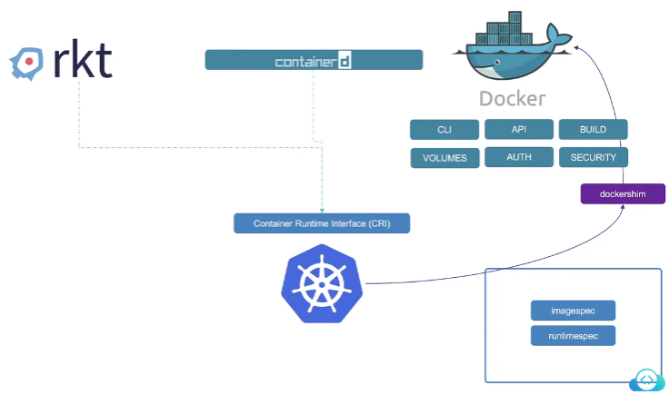
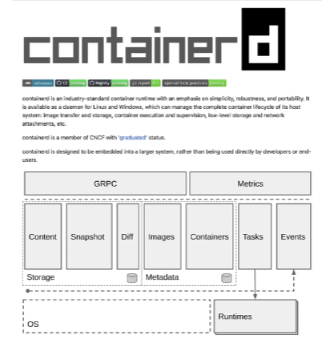
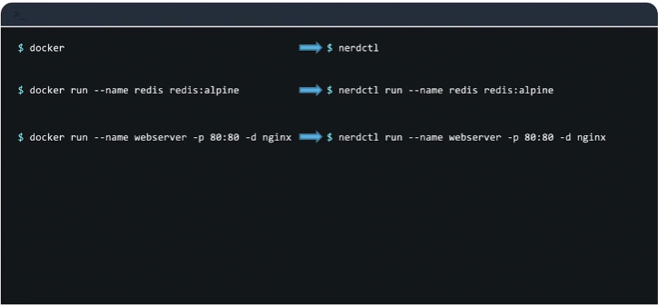
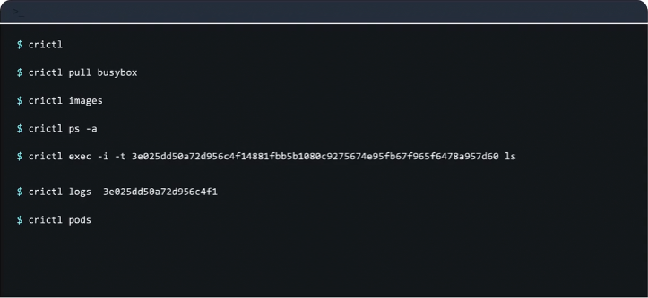
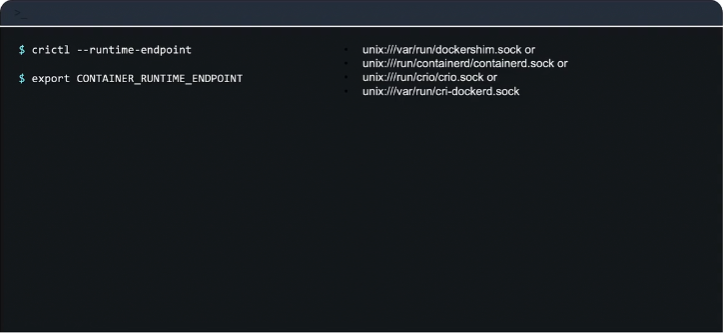
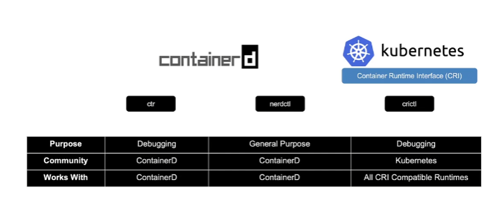

# Docker vs. ContainerD

In this section we will look at the differences between Docker and ContainerD

`containerd` and `Docker` are both tools related to containerization, but they serve different purposes within the container ecosystem. Here's a comparison between `containerd` and `Docker`:

### Docker:

- **Definition**: Docker is a platform for developing, shipping, and running applications in containers.
  
- **Components**:
  - **Docker Engine**: The core tool that allows you to build and run containers.
  - **Docker CLI**: Command-line interface for interacting with Docker Engine.
  - **Docker Compose**: Tool for defining and running multi-container Docker applications.
  - **Docker Hub**: Public registry for storing and sharing Docker images.
  
- **Features**:
  - **Container Management**: Docker provides tools to build, run, and manage containers.
  - **Image Management**: Ability to build, share, and pull Docker images from registries.
  - **Networking**: Docker provides networking features to connect containers.
  - **Volumes**: Docker allows you to manage persistent data using volumes.
  - **Orchestration**: While not a part of Docker itself, Docker can be integrated with tools like Docker Swarm or Kubernetes for container orchestration.

- **Use Case**:
  - Developers and DevOps teams use Docker for creating and managing containers to package applications and their dependencies into a standardized unit for development, shipment, and deployment.

### containerd:

- **Definition**: `containerd` is an industry-standard core container runtime, designed to be embedded into larger container systems such as Docker, Kubernetes, or CRI-O.
  
- **Role**:
  - `containerd` is an essential component that manages the container lifecycle, image distribution, and low-level container execution.
  - It is more focused on the runtime aspects of containers and less on the development and management tools provided by Docker.

- **Features**:
  - **Container Runtime**: `containerd` is responsible for executing containers, managing their lifecycle (start, stop, pause, delete), and handling container images.
  - **API Interface**: Provides a standardized API for higher-level container platforms to interact with.
  - **Modularity**: Designed to be extensible and modular, allowing it to be embedded into various container platforms.

- **Use Case**:
  - `containerd` is used as the core runtime engine by higher-level container platforms.
  - It is commonly integrated into container orchestration systems like Kubernetes, Docker, and others.
  - Developers or organizations building their container platforms might use `containerd` as the runtime engine.

### Comparison:

- **Scope**:
  - Docker is a comprehensive platform for containerization, including tools for building, managing, and running containers.
  - `containerd` is a runtime that focuses on the core functions of executing and managing containers, meant to be embedded into higher-level systems.

- **Use Cases**:
  - Use Docker for end-to-end container development, from building images to running and managing containers.
  - Use `containerd` as the core runtime engine within larger container platforms or orchestration systems.

- **Integration**:
  - Docker incorporates `containerd` as its core runtime.
  - Kubernetes, for example, uses `containerd` as the default runtime for managing containers.

- **Customization**:
  - Docker provides a user-friendly interface and tools for container management.
  - `containerd` is more focused on providing a standardized runtime interface and is typically used by developers building container platforms.

### Summary:
- Docker is a comprehensive platform for containerization, providing tools for building, running, and managing containers.
- `containerd` is an industry-standard core container runtime, focused on managing the lifecycle and execution of containers, designed to be embedded into larger container platforms.

  The terms "container" and "Docker" are often used together in discussions about containerization, but they refer to different things:
##Container vs Contauiner:
### Container:

- **Definition**: A container is a lightweight, standalone, executable package of software that includes everything needed to run an application: code, runtime, system tools, system libraries, and settings.
  
- **Isolation**:
  - Containers provide process and file system isolation, allowing applications to run in their own isolated environments.
  - They share the host OS kernel but have their own user space.

- **Advantages**:
  - **Portability**: Containers can run consistently on any environment that supports the containerization platform.
  - **Efficiency**: They use less resources compared to traditional virtual machines.
  - **Consistency**: Containers ensure that an application runs the same way in development, testing, and production environments.

- **Use Cases**:
  - Packaging and deploying applications with their dependencies in a consistent and reproducible manner.
  - Microservices architecture, where different components of an application are run in separate containers.
  - Continuous Integration and Continuous Deployment (CI/CD) pipelines.

### Docker:

- **Definition**: Docker is a popular platform and toolset for developing, shipping, and running applications in containers.
  
- **Components**:
  - **Docker Engine**: The core tool that allows you to build, run, and manage containers.
  - **Docker CLI**: Command-line interface for interacting with Docker Engine.
  - **Docker Compose**: Tool for defining and running multi-container Docker applications.
  - **Docker Hub**: Public registry for storing and sharing Docker images.

- **Features**:
  - **Image Management**: Building, storing, and sharing container images using Dockerfile and Docker Hub.
  - **Container Management**: Running, starting, stopping, and managing containers.
  - **Networking**: Docker provides networking features to connect containers.
  - **Volumes**: Managing persistent data using volumes.
  - **Orchestration**: Docker Swarm for container orchestration (or Kubernetes can be used with Docker containers).

- **Use Cases**:
  - Local development environments where developers can work with applications in containers on their laptops.
  - Building and packaging applications into Docker images for deployment.
  - Running applications in production environments using container orchestration tools.

### Comparison:

- **Container**:
  - Refers to the fundamental technology that allows applications to be packaged and run in isolated environments.
  - It is a generic term that applies to various containerization technologies like Docker, Podman, containerd, etc.

- **Docker**:
  - Refers specifically to the Docker platform, including Docker Engine, Docker CLI, Docker Compose, and Docker Hub.
  - Provides a comprehensive set of tools and services for working with containers.

### Relationship:

- Docker uses containers as its core technology to package, distribute, and run applications.
- When people refer to "Docker containers," they are often talking about containers managed and created using Docker tools.

### Summary:
- **Container** is the technology that allows applications to be packaged and run in isolated environments.
- **Docker** is a platform and toolset built around containers, providing a comprehensive solution for developing, shipping, and running applications in containers.

When discussing containers in the context of Docker, the terms are often used interchangeably. However, it's important to understand that containers are a broader concept, while Docker is a specific implementation and toolset for working with containers. Other containerization technologies exist, but Docker remains one of the most popular and widely used.

So while most other container runtimes worked to the CRI, Docker continued to work without it, so now you see Docker isn’t just a container runtime alone. Docker consists of multiple tools that are put together, for example the Docker CLI, the Docker API, the build tools that help in building images. There was support for volumes, security, and finally the container runtime called `runc`, and the daemon that managed `runc`, that was called `containerd`. So containerd is CRI compatible and can work directly with Kubernetes as all other runtimes, so containerd can be used as a runtime on its own separate from Docker.



So now you have containerd as a separate runtime and Docker separately, so Kubernetes continued to maintain support for Docker engine directly however having to maintain the dockershim was an unnecessary effort and added complications so it was decided in v1.24 release of Kubernetes to remove dockershim completely and so support for Docker was removed. But you see all the images that were built before Docker was removed so all the Docker images continued to work because Docker followed the image spec from the OCI standards so all the images built by Docker follow the standard so they continued to work with containerd but Docker itself was removed as a supported runtime form Kubernetes. So that’s kind of the whole story, now let’s look into containerd more specifically.



So containerd although is part of Docker, is a separate project on its own now and is a member of [CNCF](https://www.cncf.io/) with the [graduated](https://www.cncf.io/projects/) status, so you can now install containerd on its own without having to install Docker itself so if you don’t really need Docker’s other features you could ideally just install containerd alone. So typically we ran containers using the `docker run` command when we had Docker and if Docker isn’t installed then how do you run containers with just containerd? Now, once you install containerd it comes with a command line tool called [ctr](https://github.com/projectatomic/containerd/blob/master/docs/cli.md#client-cli), and this tool is solely made for debugging containerd and is not very user friendly as it only supports a limited set of features and this is all you can see in the documentation pages for this particular tool. So for the other than limited set of features that require any other way you want to interact with containerd you have to rely on making API calls directly which is not the most user friendly way to for us to operate.

So just to give you an idea, the `ctr` command can be used to perform basic container-related activities such as pull images, for example to pull redis image you would run

```
ctr images pull docker.io/library/redis:alpine
```

To run a container we use the `ctr` run command

```
ctr run docker.io/library/redis:alpine redis
```

But as I mentioned, this tool is solely for debugging containerd and is not very user friendly and is not to be used for managing containers on a production environment.
So a better alternative recommended is the [nerdctl](https://github.com/containerd/nerdctl#nerdctl-docker-compatible-cli-for-container) tool. So the `nerdctl` tool is a command line tool that’s very similar to Docker, so it’s a Docker-like CLI for containerd. It supports most of the CLI options that Docker supports and apart from that it has the added benefit that it can give us access to the newest features implemented in containerd, so for example we can work with encrypted container images or other new features that will eventually be implemented into the regular Docker command in the future. It also supports lazy pulling of images, P2P image distribution, image signing and verifying and namespaces in Kubernetes which are not available in Docker. So the `nerdctl` tool works very similar to Docker cli, so instead of Docker you would simply have to replace it with `nerdctl` so it can run almost all Docker commands that interact with containers like this



So that’s pretty easy and straight forward so now that we have talked about `ctr` and the `nerdctl` tool, it’s important to talk about another command like tool known as [crictl](https://github.com/kubernetes-sigs/cri-tools/blob/master/docs/crictl.md#container-runtime-interface-cri-cli). So earlier we talked about the CRI which is a single interface used to connect CRI compatible container runtimes, containerd, `rkt` and others. So the `crictl` is a command line utility that is used to interact with the CRI compatible container runtime, so this is kind of interaction from the Kubernetes perspective. So this tool is developed and maintained by the Kubernetes community and this tool works across all the different container runtimes and because earlier you had the `ctr` and `nerdctl` utility that was built by the containerd community specifically for containerd, but this particular tool is from the Kubernetes perspective that works across different container runtimes.

So it must be installed separately and is used to inspect and debug container runtimes so this again is not ideally used to create containers unlike the Docker or the `nerdctl` utility but is again a debugging tool. You can technically create containers with the `crictl` utility but it’s not easy. It’s only to be used for some special debugging purposes. And remember that it kind of works along with the kubelet so we know that the kubelet is responsible for ensuring that a specific number of containers or pods are available on a node at time, so if you kind of go through the `crictl` utility and try and create containers with it, then eventually kubelet is going to delete them because kubelet is unaware of some of those containers or pods that are created outside of its knowledge so anything that it sees it’s going to go and delete it, so because of those things remember that the `crictl` utility is only used for debugging purposes and getting into containers and all of that.

So let’s look at some of the command line examples so you simply run  the `crictl` command for this and this can be used to perform basic container-related activities such as pull images, or list existing images, list containers, very similar to the Docker command where you use the PS commands, so in Docker you run the `ps` command, and here you run the `crictl ps` command and to run a command in since a container docker remember we use the `exec` command and it’s the same here and along with the same options such as `-i` and `-t` and you specify the container id. The view the logs, you use the `crictl` logs command, again very similar to the docker command.



One major difference is that the `crictl` command is also aware of pods so you can list pods by running the `crictl` pods command so this wasn’t something that Docker was aware of. So while working with Kubernetes in the past, we used Docker commands a lot to troubleshoot containers and view logs especially on the worker nodes and now you’re going to use the `crictl` command to do so. So the syntax is a lot similar and so it shouldn’t be really hard.
So here’s a chart that lists the comparison between the Docker and `crictl` command line tools. So as you can see, a lot of command such as attach exec, images, info, inspect, logs, ps, stats, version etc., work exactly the same way, and some of the commands to create, remove and start and stop images work similarly too. So a full list of differences can be found in [this link](https://kubernetes.io/docs/reference/tools/map-crictl-dockercli/#retrieve-debugging-information).

| docker cli | crictl            | Description                                                          | Unsupported Features                |
|------------|-------------------|----------------------------------------------------------------------|-------------------------------------|
| attach     | attach            | Attach to a running container                                        | --detach-keys, --sig-proxy          |
| exec       | exec              | Run a command in a running container                                 | --privileged, --user, --detach-keys |
| images     | images            | List images                                                          |                                     |
| info       | info              | Display system-wide information                                      |                                     |
| inspect    | inspect, inspecti | Return low-level information on a container, image or task           |                                     |
| logs       | logs              | Fetch the logs of a container                                        | --details                           |
| ps         | ps                | List containers                                                      |                                     |
| stats      | stats             | Display a live stream of container(s) resource usage statistics      | Column: NET/BLOCK I/O, PIDs         |
| version    | version           | Show the runtime (Docker, ContainerD, or others) version information |                                     |

So, since as I mentioned, `crictl` can be used to connect to any CRI compatible runtime, remember to set the right endpoint if you have multiple container runtimes configured, or if you want `crictl` to interact with a specific runtime, for example if you haven’t configured anything by default it’s going to connect to these sockets in this particular order, so it’s going to try and connect to dockershim first, then containerd, then CRI-O, then the CRI-dockerd – that’s kind of the order that it falls. But if you want to override that and set a specific endpoint, you use the `--runtime-endpoint` option with the `crictl` command line, or you could use the `CONTAINER_RUNTIME_ENDPOINT` environment variable. Set the environment variable to the right endpoint.



So to summarize we have the `ctr` command line utility that comes with containerd and works with containerd which is used for debugging purposes only and has a very limited set of features, so ideally you wouldn’t be using this at all so you can kind of ignore this. Then we have the `nerdctl` CLI which is again from the containerd community but this is a Docker-like CLI for containerd used for general purpose to create containers and supports the same or more features than Docker CLI, so it’s something that I think we’ll be using a lot more going forward. Then we have the `crictl` utility which is from the Kubernetes community and mainly used to interact with CRI compatible runtimes, so it’s not just for containerd – this can be used for all CRI supported runtimes – again this is mainly to be used for debugging purposes.



So if we look at the comparisons here, you can see that `ctr` and `crictl` are used mainly for debugging purposes, whereas the `nerdctl` is used for general purpose. The `ctr` and `nerdctl` are from the containerd community and work with containerd, whereas `crictl` is from the Kubernetes community and works across all CRI compatible runtimes.
So our labs originally had Docker installed on all the nodes so we used the Docker commands to troubleshoot, but now it’s all containerd so remember to use the `crictl` command instead to troubleshoot.


