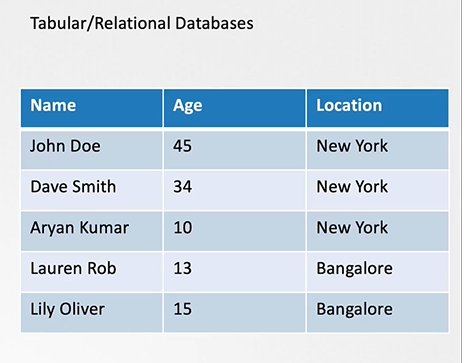

# ETCD for Beginners
  - Take me to the [Video Tutorial](https://kodekloud.com/topic/etcd-for-beginners/)

  In this section, we will take a quick look at introduction to ETCD for beginners.
  - What is ETCD?
  - What is a Key-Value Store?
  - How to get started quickly with ETCD?
  - How to operate ETCD?

 ## What is a ETCD?
     - ETCD is a distributed reliable key-value store that is simple, secure & Fast.


The article provides a beginner-friendly introduction to ETCD, a distributed key-value store often used in Kubernetes. Here's a summary of the main points:

- **Introduction to ETCD:**
  - ETCD is a distributed, reliable, and fast key-value store.
  - It is simple, secure, and widely used in distributed systems.

- **Key-Value Store vs Traditional Databases:**
  - Traditional databases store data in rows and columns.
  - ETCD stores data in documents or pages, allowing flexibility without affecting other entries.
  - Each individual or entity gets a document with all its information.

- **Getting Started with ETCD:**
  - ETCD is easy to install and use.
  - Download the binary, extract it, and run the ETCD executable.
  - ETCD listens on port 2379 by default.
  - The ETCD control client is a command-line tool to interact with ETCD.

- **Using ETCD Control Client:**
  - Use `etcdctl` commands to store and retrieve key-value pairs.
  - Example: `etcdctl set key1 value1` to store a key-value pair, `etcdctl get key1` to retrieve it.
  - Additional options and commands can be explored with `etcdctl` tool.

- **History of ETCD Releases:**
  - ETCD has evolved through various versions.
  - Version 2.0 introduced the raft consensus algorithm in 2015.
  - Version 3.0 in 2017 brought optimizations and performance improvements.
  - In 2018, ETCD project was incubated in CNCF.

- **ETCDCTL Commands and Versions:**
  - `etcdctl` commands differ between version 2 and version 3 of ETCD.
  - Check the configured API version (`ETCDCTL_API`) using `etcdctl version`.
  - Commands for v2: `set`, `get`, etc. Commands for v3: `put`, `get`, etc.

- **Switching API Versions with ETCDCTL:**
  - To switch to API version 3, set `ETCDCTL_API` environment variable to `3` for each command.
  - Alternatively, export `ETCDCTL_API=3` for the entire session.
  - With v3, the command structure changes (e.g., `etcdctl put`, `etcdctl get`).

- **Conclusion:**
  - The article ends by mentioning that future videos will explore setting up ETCD in a high-availability (HA) environment and its integration with Kubernetes.

The article serves as a foundational guide for beginners to understand ETCD, its usage, and the basics of interacting with it using the `etcdctl` command-line tool.


## What is a Key-Value Store
   - Traditionally, databases have been in tabular format, you must have heared about SQL or Relational databases. They store data in rows and columns

     

   - A Key-Value Store stores information in a Key and Value format.

     

## Install ETCD
   - Its easy to install and get started with **`ETCD`**.
     - Download the relevant binary for your operating system from github releases page (https://github.com/etcd-io/etcd/releases)

       For Example: To download ETCD v3.5.6, run the below curl command

       ```
       $ curl -LO https://github.com/etcd-io/etcd/releases/download/v3.5.6/etcd-v3.5.6-linux-amd64.tar.gz
       ```
     - Extract it.
       ```
       $ tar xvzf etcd-v3.5.6-linux-amd64.tar.gz
       ```
     - Run the ETCD Service
       ```
       $ ./etcd
       ```
     - When you start **`ETCD`** it will by default listens on port **`2379`**
      - The default client that comes with **`ETCD`** is the [**`etcdctl`**](https://github.com/etcd-io/etcd/tree/main/etcdctl) client. You can use it to store and retrieve key-value pairs.
        ```
        Syntax: To Store a Key-Value pair
        $ ./etcdctl put key1 value1
        ```
        ```
        Syntax: To retrieve the stored data
        $ ./etcdctl get key1
        ```
        ```
        Syntax: To view more commands. Run etcdctl without any arguments
        $ ./etcdctl
        ```

        

       K8s Reference Docs:
       - https://kubernetes.io/docs/concepts/overview/components/
       - https://etcd.io/docs/
       - https://kubernetes.io/docs/tasks/administer-cluster/configure-upgrade-etcd/

