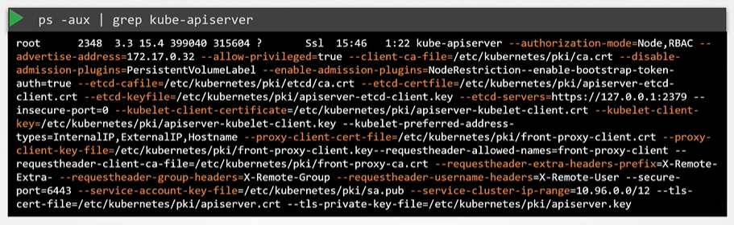

# Kube API Server
  - Take me to [Video Tutorial](https://kodekloud.com/topic/kube-api-server/)
  


Here is a summary of the article on the **kube-apiserver** in Kubernetes:

- **kube-apiserver** is highlighted as the primary management component in Kubernetes.
- Whenever a **kubectl** command is executed, it reaches out to the **kube-apiserver**.
- The **kube-apiserver** first authenticates and validates the request before fetching the data from the **etcd** cluster and responding with the requested information.
- Instead of using **kubectl**, you can also directly invoke the APIs by sending a POST request.
- An example scenario of creating a pod is discussed:
  - The API server creates a pod object without assigning it to a node after authenticating and validating the request.
  - The scheduler identifies the right node for the new pod and communicates it back to the **kube-apiserver**.
  - The **kube-apiserver** updates the information in the **etcd** cluster, which then passes the information to the **kubelet** on the worker node.
  - The **kubelet** creates the pod on the node and deploys the application image using the container runtime engine.
  - After completion, the **kubelet** updates the status back to the **kube-apiserver** which then updates the data in the **etcd** cluster.
- The **kube-apiserver** is at the core of all tasks required to make changes in the cluster.
- It is responsible for authenticating, validating requests, and retrieving and updating data in the **etcd** data store.
- It is the only component that interacts directly with the **etcd** data store.
- Other components like the scheduler, kube-controller-manager, and kubelet use the **kube-apiserver** to perform updates in the cluster.
- For those setting up the cluster hardware, the **kube-apiserver** binary is available on the Kubernetes release page to download and configure as a service.
- The **kube-apiserver** runs with numerous parameters, as shown in the article.
- Understanding these parameters at a high level will facilitate the configuration of the entire cluster later on.
- The Kubernetes architecture involves various components working together, necessitating knowledge of their locations and modes of communication.
- There are different modes of authentication, authorization, encryption, and security, leading to the many options available.
- **etcd servers** option specifies the location of the **etcd** servers for the **kube-apiserver** to connect to.
- To view **kube-apiserver** options in an existing cluster:
  - For **kubeadmin** setup, the **kubeadmin-apiserver** is deployed as a pod in the **kube-system** namespace on the master node. The options can be seen within the pod definition file.
  - In a non-**kubeadmin** setup, the options can be inspected by viewing the **kube-apiserver** service located in **etc/systemd/system/kube-apiserver.service**.
  - Running processes and effective options can be seen by listing the processes on the master node and searching for **kube-apiserver**.

The article concludes by emphasizing the importance of understanding these components and their configurations, especially in the context of SSL/TLS certificates, which will be discussed in detail later in the course.


In this section, we will talk about kube-apiserver in kubernetes


#### Kube-apiserver is the primary component in kubernetes.
- Kube-apiserver is responsible for **`authenticating`**, **`validating`** requests, **`retrieving`** and **`Updating`** data in ETCD key-value store. In fact kube-apiserver is the only component that interacts directly to the etcd datastore. The other components such as kube-scheduler, kube-controller-manager and kubelet uses the API-Server to update in the cluster in their respective areas.
  
  
  
## Installing kube-apiserver

- If you are bootstrapping kube-apiserver using **`kubeadm`** tool, then you don't need to know this, but if you are setting up using the hardway then kube-apiserver is available as a binary in the kubernetes release page.
  - For example: You can downlaod the kube-apiserver v1.13.0 binary here [kube-apiserver](https://storage.googleapis.com/kubernetes-release/release/v1.13.0/bin/linux/amd64/kube-apiserver)
    ```
    $ wget https://storage.googleapis.com/kubernetes-release/release/v1.13.0/bin/linux/amd64/kube-apiserver
    ```
 
 
 
## View kube-apiserver - Kubeadm
- kubeadm deploys the kube-apiserver as a pod in kube-system namespace on the master node.
  ```
  $ kubectl get pods -n kube-system
  ```
   
  
   
## View kube-apiserver options - Kubeadm
- You can see the options with in the pod definition file located at **`/etc/kubernetes/manifests/kube-apiserver.yaml`**
  ```
  $ cat /etc/kubernetes/manifests/kube-apiserver.yaml
  ```
  
  
   
## View kube-apiserver options - Manual
- In a Non-kubeadm setup, you can inspect the options by viewing the kube-apiserver.service
  ```
  $ cat /etc/systemd/system/kube-apiserver.service
  ```
  
  
   
- You can also see the running process and affective options by listing the process on master node and searching for kube-apiserver.
  ```
  $ ps -aux | grep kube-apiserver
  ```
  

K8s Reference Docs:
- https://kubernetes.io/docs/reference/command-line-tools-reference/kube-apiserver/
- https://kubernetes.io/docs/concepts/overview/components/
- https://kubernetes.io/docs/concepts/overview/kubernetes-api/
- https://kubernetes.io/docs/tasks/access-application-cluster/access-cluster/
- https://kubernetes.io/docs/tasks/administer-cluster/access-cluster-api/
https://github.com/techiescamp/kubernetes-projects/tree/main/01-kubernetes-the-hard-way-aws
