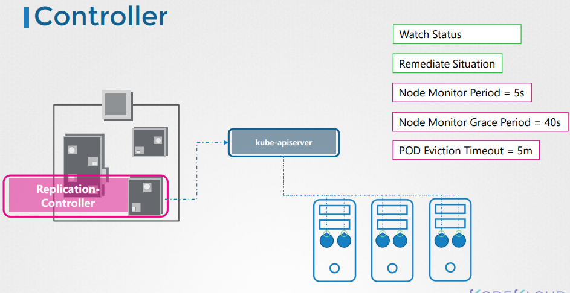

# Kube Controller Manager

  - Take me to [Video Tutorial](https://kodekloud.com/topic/kube-controller-manager/)
  


Here is a summary of the article on the **Kube Controller Manager** in Kubernetes:

- **Kube Controller Manager** manages various controllers in Kubernetes, where a controller is likened to an office or department with specific responsibilities.
- Controllers continuously monitor the state of components within Kubernetes and work to bring the system to the desired functioning state.
- An example is the **Node Controller**, responsible for monitoring node status and ensuring application functionality through the Kube API server.
  - It checks node status every five seconds, marking nodes as unreachable after not receiving heartbeats for 40 seconds.
  - After marking a node unreachable, it gives it five minutes to come back up before removing assigned PODs and provisioning them on healthy nodes if part of a replica set.
- Another example is the **Replication Controller**, which monitors replica set status and ensures the desired number of PODs are available within the set, creating new PODs if necessary.
- These controllers are integral to Kubernetes concepts such as deployments, services, namespaces, and persistent volumes, implementing the intelligence behind these constructs.
- The controllers are packaged into a single process known as the **Kubernetes Controller Manager** when installed.
- To install and view the **Kubernetes Controller Manager**:
  - Download it from the Kubernetes release page, extract it, and run it as a service.
  - Customize controller settings using provided options, such as node monitor period, grace period, and eviction timeout.
  - Use the **controllers** option to enable specific controllers, as all are enabled by default.
  - Troubleshoot controller issues by checking the enabled controllers.
- To view the **Kube Controller Manager**'s server options:
  - For **kubeadmin** setup, it is deployed as a POD in the **kube-system** namespace on the master node. Options can be seen in the POD definition file.
  - In a non-**kubeadmin** setup, inspect options by viewing the **Kube Controller Manager** service located at the services directory.
  - View running processes and effective options by listing processes on the master node and searching for **Kube Controller Manager**.

Understanding these controllers and their configurations is crucial for managing and maintaining a Kubernetes cluster effectively.


In this section, we will take a look at kube-controller-manager.


#### Kube Controller Manager manages various controllers in kubernetes.
- In kubernetes terms, a controller is a process that continuously monitors the state of the components within the system and works towards bringing the whole system to the desired functioning state.

## Node Controller
   - Responsible for monitoring the state of the Nodes and taking necessary actions to keep the application running. 
  
   
   
## Replication Controller
   - It is responsible for monitoring the status of replicasets and ensuring that the desired number of pods are available at all time within the set.
   
   
   
## Other Controllers
   - There are many more such controllers available within kubernetes
     
   
   
   
  ## Installing Kube-Controller-Manager
  - When you install kube-controller-manager the different controllers will get installed as well.
  - Download the kube-controller-manager binary from the kubernetes release page. For example: You can download kube-controller-manager v1.13.0 here [kube-controller-manager](https://storage.googleapis.com/kubernetes-release/release/v1.13.0/bin/linux/amd64/kube-controller-manager)
    ```
    $ wget https://storage.googleapis.com/kubernetes-release/release/v1.13.0/bin/linux/amd64/kube-controller-manager
    ```
  - By default all controllers are enabled, but you can choose to enable specific one from **`kube-controller-manager.service`**
    ```
    $ cat /etc/systemd/system/kube-controller-manager.service
    ```
    
    
## View kube-controller-manager - kubeadm
- kubeadm deploys the kube-controller-manager as a pod in kube-system namespace
  ```
  $ kubectl get pods -n kube-system
  ```
  
  
## View kube-controller-manager options - kubeadm
- You can see the options within the pod located at **`/etc/kubernetes/manifests/kube-controller-manager.yaml`**
  ```
  $ cat /etc/kubernetes/manifests/kube-controller-manager.yaml
  ```
  
  
## View kube-controller-manager options - Manual
- In a non-kubeadm setup, you can inspect the options by viewing the **`kube-controller-manager.service`**
  ```
  $ cat /etc/systemd/system/kube-controller-manager.service
  ```
  
  
- You can also see the running process and affective options by listing the process on master node and searching for kube-controller-manager.
  ```
  $ ps -aux | grep kube-controller-manager
  ```
  
  
K8s Reference Docs:
- https://kubernetes.io/docs/reference/command-line-tools-reference/kube-controller-manager/
- https://kubernetes.io/docs/concepts/overview/components/
   
     
