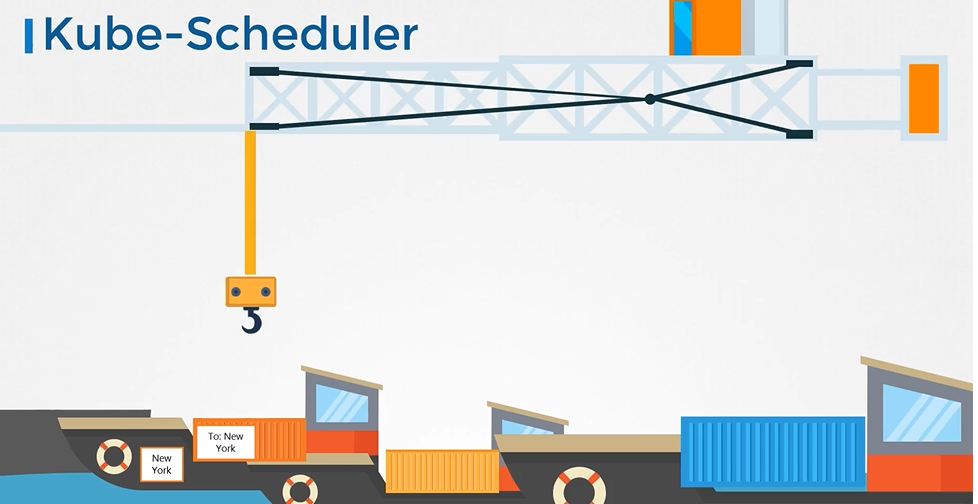
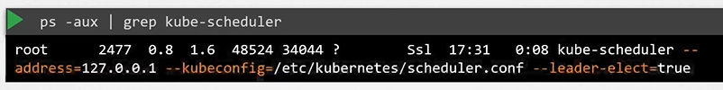

# Kube Scheduler
  - Take me to [Video Tutorial](https://kodekloud.com/topic/kube-scheduler/)

In this section, we will take a look at kube-scheduler.

#### kube-scheduler is responsible for scheduling pods on nodes.  
- The kube-scheduler is only responsible for deciding which pod goes on which node. It doesn't actually place the pod on the nodes, that's the job of the **`kubelet`**.

  
  
#### Why do you need a Scheduler?

  

As Per ChatGpt  

In Kubernetes, a scheduler is essential for efficiently managing the deployment of containers across the cluster's nodes. Here are several reasons why a scheduler is necessary:

1. **Resource Optimization**: Kubernetes scheduler ensures that each pod (a group of one or more containers) is placed on a node with adequate resources (CPU, memory, etc.) to run effectively. It considers the resource requests and limits specified in the pod's configuration to make informed decisions about placement.

2. **High Availability**: The scheduler plays a crucial role in ensuring high availability by spreading pods across different nodes. By distributing workloads, it mitigates the risk of a single point of failure and enhances the overall resilience of the system.

3. **Load Balancing**: Kubernetes scheduler helps in load balancing by evenly distributing the workload across nodes. This prevents overloading certain nodes while others remain underutilized, thus optimizing resource utilization and improving system performance.

4. **Affinity and Anti-affinity**: Kubernetes allows administrators to define affinity and anti-affinity rules to influence pod placement. The scheduler evaluates these rules and schedules pods based on node labels, pod labels, or other attributes specified in the rules. This capability helps in achieving specific deployment requirements, such as co-locating related services or separating critical workloads.

5. **Constraints and Policies**: The scheduler supports various constraints and policies that administrators can define to control pod placement. These constraints may include node selectors, node taints and tolerations, pod affinity/anti-affinity, resource quotas, and custom scheduling policies. The scheduler ensures compliance with these constraints while making scheduling decisions.

6. **Dynamic Scheduling**: Kubernetes scheduler continuously monitors the cluster's state and adjusts pod placement as nodes are added, removed, or become unavailable. This dynamic scheduling capability ensures that the cluster remains responsive to changes in workload demand and cluster topology.

7. **Integration with Other Kubernetes Components**: The scheduler integrates with other Kubernetes components such as the kube-controller-manager, kubelet, and API server to coordinate pod scheduling and lifecycle management. It collaborates with these components to ensure consistent and reliable operation of the cluster.

Overall, the scheduler is a critical component of Kubernetes that automates the placement of pods onto cluster nodes, optimizing resource utilization, ensuring high availability, and adhering to deployment constraints and policies defined by administrators.


https://kubernetes.io/docs/concepts/scheduling-eviction/
    
## Install kube-scheduler - Manual
- Download the kubescheduler binary from the kubernetes release pages [kube-scheduler](https://storage.googleapis.com/kubernetes-release/release/v1.13.0/bin/linux/amd64/kube-scheduler). For example: To download kube-scheduler v1.13.0, Run the below command.
  ```
  $ wget https://storage.googleapis.com/kubernetes-release/release/v1.13.0/bin/linux/amd64/kube-scheduler
  ```
- Extract it
- Run it as a service

  
  
## View kube-scheduler options - kubeadm
- If you set it up with kubeadm tool, kubeadm tool will deploy the kube-scheduler as pod in kube-system namespace on master node.
  ```
  $ kubectl get pods -n kube-system
  ```
- You can see the options for kube-scheduler in pod definition file that is located at **`/etc/kubernetes/manifests/kube-scheduler.yaml`**
  ```
  $ cat /etc/kubernetes/manifests/kube-scheduler.yaml
  ```
  
  
- You can also see the running process and affective options by listing the process on master node and searching for kube-apiserver.
  ``` 
  $ ps -aux | grep kube-scheduler
  ```
  
  
  K8s Reference Docs:
  - https://kubernetes.io/docs/reference/command-line-tools-reference/kube-scheduler/
  - https://kubernetes.io/docs/concepts/scheduling-eviction/kube-scheduler/
  - https://kubernetes.io/docs/concepts/overview/components/
  - https://kubernetes.io/docs/tasks/extend-kubernetes/configure-multiple-schedulers/
    
