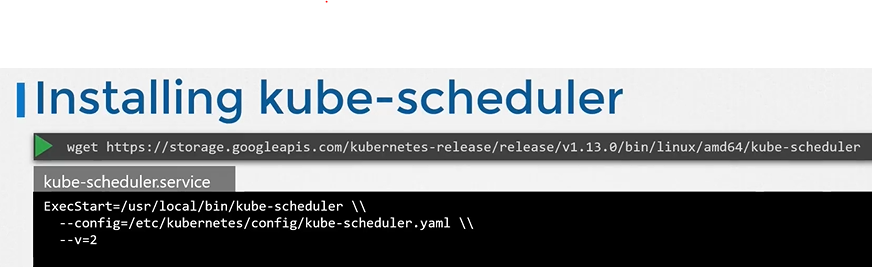

# Kube Scheduler
  - Take me to [Video Tutorial](https://kodekloud.com/topic/kube-scheduler/)

In this section, we will take a look at kube-scheduler.

#### kube-scheduler is responsible for scheduling pods on nodes.  
- The kube-scheduler is only responsible for deciding which pod goes on which node. It doesn't actually place the pod on the nodes, that's the job of the **`kubelet`**.

  
  
#### Why do you need a Scheduler?

  

As Per ChatGpt  


Here's a summary of the text regarding kube-scheduler:

- **Role of Kube-Scheduler:**
  - Responsible for scheduling pods on nodes in Kubernetes.
  - Determines which pod goes on which node but does not physically place them.
  - Kubelet, the "captain on the ship," actually creates pods on nodes.

- **Scheduler's Decision-making Process:**
  - Ensures the right container ends up on the right ship (node).
  - Considers factors like node capacity, pod resource requirements, and destination.
  - Filters out nodes that don't fit the pod's resource profile.
  - Ranks remaining nodes using a priority function to find the best fit.
  - Example: The node with more free resources after placing the pod gets a higher rank.

- **Customization and Additional Topics:**
  - Scheduler functionality can be customized.
  - Topics include resource requirements, limits, taints and tolerations, node selectors, affinity rules, etc.
  - These topics will be discussed in detail in an upcoming section.

- **Installation of Kube-Scheduler:**
  - Download the kube-scheduler binary from the Kubernetes release page.
  - Extract it and run it as a service, specifying the scheduler configuration file.

- **Viewing Kube-Scheduler Options:**
  - For clusters set up with `kubeadm` tool, kube-scheduler is deployed as a pod in the `kube-system` namespace on the master node.
  - View options within the pod definition file located at `/etc/kubernetes/manifest/folder`.
  - See running process and effective options by listing the process on the master node and searching for `kube-scheduler`.

The summary covers the kube-scheduler's role, decision-making process, customization options, installation steps, and how to view its options in an existing cluster setup.


https://kubernetes.io/docs/concepts/scheduling-eviction/
    
## Install kube-scheduler - Manual
- Download the kubescheduler binary from the kubernetes release pages [kube-scheduler](https://storage.googleapis.com/kubernetes-release/release/v1.13.0/bin/linux/amd64/kube-scheduler). For example: To download kube-scheduler v1.13.0, Run the below command.
  ```
  $ wget https://storage.googleapis.com/kubernetes-release/release/v1.13.0/bin/linux/amd64/kube-scheduler
  ```
- Extract it
- Run it as a service

  
  
## View kube-scheduler options - kubeadm
- If you set it up with kubeadm tool, kubeadm tool will deploy the kube-scheduler as pod in kube-system namespace on master node.
  ```
  $ kubectl get pods -n kube-system
  ```
- You can see the options for kube-scheduler in pod definition file that is located at **`/etc/kubernetes/manifests/kube-scheduler.yaml`**
  ```
  $ cat /etc/kubernetes/manifests/kube-scheduler.yaml
  ```
  
  
- You can also see the running process and affective options by listing the process on master node and searching for kube-apiserver.
  ``` 
  $ ps -aux | grep kube-scheduler
  ```
  
  
  K8s Reference Docs:
  - https://kubernetes.io/docs/reference/command-line-tools-reference/kube-scheduler/
  - https://kubernetes.io/docs/concepts/scheduling-eviction/kube-scheduler/
  - https://kubernetes.io/docs/concepts/overview/components/
  - https://kubernetes.io/docs/tasks/extend-kubernetes/configure-multiple-schedulers/
    
