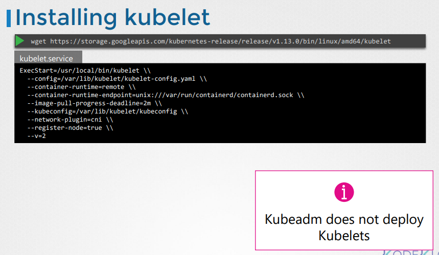

# Kubelet
  - Take me to [Video Tutorial](https://kodekloud.com/topic/kubelet/)

Here is a summary of the article on **Kubelet** in Kubernetes:

- **Kubelet** is compared to the captain of a ship, responsible for all activities on the ship and the primary contact point from the mastership.
- It handles paperwork to join the cluster, loads/unloads containers as instructed by the master's scheduler, and reports ship and container status back to the kube API server.
- On a Kubernetes worker node, **Kubelet** registers the node with the cluster and executes instructions to load containers or pods by requesting the container runtime engine (like Docker) to pull required images and run instances.
- **Installation**:
  - If using **kubeadm** to deploy the cluster, **Kubelet** is not automatically installed on worker nodes, unlike other components.
  - It must be manually installed: download the installer, extract it, and run it as a service on the worker node.
- To view the running **Kubelet** process and its effective options:
  - List the process on the worker node and search for **Kubelet**.
- Future topics in the course will include more details on **Kubelets**, such as configuring them, generating certificates, and TLS bootstrapping.

Understanding the role and installation of **Kubelet** is essential for managing worker nodes and containers within a Kubernetes cluster.


  
In this section we will take a look at kubelet.

#### Kubelet is the sole point of contact for the kubernetes cluster
- The **`kubelet`** will create the pods on the nodes, the scheduler only decides which pods goes where.

  


## Install kubelet
- Kubeadm does not deploy kubelet by default. You must manually download and install it.
- Download the kubelet binary from the kubernetes release pages [kubelet](https://storage.googleapis.com/kubernetes-release/release/v1.13.0/bin/linux/amd64/kubelet). For example: To download kubelet v1.13.0, Run the below command.
  ```
  $ wget https://storage.googleapis.com/kubernetes-release/release/v1.13.0/bin/linux/amd64/kubelet
  ```
- Extract it
- Run it as a service

  
  
## View kubelet options
- You can also see the running process and affective options by listing the process on worker node and searching for kubelet.
  ``` 
  $ ps -aux |grep kubelet
  ```
  
  

K8s Reference Docs:
- https://kubernetes.io/docs/reference/command-line-tools-reference/kubelet/
- https://kubernetes.io/docs/concepts/overview/components/
- https://kubernetes.io/docs/setup/production-environment/tools/kubeadm/kubelet-integration/
