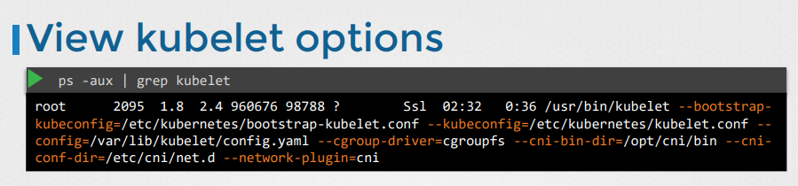

# Kubelet
  - Take me to [Video Tutorial](https://kodekloud.com/topic/kubelet/)
  
In this section we will take a look at kubelet.

#### Kubelet is the sole point of contact for the kubernetes cluster
- The **`kubelet`** will create the pods on the nodes, the scheduler only decides which pods goes where.

  


As per Chat Gpt  ketlet in K8s  

`kubelet` is an essential component of Kubernetes, responsible for managing the lifecycle of pods, which are the smallest deployable units in Kubernetes. Here are several reasons why `kubelet` is necessary:

1. **Pod Management**: `kubelet` ensures that the containers described in a PodSpec are running and healthy. It pulls container images from a container registry when needed and starts the containers. If a container fails, `kubelet` restarts it.

2. **Node Status Reporting**: `kubelet` reports the node's status (including CPU, memory, and disk usage) to the Kubernetes master. This information helps the master make scheduling decisions.

3. **Container Logging and Monitoring**: `kubelet` is responsible for collecting logs and monitoring container health. It streams container logs to a centralized logging solution and exposes container health status, which can be used by monitoring tools.

4. **Container Runtime Integration**: `kubelet` integrates with container runtimes (such as Docker, containerd, or CRI-O) to manage containers. It invokes runtime-specific APIs to start, stop, and monitor containers.

5. **Resource Isolation**: `kubelet` enforces resource isolation by setting up Linux namespaces and cgroups for each container. This ensures that containers running on the same node are isolated from each other.

6. **Container Network Setup**: `kubelet` configures networking for pods, including setting up network namespaces, IP addresses, and routing rules. It ensures that containers within a pod can communicate with each other and with external services.

7. **Volume Management**: `kubelet` manages volumes attached to pods, including provisioning, mounting, and unmounting volumes. It ensures that volumes are available to containers as specified in the pod's configuration.

Overall, `kubelet` plays a crucial role in maintaining the desired state of pods on a Kubernetes node, ensuring that they are running correctly and providing necessary information to the Kubernetes control plane for orchestration and monitoring purposes.

## Install kubelet
- Kubeadm does not deploy kubelet by default. You must manually download and install it.
- Download the kubelet binary from the kubernetes release pages [kubelet](https://storage.googleapis.com/kubernetes-release/release/v1.13.0/bin/linux/amd64/kubelet). For example: To download kubelet v1.13.0, Run the below command.
  ```
  $ wget https://storage.googleapis.com/kubernetes-release/release/v1.13.0/bin/linux/amd64/kubelet
  ```
- Extract it
- Run it as a service

  
  
## View kubelet options
- You can also see the running process and affective options by listing the process on worker node and searching for kubelet.
  ``` 
  $ ps -aux |grep kubelet
  ```
  
  

K8s Reference Docs:
- https://kubernetes.io/docs/reference/command-line-tools-reference/kubelet/
- https://kubernetes.io/docs/concepts/overview/components/
- https://kubernetes.io/docs/setup/production-environment/tools/kubeadm/kubelet-integration/
