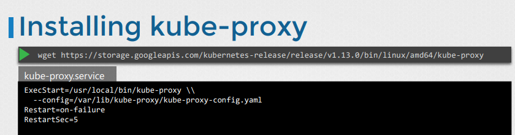

# Kube Proxy
- Take me to [Video Tutorial](https://kodekloud.com/topic/kube-proxy/)


Here is a summary of the article on **kube-proxy** in Kubernetes:

- **kube-proxy** is discussed in the context of enabling communication between pods in a Kubernetes cluster.
- In a Kubernetes cluster, every pod should be able to reach every other pod, achieved by deploying a pod networking solution.
- A **pod network** is an internal virtual network spanning across all nodes in the cluster, allowing pods to communicate.
- To ensure consistent access, services are used. Services provide a stable endpoint for pods to access other pods using the service name.
- **kube-proxy** is responsible for managing services in Kubernetes.
- It runs on each node and creates rules to forward traffic to services.
- When a new service is created, **kube-proxy** creates appropriate rules on each node to forward traffic to the backend pods.
- This forwarding is typically done using **iptables** rules.
- **kube-proxy** is a crucial component for enabling communication between pods and services in the cluster.
- For installation, download the **kube-proxy** binary, extract it, and run it as a service.
- If using the **kubeadm** tool, **kube-proxy** is deployed as pods on each node using a **DaemonSet**.

Understanding **kube-proxy** is essential for managing communication and services within a Kubernetes cluster, ensuring that pods can access necessary resources reliably.


In this section, we will take a look at kube-proxy.

Within Kubernetes Cluster, every pod can reach every other pod, this is accomplish by deploying a pod networking cluster to the cluster. 
- Kube-Proxy is a process that runs on each node in the kubernetes cluster.
  
  
  
## Install kube-proxy - Manual
- Download the kube-proxy binary from the kubernetes release pages [kube-proxy](https://storage.googleapis.com/kubernetes-release/release/v1.13.0/bin/linux/amd64/kube-proxy). For example: To download kube-proxy v1.13.0, Run the below command.
  ```
  $ wget https://storage.googleapis.com/kubernetes-release/release/v1.13.0/bin/linux/amd64/kube-proxy
  ```
- Extract it
- Run it as a service

  

## View kube-proxy options - kubeadm
- If you set it up with kubeadm tool, kubeadm tool will deploy the kube-proxy as pod in kube-system namespace. In fact it is deployed as a daemonset on master node.
  ```
  $ kubectl get pods -n kube-system
  ```
  
  
  
K8s Reference Docs:
- https://kubernetes.io/docs/reference/command-line-tools-reference/kube-proxy/
- https://kubernetes.io/docs/concepts/overview/components/
