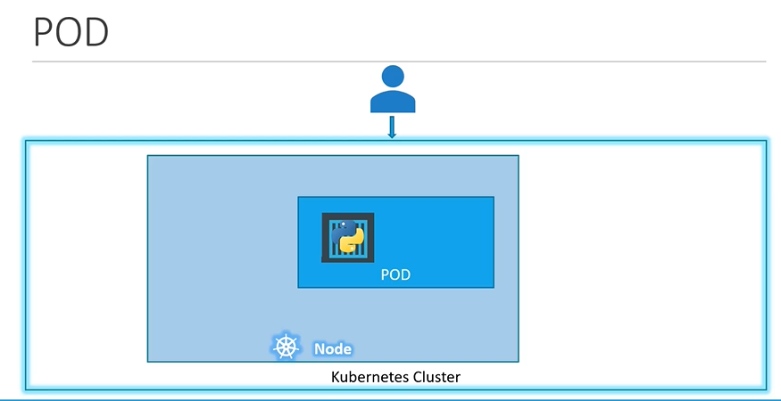

# Pods
  - Take me to [Video Tutorial](https://kodekloud.com/topic/pods-2/)

Here is a summary of the article on **Kubernetes Pods**:

- **Pods** are the smallest unit in Kubernetes, encapsulating one or more containers.
- Each pod represents a single instance of an application.
- In the simplest case, a single pod contains a single container running an application.
- Scaling an application involves creating additional pods, not adding containers to existing pods.
- Pods can have a one-to-one relationship with containers, but they can also have multiple containers.
- Multiple containers in a single pod are useful for supporting tasks, such as processing data.
- Containers in the same pod share the same network space and can communicate using `localhost`.
- Kubernetes automatically manages the connectivity and lifecycle of containers within a pod.
- Kubernetes does this by creating and destroying pods, ensuring containers are co-located and co-managed.
- Pods can be scaled up by creating new pods and scaled down by deleting existing pods.
- Kubernetes abstracts away the complexities of managing container relationships and networking.
- The `kubectl run` command is used to create pods, specifying the Docker image for the application.
- Docker images are pulled from repositories like Docker Hub, either public or private.
- The `kubectl get pods` command lists the pods in the cluster, showing their status.
- Access to applications running in pods can be configured through networking and services, which will be covered in later lectures.

Understanding pods is fundamental to managing applications in Kubernetes, allowing for scalable and flexible deployments of containerized applications.

-------
Here's a summary of the article on creating a pod using a YAML-based configuration file:

- Kubernetes uses YAML files for creating objects like pods, replicas, deployments, and services.
- A Kubernetes definition file contains four top-level fields: API version, kind, metadata, and spec.
- **API version**: Specifies the version of the Kubernetes API being used, set as V1 for pods.
- **Kind**: Specifies the type of object being created, set as "pod" in this case.
- **Metadata**: Contains data about the object, such as its name and labels.
  - The name is a string value for naming the pod.
  - Labels are a dictionary allowing you to add key-value pairs for identification.
  - Labels can help in grouping and filtering pods later on.
- **Spec**: Contains additional information specific to the object being created.
  - For pods, it includes a "containers" property, which is a list.
  - Since pods can have multiple containers, "containers" is an array.
  - Each item in the "containers" list is a dictionary.
    - The "name" property specifies the name of the container.
    - The "image" property specifies the Docker image to use for the container.
- To create the pod, use `kubectl create -f pod-definition.yaml`.
- Use `kubectl get pods` to see a list of pods and `kubectl describe pod` for detailed information.

In summary, the YAML file defines the characteristics of the pod, such as its name, labels for identification, and the Docker image to use. Once the YAML file is created, Kubernetes can create the pod based on this configuration. The `kubectl` commands help in managing and viewing the created pods.


In this section, we will take a look at PODS.
- POD introduction
- How to deploy pod?

#### Kubernetes doesn't deploy containers directly on the worker node.

  
  
#### Here is a single node kubernetes cluster with single instance of your application running in a single docker container encapsulated in the pod.



#### Pod will have a one-to-one relationship with containers running your application.

  
  
## Multi-Container PODs
- A single pod can have multiple containers except for the fact that they are usually not multiple containers of the **`same kind`**.
  
  
  
## Docker Example (Docker Link)
  
  
  
## How to deploy pods?
Lets now take a look to create a nginx pod using **`kubectl`**.

- To deploy a docker container by creating a POD.
  ```
  $ kubectl run nginx --image nginx
  ```

- To get the list of pods
  ```
  $ kubectl get pods
  ```

 

K8s Reference Docs:
- https://kubernetes.io/docs/concepts/workloads/pods/pod/
- https://kubernetes.io/docs/concepts/workloads/pods/pod-overview/
- https://kubernetes.io/docs/tutorials/kubernetes-basics/explore/explore-intro/


