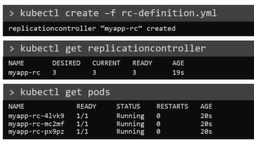

# ReplicaSets
  - Take me to [Video Tutorial](https://kodekloud.com/topic/replicasets/)


Here's a summary of the article on Kubernetes Controllers, specifically focusing on the Replication Controller and Replica Set:

- **Controllers in Kubernetes** are processes that monitor Kubernetes objects and respond accordingly, serving as the brain behind Kubernetes operations.
- **Replication Controller** helps run multiple instances of a single pod in a Kubernetes cluster, ensuring high availability.
  - It creates and maintains a specified number of pods, even if it's just one or hundreds, for reliability.
  - It can automatically bring up a new pod if the existing one fails.
  - Helps balance the load across multiple pods by creating additional replicas.
- **Replica Set** is similar to a Replication Controller but is the newer technology.
  - Uses the `apps/v1` API version.
  - Includes a `selector` property to identify which pods it manages, useful for monitoring existing pods.
  - Can manage pods not created as part of its creation.
- **Creating a Replication Controller or Replica Set** involves defining a YAML file with sections for `API version`, `kind`, `metadata`, and `spec`.
  - `Metadata` includes the name and labels for identification.
  - `Spec` includes a `template` section providing the pod template to be used.
  - Replication Controller also needs a `replicas` property to specify the number of replicas.
  - Replica Set requires a `selector` section to match labels on existing pods.
- **Scaling** a Replica Set involves updating the `replicas` field in the YAML file and using `kubectl replace` or `kubectl scale` commands.
  - `kubectl create` is used to create the Replication Controller or Replica Set from the YAML file.
  - `kubectl get` to see the list of created Replication Controllers or Replica Sets.
  - `kubectl delete` to remove a Replication Controller or Replica Set.
  - `kubectl replace` to update an existing Replication Controller or Replica Set.
  - `kubectl scale` to scale the Replica Set, specifying the desired number of replicas.
- **Labels and Selectors** are crucial for Controllers to identify which pods to manage.
  - Labels help in filtering and identifying pods.
  - Selectors specify which pods a Replica Set should monitor, even if they were created before the Replica Set.
  
Understanding these concepts and commands helps in managing the deployment, scaling, and monitoring of applications in Kubernetes effectively.


In this section, we will take a look at the below
- Replication Controller
- ReplicaSet

#### Controllers are brain behind kubernetes

## What is a Replica and Why do we need a replication controller?

  
  
  
  
## Difference between ReplicaSet and Replication Controller
- **`Replication Controller`** is the older technology that is being replaced by a **`ReplicaSet`**.
- **`ReplicaSet`** is the new way to setup replication.

## Creating a Replication Controller

## Replication Controller Definition File
  
   
  
```
    apiVersion: v1
    kind: ReplicationController
    metadata:
      name: myapp-rc
      labels:
        app: myapp
        type: front-end
    spec:
     template:
        metadata:
          name: myapp-pod
          labels:
            app: myapp
            type: front-end
        spec:
         containers:
         - name: nginx-container
           image: nginx
     replicas: 3
```
  - To Create the replication controller
    ```
    $ kubectl create -f rc-definition.yaml
    ```
  - To list all the replication controllers
    ```
    $ kubectl get replicationcontroller
    ```
  - To list pods that are launch by the replication controller
    ```
    $ kubectl get pods
    ```
    
    
## Creating a ReplicaSet
  
## ReplicaSet Definition File

   

```
    apiVersion: apps/v1
    kind: ReplicaSet
    metadata:
      name: myapp-replicaset
      labels:
        app: myapp
        type: front-end
    spec:
     template:
        metadata:
          name: myapp-pod
          labels:
            app: myapp
            type: front-end
        spec:
         containers:
         - name: nginx-container
           image: nginx
     replicas: 3
     selector:
       matchLabels:
        type: front-end
 ```
#### ReplicaSet requires a selector definition when compare to Replication Controller.
   
  - To Create the replicaset
    ```
    $ kubectl create -f replicaset-definition.yaml
    ```
  - To list all the replicaset
    ```
    $ kubectl get replicaset
    ```
  - To list pods that are launch by the replicaset
    ```
    $ kubectl get pods
    ```
   
    
    
## Labels and Selectors
#### What is the deal with Labels and Selectors? Why do we label pods and objects in kubernetes?

  
  
## How to scale replicaset
- There are multiple ways to scale replicaset
  - First way is to update the number of replicas in the replicaset-definition.yaml definition file. E.g replicas: 6 and then run 
 ```
    apiVersion: apps/v1
    kind: ReplicaSet
    metadata:
      name: myapp-replicaset
      labels:
        app: myapp
        type: front-end
    spec:
     template:
        metadata:
          name: myapp-pod
          labels:
            app: myapp
            type: front-end
        spec:
         containers:
         - name: nginx-container
           image: nginx
     replicas: 6
     selector:
       matchLabels:
        type: front-end
```

  ```
  $ kubectl apply -f replicaset-definition.yaml
  ```
  - Second way is to use **`kubectl scale`** command.
  ```
  $ kubectl scale --replicas=6 -f replicaset-definition.yaml
  ```
  - Third way is to use **`kubectl scale`** command with type and name
  ```
  $ kubectl scale --replicas=6 replicaset myapp-replicaset
  ```
  

#### K8s Reference Docs:
- https://kubernetes.io/docs/concepts/workloads/controllers/replicaset/
- https://kubernetes.io/docs/concepts/workloads/controllers/replicationcontroller/
