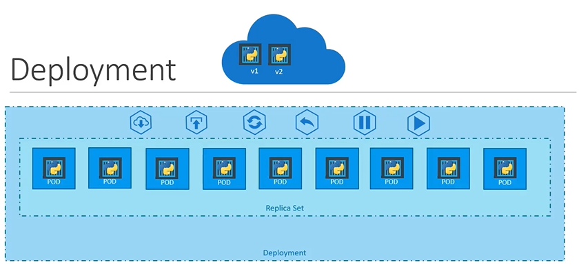

# Deployments
  - Take me to [Video Tutorial](https://kodekloud.com/topic/deployments-3/)

Here's a summary of the article on Kubernetes Deployments:

- **Kubernetes Deployments** provide capabilities for deploying applications in a production environment.
- **Objective**:
  - Deploy multiple instances of an application for scalability.
  - Upgrade instances seamlessly with newer versions of application builds.
  - Perform rolling updates to avoid service interruptions.
  - Ability to undo changes and perform rollbacks.
  - Pause and resume changes for multiple modifications to the environment.
- **Key Features of Deployments**:
  - **Scalability**: Deploy multiple instances of an application.
  - **Seamless Upgrades**: Upgrade instances with rolling updates to avoid service downtime.
  - **Rollback Changes**: Ability to revert to previous versions in case of errors.
  - **Pause and Resume**: Make multiple changes to the environment and apply them together.
- **Components**:
  - **Pods**: Instances of the application, encapsulated in containers.
  - **Replication Controllers or ReplicaSets**: Manage multiple pods.
  - **Deployment**: Kubernetes object for higher-level management.
- **Creating a Deployment**:
  - Write a deployment definition file in YAML format.
  - Contents similar to ReplicaSet definition file but with `kind: Deployment`.
  - Includes `API version`, `metadata` (name and labels), and `spec` (template, replicas, and selector).
  - Run `kubectl create` command with the deployment definition file to create the deployment.
- **Viewing Deployments**:
  - Use `kubectl get deployment` command to see the newly created deployment.
  - Deployment automatically creates a ReplicaSet.
  - Use `kubectl get ReplicaSet` to view the created ReplicaSet.
  - ReplicaSets create pods, view with `kubectl get pods`.
- **Differences between ReplicaSets and Deployments**:
  - Deployment is a higher-level Kubernetes object for application management.
  - Provides features for seamless upgrades, rolling updates, rollbacks, and pausing/resuming changes.
  - Use `kubectl get all` to see all the created objects at once, including the deployment, ReplicaSets, and pods.

Kubernetes Deployments offer a powerful way to manage and scale applications, providing flexibility and control in production environments.


In this section, we will take a look at kubernetes deployments

#### Deployment is a kubernetes object. 
  
 
  
#### How do we create deployment?

```
    apiVersion: apps/v1
    kind: Deployment
    metadata:
      name: myapp-deployment
      labels:
        app: myapp
        type: front-end
    spec:
     template:
        metadata:
          name: myapp-pod
          labels:
            app: myapp
            type: front-end
        spec:
         containers:
         - name: nginx-container
           image: nginx
     replicas: 3
     selector:
       matchLabels:
        type: front-end
 ```
- Once the file is ready, create the deployment using deployment definition file
  ```
  $ kubectl create -f deployment-definition.yaml
  ```
- To see the created deployment
  ```
  $ kubectl get deployment
  ```
- The deployment automatically creates a **`ReplicaSet`**. To see the replicasets
  ```
  $ kubectl get replicaset
  ```
- The replicasets ultimately creates **`PODs`**. To see the PODs
  ```
  $ kubectl get pods
  ```
    
  
  
- To see the all objects at once
  ```
  $ kubectl get all
  ```
  
  
K8s Reference Docs:
- https://kubernetes.io/docs/concepts/workloads/controllers/deployment/
- https://kubernetes.io/docs/tutorials/kubernetes-basics/deploy-app/deploy-intro/
- https://kubernetes.io/docs/concepts/cluster-administration/manage-deployment/
- https://kubernetes.io/docs/concepts/overview/working-with-objects/kubernetes-objects/
