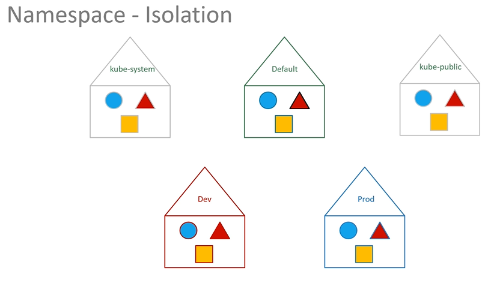

# Namespaces
  - Take me to [Video Tutorial](https://kodekloud.com/topic/namespaces/)


Here's a summary of the article on Kubernetes Namespaces:

- **Namespaces in Kubernetes** can be likened to houses, each with its own set of rules and resources.
- **Default Namespace**:
  - The default namespace is automatically created by Kubernetes.
  - It contains pods and services for internal purposes like networking and DNS.
- **Kube-system Namespace**:
  - Houses internal Kubernetes system services.
  - Keeps system resources separate from user resources.
- **Kube-public Namespace**:
  - Contains resources made available to all users.
- **Purpose of Namespaces**:
  - Isolate resources.
  - Prevent accidental modifications across different environments.
  - Apply specific policies and resource quotas.
- **Usage**:
  - In small environments, default namespace suffices.
  - For larger setups, create custom namespaces.
- **Resource Referencing**:
  - Resources within a namespace can refer to each other by name.
  - To reach services in other namespaces, use `servicename.namespace.svc.cluster.local` format.
- **Operational Aspects**:
  - Use `kubectl` commands to work with namespaces.
  - Use `-n` option to specify a namespace in commands.
  - To permanently set a namespace, use `kubectl config set-context` command.
- **Creating Namespaces**:
  - Use a namespace definition file with `apiVersion: v1`, `kind: Namespace`, and `metadata` specifying the name.
  - Run `kubectl create -f namespace-definition.yaml` to create the namespace.
  - Alternatively, use `kubectl create namespace dev` to create a namespace directly.
- **Switching Namespaces**:
  - Use `kubectl config set-context` to switch to a different namespace.
  - This allows for easier management of resources in different environments.
- **Viewing Pods**:
  - Use `kubectl get pods` to view pods in the current namespace.
  - Use `-n` option to specify a namespace to view pods in that namespace.
  - Use `--all-namespaces` to view pods across all namespaces.
- **Resource Quotas**:
  - Create resource quotas to limit resource usage in namespaces.
  - Define limits such as number of pods, CPU units, memory, etc. in a quota definition file.

Understanding and working with Kubernetes Namespaces allows for better organization, resource management, and isolation of resources within a Kubernetes cluster.


 
In this section, we will take a look at **`Namespaces`**

So far in this course we have created **`Objects`** such as **`PODs`**, **`Deployments`** and **`Services`** in our cluster. Whatever we have been doing we have been doing in a **`NAMESPACE`**.
- This namespace is the **`default`** namespace in kubernetes. It is automatically created when kubernetes is setup initially.

  
 
- You can create your own namespaces as well.

  
  
- To list the pods in default namespace
  ```
  $ kubectl get pods
  ```
- To list the pods in another namespace. Use **`kubectl get pods`** command along with the **`--namespace`** flag or argument.
  ```
  $ kubectl get pods --namespace=kube-system
  ```
  
  
- Here we have a pod definition file, when we create a pod with pod-definition file, the pod is created in the default namespace.

```
apiVersion: v1
kind: Pod
metadata:
  name: myapp-pod
  labels:
     app: myapp
     type: front-end
spec:
  containers:
  - name: nginx-container
    image: nginx
 ```
  ```
  $ kubectl create -f pod-definition.yaml
  ```
- To create the pod with the pod-definition file in another namespace, use the **`--namespace`** option.
  ```
  $ kubectl create -f pod-definition.yaml --namespace=dev
  ```
  

- If you want to make sure that this pod gets you created in the **`dev`** env all the time, even if you don't specify in the command line, you can move the **`--namespace`** definition into the pod-definition file.
```
apiVersion: v1
kind: Pod
metadata:
  name: myapp-pod
  namespace: dev
  labels:
     app: myapp
     type: front-end
spec:
  containers:
  - name: nginx-container
    image: nginx
 ```
  
  
  
- To create a new namespace, create a namespace definition as shown below and then run **`kubectl create`**
```
apiVersion: v1
kind: Namespace
metadata:
  name: dev
```

  ```
  $ kubectl create -f namespace-dev.yaml
  ```
  Another way to create a namespace
  ```
  $ kubectl create namespace dev
  ```
  
  
- By default, we will be in a **`default`** namespace. To switch to a particular namespace permenently run the below command.
  ```
  $ kubectl config set-context $(kubectl config current-context) --namespace=dev
  ```
- To view pods in all namespaces
  ```
  $ kubectl get pods --all-namespaces
  ```
  
  
- To limit resources in a namespace, create a resource quota. To create one start with **`ResourceQuota`** definition file.
```
apiVersion: v1
kind: ResourceQuota
metadata:
  name: compute-quota
  namespace: dev
spec:
  hard:
    pods: "10"
    requests.cpu: "4"
    requests.memory: 5Gi
    limits.cpu: "10"
    limits.memory: 10Gi
```
  ```
  $ kubectl create -f compute-quota.yaml
  ```
  
  
K8s Reference Docs:
- https://kubernetes.io/docs/concepts/overview/working-with-objects/namespaces/
- https://kubernetes.io/docs/tasks/administer-cluster/namespaces-walkthrough/
- https://kubernetes.io/docs/tasks/administer-cluster/namespaces/
- https://kubernetes.io/docs/tasks/administer-cluster/manage-resources/quota-memory-cpu-namespace/
- https://kubernetes.io/docs/tasks/access-application-cluster/list-all-running-container-images/
  
  
