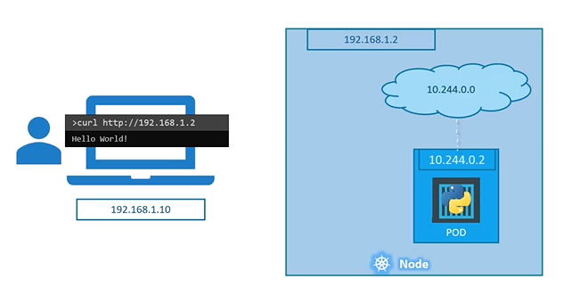
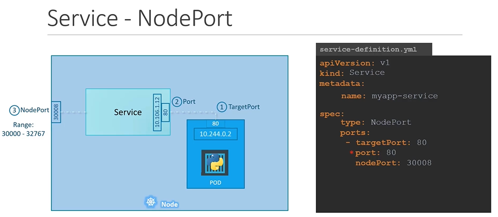

# Kubernetes Services
  - Take me to [Video Tutorial](https://kodekloud.com/topic/services-3/)

Here's a summary of the article on Kubernetes Services:

- **Kubernetes Services** facilitate communication between different components within and outside of an application.
- They help connect various groups of Pods, such as frontend, backend, and external data sources.
- Services enable loose coupling between microservices, allowing them to work together.
- **Use Cases**:
  - They enable external access to applications running on Pods.
  - They provide a way to map ports on the node to ports on Pods.
- **Types of Services**:
  - **NodePort**:
    - Listens to a port on the node and forwards requests to Pods.
    - Useful for external access.
  - **ClusterIP**:
    - Creates a virtual IP inside the cluster for communication between services.
  - **LoadBalancer**:
    - Provisions a load balancer in supported cloud providers.
    - Useful for load balancing across web servers, for instance.
- **Creating a NodePort Service**:
  - Use a definition file with `apiVersion: v1`, `kind: Service`, `metadata`, and `spec` sections.
  - Specify `type: NodePort` in the `spec`.
  - Define `ports`:
    - `targetPort`: Port on the Pod where the web server runs (e.g., 80).
    - `port`: Port on the service object itself (e.g., 80).
    - `nodePort`: Port on the node for external access (e.g., 30,008).
  - Use `selector` to link the service to Pods using labels.
- **Working with Multiple Pods**:
  - When multiple Pods have the same label (e.g., `app: myapp`), the service automatically selects all of them as endpoints.
  - The service acts as a built-in load balancer, distributing external requests among the Pods using a random algorithm.
- **Distributed Pods Across Nodes**:
  - Services created for multiple Pods across nodes automatically span all nodes in the cluster.
  - They map the target port to the same node port on all nodes.
  - This allows accessing the application using any node's IP and the same port number.
- **Flexibility and Adaptiveness**:
  - Whether it's a single Pod on a node, multiple Pods on a node, or multiple Pods across nodes, the service creation process remains the same.
  - Kubernetes automatically updates the service when Pods are added or removed, making it flexible and adaptive.

In summary, Kubernetes Services provide a vital function in enabling communication and external access to applications running on Pods. They simplify the process of load balancing, service discovery, and maintaining connectivity in dynamic Kubernetes environments.


In this section we will take a look at **`services`** in kubernetes

## Services
- Kubernetes Services enables communication between various components within and outside of the application.

  
  
#### Let's look at some other aspects of networking

## External Communication

- How do we as an **`external user`** access the **`web page`**?

  - From the node (Able to reach the application as expected)
  
    
    
  - From outside world (This should be our expectation, without something in the middle it will not reach the application)
  
    
   
    
 ## Service Types
 
 #### There are 3 types of service types in kubernetes
 
   
 
 1. NodePort
    - Where the service makes an internal port accessible on a port on the NODE.
      ```
      apiVersion: v1
      kind: Service
      metadata:
       name: myapp-service
      spec:
       types: NodePort
       ports:
       - targetPort: 80
         port: 80
         nodePort: 30008
      ```
     
      
      #### To connect the service to the pod
      ```
      apiVersion: v1
      kind: Service
      metadata:
       name: myapp-service
      spec:
       type: NodePort
       ports:
       - targetPort: 80
         port: 80
         nodePort: 30008
       selector:
         app: myapp
         type: front-end
       ```

    
      
      #### To create the service
      ```
      $ kubectl create -f service-definition.yaml
      ```
      
      #### To list the services
      ```
      $ kubectl get services
      ```
      
      #### To access the application from CLI instead of web browser
      ```
      $ curl http://192.168.1.2:30008
      ```
      
      

      #### A service with multiple pods
      
      
      
      #### When Pods are distributed across multiple nodes
     
      
     
            
 1. ClusterIP
    - In this case the service creates a **`Virtual IP`** inside the cluster to enable communication between different services such as a set of frontend servers to a set of backend servers.
    
 1. LoadBalancer
    - Where the service provisions a **`loadbalancer`** for our application in supported cloud providers.
    
K8s Reference Docs:
- https://kubernetes.io/docs/concepts/services-networking/service/
- https://kubernetes.io/docs/tutorials/kubernetes-basics/expose/expose-intro/

