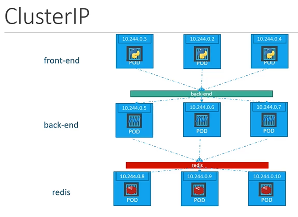

# Kubernetes Services - ClusterIP
  - Take me to [Video Tutorial](https://kodekloud.com/topic/services-cluster-ip-2/)

Here's a summary of the article on Kubernetes Service Cluster IP:

- **Objective**: The lecture discusses how Kubernetes Service Cluster IP helps establish connectivity between different tiers or services of a full-stack web application running on pods within a Kubernetes cluster.
  
- **Application Architecture**: A typical full-stack web app consists of various pods hosting different parts of the application, such as frontend web servers, backend servers, key-value stores like Redis, and persistent databases like MySQL.

- **Challenge**: The pods are assigned IP addresses, but these IPs are not static. Pods can go down and new ones are created frequently, making it unreliable to rely on IP addresses for internal communication within the application. Additionally, determining which pod a frontend pod should connect to can be complex.

- **Solution - Kubernetes Service**: A Kubernetes service helps group pods together and provides a single interface to access the pods within a group. For instance, a service for backend pods groups all backend pods together and offers a single interface for other pods to access this service. Requests are then forwarded to one of the pods under the service randomly.

- **Example Use Case**:
  - Create a service for backend pods to group them together.
  - Create additional services for Redis and allow backend pods to access Redis through the service.
  - This approach simplifies the deployment of a microservices-based application on a Kubernetes cluster.
  - Each layer of the application can scale or move without affecting communication between different services.

- **Cluster IP Service**:
  - Each service created gets an IP and name assigned inside the cluster.
  - Pods within the cluster use this name to access the service.
  - To create a Cluster IP service, use a definition file with the following specifications:
    - `apiVersion: v1`, `kind: Service`, `metadata`, and `spec`.
    - `type: ClusterIP` (default if not specified).
    - `ports`:
      - `targetPort`: The port where the backend is exposed (e.g., 80).
      - `port`: The port where the service is exposed, also 80 in this case.
    - Use `selector` to link the service to a set of pods by copying the labels from the pod definition file.

- **Creating the Service**:
  - Use `kubectl create` command to create the service.
  - Check the status of the service using `kubectl get services` command.
  - The service can now be accessed by other pods using either the cluster IP or the service name.

This approach simplifies the communication between different tiers of the application and provides a stable, scalable method for pods to interact within a Kubernetes cluster.


------------------

Here's a summary of the article on the Load Balancer type of service in Kubernetes:

- **Objective**: The lecture introduces the Load Balancer type of service in Kubernetes, which helps in making front-end applications accessible to external users through a single URL.

- **NodePort Service Recap**: Previously, the NodePort service was discussed, which allows making an external-facing application available on a port on the worker nodes.

- **Challenge**: The focus now shifts to front-end applications, like the voting app and result app, hosted on worker nodes in a cluster. While NodePort services can make these accessible, it requires users to use different IP addresses and port combinations for each node.

- **Desired Solution**: End users typically prefer a single URL (like votingapp.com or resultapp.com) to access the application, rather than multiple IP addresses and ports.

- **Manual Load Balancer Approach**:
  - One way to achieve this is by creating a new virtual machine (VM) for load balancer purposes.
  - Install and configure a suitable load balancer such as HAProxy or nginx on this VM.
  - Configure the load balancer to route traffic to the underlying nodes.
  - However, setting up and managing this external load balancer can be cumbersome.

- **Cloud Platform Integration**:
  - Kubernetes supports integration with native load balancers provided by certain cloud platforms like Google Cloud Platform (GCP), AWS, and Azure.
  - Leveraging the native load balancer of the cloud platform simplifies the process and configuration.
  - Set the type of service for front-end services to LoadBalancer instead of NodePort.
  - This works seamlessly on supported cloud platforms like GCP, AWS, and Azure, automatically configuring the load balancing for the service.
  - Note that setting the service type to LoadBalancer in an unsupported environment (like VirtualBox) would behave the same as NodePort, without external load balancing.

- **Implementation in Cloud Platforms**:
  - In demos of deploying applications on cloud platforms (GCP, AWS, Azure), the LoadBalancer type will be demonstrated, showing the automatic configuration of load balancing.

- **Conclusion**:
  - Using the LoadBalancer service type in Kubernetes simplifies the process of making front-end applications accessible through a single URL.
  - Supported cloud platforms like GCP, AWS, and Azure integrate seamlessly with Kubernetes to provide native load balancing capabilities for services.

This approach provides end users with a single, user-friendly URL to access front-end applications, enhancing accessibility and usability while leveraging the native load balancing features of supported cloud platforms.


  
In this section we will take a look at **`services - ClusterIP`** in kubernetes
         
## ClusterIP
- In this case the service creates a **`Virtual IP`** inside the cluster to enable communication between different services such as a set of frontend servers to a set of backend servers.
    
    
    
#### What is a right way to establish connectivity between these services or tiers  
- A kubernetes service can help us group the pods together and provide a single interface to access the pod in a group.

  
  
#### To create a service of type ClusterIP
```
apiVersion: v1
kind: Service
metadata:
 name: back-end
spec:
 types: ClusterIP
 ports:
 - targetPort: 80
   port: 80
 selector:
   app: myapp
   type: back-end
```
```
$ kubectl create -f service-definition.yaml
```

#### To list the services
```
$ kubectl get services
```
  
   
K8s Reference Docs:
- https://kubernetes.io/docs/concepts/services-networking/service/
- https://kubernetes.io/docs/tutorials/kubernetes-basics/expose/expose-intro/
