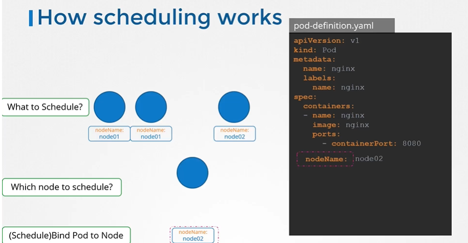

# Manual Scheduling
  - Take me to [Video Tutorial](https://kodekloud.com/topic/manual-scheduling/)


Here's a summary of the article on manually scheduling pods on nodes in Kubernetes:

- **Objective**: The lecture discusses how to manually schedule pods on nodes in Kubernetes when there is no scheduler available.

- **Scheduling Pods with a Scheduler**:
  - Normally, the scheduler in Kubernetes automatically assigns pods to nodes based on available resources.
  - The scheduler looks for pods without the "Node Name" field set in their specifications.
  - It then uses a scheduling algorithm to determine the appropriate node and sets the "Node Name" field accordingly.
  - This process creates a binding object to schedule the pod on the selected node.

- **Manually Assigning Pods**:
  - Without a scheduler, pods remain in a pending state until assigned to a node.
  - To manually assign a pod to a node, set the "Node Name" field in the pod specification file during pod creation.
  - This method allows direct assignment of the pod to a specific node.
  - However, the "Node Name" can only be specified during the initial creation of the pod.

- **Assigning Nodes to Existing Pods**:
  - If a pod is already created and needs to be assigned to a node, direct modification of the "Node Name" field is not allowed.
  - An alternative method is to create a binding object and send a POST request to the pod's binding API.
  - In the binding object, specify the target node with its name, and send the request in JSON format to the pod's binding API.

- **Steps for Manual Scheduling**:
  - Create a binding object in JSON format with the target node's name.
  - Send a POST request to the pod's binding API with the binding object data.
  - This mimics the action of the scheduler in assigning the pod to the specified node.

- **Practice and Conclusion**:
  - The lecture encourages practicing manual pod scheduling on nodes.
  - It emphasizes the need to convert YAML files to their equivalent JSON form for the binding object.
  - The manual scheduling method provides a workaround when there is no scheduler available to automatically assign pods to nodes.

In summary, the lecture explains the process of manually scheduling pods on nodes in Kubernetes. It details the steps to set the "Node Name" field during pod creation and the use of binding objects with POST requests to assign nodes to existing pods. This manual scheduling method is useful when a scheduler is not present in the cluster.


-----------------------------------------------------------------  
In this section, we will take a look at **`Manually Scheduling`** a **`POD`** on a node.

## How Scheduling Works
- What do you do when you do not have a scheduler in your cluster?
  - Every POD has a field called NodeName that by default is not set. You don't typically specify this field when you create the manifest file, kubernetes adds it automatically.
  - Once identified it schedules the POD on the node by setting the nodeName property to the name of the node by creating a binding object.
    ```
    apiVersion: v1
    kind: Pod
    metadata:
     name: nginx
     labels:
      name: nginx
    spec:
     containers:
     - name: nginx
       image: nginx
       ports:
       - containerPort: 8080
     nodeName: node02
    ```
    
    
## No Scheduler
  - You can manually assign pods to node itself. Well without a scheduler, to schedule pod is to set **`nodeName`** property in your pod definition file while creating a pod.
    
    
    
  - Another way
    ```
    apiVersion: v1
    kind: Binding
    metadata:
      name: nginx
    target:
      apiVersion: v1
      kind: Node
      name: node02
    ```
    ```
    apiVersion: v1
    kind: Pod
    metadata:
     name: nginx
     labels:
      name: nginx
    spec:
     containers:
     - name: nginx
       image: nginx
       ports:
       - containerPort: 8080
    ```
    
    
    
K8s Reference Docs:
- https://kubernetes.io/docs/reference/using-api/api-concepts/
- https://kubernetes.io/docs/concepts/scheduling-eviction/assign-pod-node/#nodename
    
    
   
