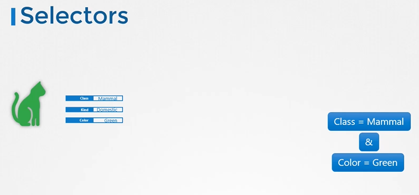
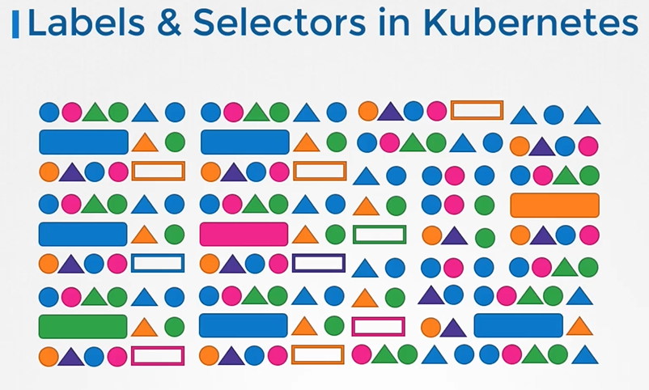
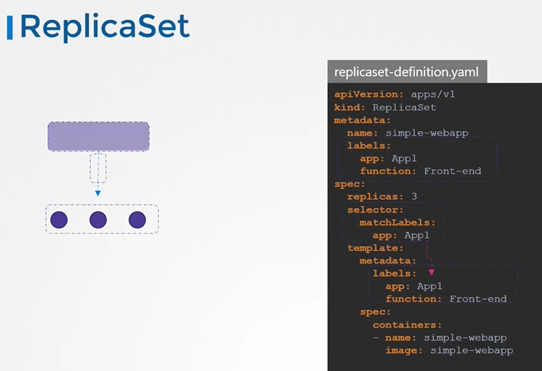
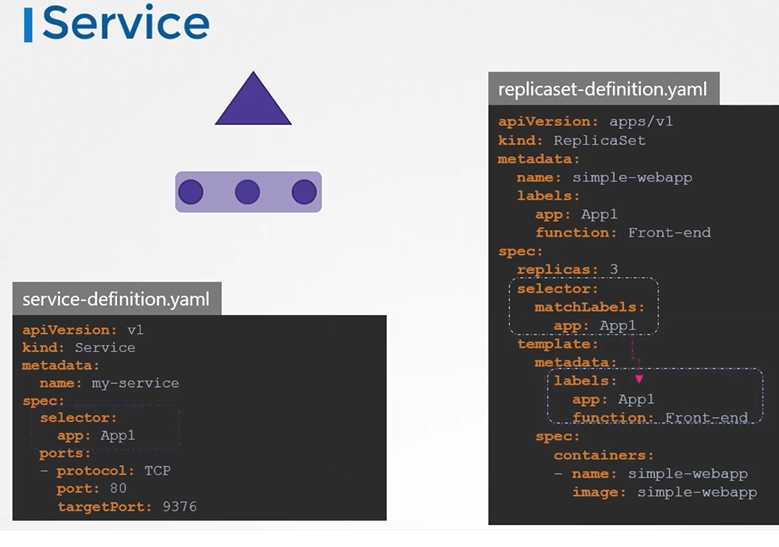
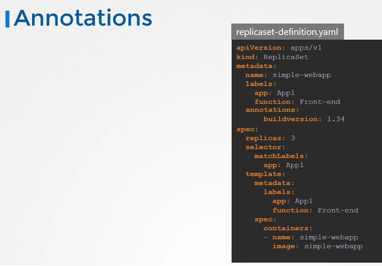

# Labels and Selectors
  - Take me to [Video Tutorial](https://kodekloud.com/topic/labels-and-selectors/)


Here's a summary of the article "Introduction to Labels, Selectors, and Annotations in Kubernetes":

### Overview:
- The article provides an introduction to the concepts of labels, selectors, and annotations in Kubernetes.
- These features are essential for grouping, filtering, and adding metadata to Kubernetes objects.

### Labels and Selectors:
- **Definition**: Labels are properties attached to Kubernetes objects to categorize and group them.
- **Purpose**: They enable filtering and selection of specific objects based on defined criteria.
- **Usage**:
  - Labels are added to objects (e.g., pods) using key-value pairs.
  - Example: `app: app1`, `function: backend`, etc.
  - Selectors are used to filter objects based on label criteria.
  - Example: `app=app1` to filter pods with the label `app` equal to `app1`.

### Application in Kubernetes:
- **Object Management**:
  - Labels and selectors help manage and organize Kubernetes objects.
  - They allow grouping objects by type, application, function, etc.
- **Implementation**:
  - In a pod definition file, labels are specified under the `metadata` section.
  - Example: `labels: app: app1, function: backend`.
  - To select pods with specific labels, use `kubectl get pods` with the `--selector` option.
  - Example: `kubectl get pods --selector app=app1`.

### Use Case: Replica Sets:
- **Replica Sets**:
  - Labels are crucial for connecting pods to a replica set.
  - Labels are defined both in the pod template and the replica set itself.
  - The `selector` field in the replica set matches the labels of the pods it manages.

### Annotations:
- **Definition**: Annotations are additional details added to Kubernetes objects for informational purposes.
- **Purpose**: They record tool details, contact information, or other metadata not used for filtering.
- **Usage**:
  - Annotations are used for integrations or informative data.
  - Example: Tool name, version, build info, contact details, etc.

### Conclusion:
- Labels, selectors, and annotations are vital tools in Kubernetes for managing, filtering, and adding metadata to objects.
- Labels group objects, selectors filter them based on criteria, and annotations provide additional information.
- Understanding and practicing with labels and selectors is crucial for effective Kubernetes object management.

The article serves as a foundational guide for beginners in Kubernetes, explaining the significance and usage of labels, selectors, and annotations in managing objects within a Kubernetes cluster.

______________________________________________________

  
In this section, we will take a look at **`Labels and Selectors`**

#### Labels and Selectors are standard methods to group things together.
  
#### Labels are properties attached to each item.

  
  
#### Selectors help you to filter these items
 
  
  
How are labels and selectors are used in kubernetes?
- We have created different types of objects in kubernetes such as **`PODs`**, **`ReplicaSets`**, **`Deployments`** etc.
  
  
  
How do you specify labels?
   ```
    apiVersion: v1
    kind: Pod
    metadata:
     name: simple-webapp
     labels:
       app: App1
       function: Front-end
    spec:
     containers:
     - name: simple-webapp
       image: simple-webapp
       ports:
       - containerPort: 8080
   ```
 
 
Once the pod is created, to select the pod with labels run the below command
```
$ kubectl get pods --selector app=App1
```

Kubernetes uses labels to connect different objects together
   ```
    apiVersion: apps/v1
    kind: ReplicaSet
    metadata:
      name: simple-webapp
      labels:
        app: App1
        function: Front-end
    spec:
     replicas: 3
     selector:
       matchLabels:
        app: App1
    template:
      metadata:
        labels:
          app: App1
          function: Front-end
      spec:
        containers:
        - name: simple-webapp
          image: simple-webapp   
   ```

  

For services
 
      ```
      apiVersion: v1
      kind: Service
      metadata:
       name: my-service
      spec:
       selector:
         app: App1
       ports:
       - protocol: TCP
         port: 80
         targetPort: 9376 
       ```
  
  
## Annotations
- While labels and selectors are used to group objects, annotations are used to record other details for informative purpose.
    ```
    apiVersion: apps/v1
    kind: ReplicaSet
    metadata:
      name: simple-webapp
      labels:
        app: App1
        function: Front-end
      annotations:
         buildversion: 1.34
    spec:
     replicas: 3
     selector:
       matchLabels:
        app: App1
    template:
      metadata:
        labels:
          app: App1
          function: Front-end
      spec:
        containers:
        - name: simple-webapp
          image: simple-webapp   
    ```
  

K8s Reference Docs:
- https://kubernetes.io/docs/concepts/overview/working-with-objects/labels/
