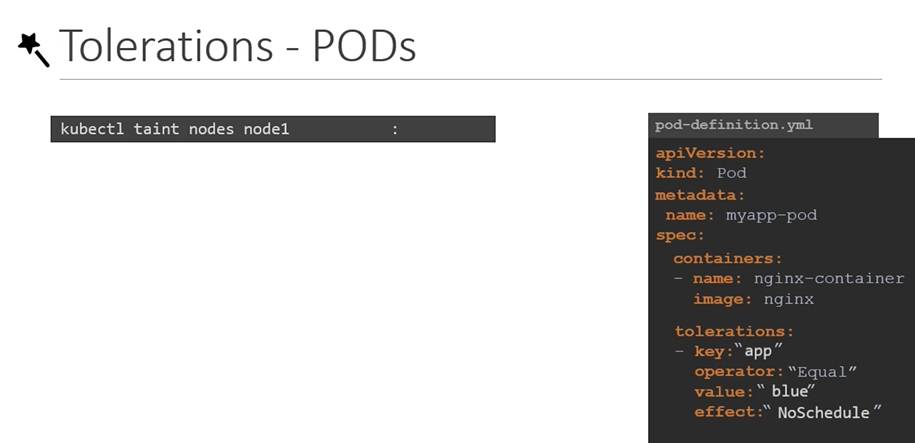

# Taints and Tolerations
  - Take me to [Video Tutorial](https://kodekloud.com/topic/taints-and-tolerations-2/)

Here's a summary of the article "Understanding Taints and Tolerations in Kubernetes":

### Overview:
- The article explains the concepts of taints and tolerations in Kubernetes.
- It uses an analogy of bugs (pods) approaching a person (node) sprayed with repellent spray (taint) to describe how taints and tolerations work.

### Taints and Tolerations:
- **Definition**:
  - **Taints**: Restrictions set on nodes to control which pods can be scheduled on them.
  - **Tolerations**: Pod specifications indicating which taints they can tolerate.

### Application with Nodes and Pods:
- **Scenario**:
  - Consider a cluster with three worker nodes named one, two, and three.
  - Pods A, B, C, and D are to be deployed on these nodes.

### Taints on Nodes:
- **Purpose**:
  - Taints restrict pods from being scheduled on nodes unless the pods have tolerations.
  - Example: Tainting node one with the key "app=blue" to dedicate it to specific pods.

### Tolerations on Pods:
- **Usage**:
  - Pods must specify tolerations for taints they can tolerate.
  - Example: Pod D is given a toleration for the taint "app=blue" on node one.

### Taint Effects:
- **Effects**:
  - `NoSchedule`: Pods won't be scheduled on the node.
  - `PreferNoSchedule`: System tries to avoid placing pods on the node.
  - `NoExecute`: New pods won't be scheduled, existing pods may be evicted.

### Commands and Syntax:
- **Taints**:
  - `kubectl taint nodes <node-name> <key>=<value>:<effect>` to taint a node.
  - Example: `kubectl taint nodes node1 app=blue:NoSchedule`

- **Tolerations**:
  - Add a `tolerations` section in pod definition YAML.
  - Example:
    ```yaml
    tolerations:
    - key: "app"
      operator: "Equal"
      value: "blue"
      effect: "NoSchedule"
    ```

### Pod Scheduling:
- **Process**:
  - Scheduler places pods based on taints and tolerations.
  - Pod A and B are thrown off node one due to taint, while pod D (tolerant) is accepted.
  - Pod D is scheduled on node one, adhering to taints and tolerations.

### NoExecute Taint Effect:
- **Scenario**:
  - With `NoExecute`, existing pods on tainted nodes are evicted.
  - Example: Pod C is evicted from node one after taint "app=blue" is applied.

### Master Node Taint:
- **Observation**:
  - By default, no pods are scheduled on master nodes in Kubernetes clusters.
  - A taint "NoSchedule" is set on master nodes to prevent pod scheduling.
  - It's a best practice to avoid deploying application workloads on master nodes.

### Conclusion:
- Taints and tolerations in Kubernetes control pod scheduling on nodes.
- Taints restrict nodes, and tolerations allow specific pods to be scheduled on tainted nodes.
- They are used to enforce policies on pod placement within the cluster.

The article provides a detailed understanding of taints and tolerations in Kubernetes, using a practical analogy and examples. It emphasizes how these mechanisms control and optimize pod scheduling on nodes, ensuring efficient resource utilization within the cluster.

___________________________________________________________________________________________________


In this section, we will take a look at taints and tolerations.
- Pod to node relationship and how you can restrict what pods are placed on what nodes.

#### Taints and Tolerations are used to set restrictions on what pods can be scheduled on a node. 
- Only pods which are tolerant to the particular taint on a node will get scheduled on that node.

  
  
## Taints
- Use **`kubectl taint nodes`** command to taint a node.

  Syntax
  ```
  $ kubectl taint nodes <node-name> key=value:taint-effect
  ```
 
  Example
  ```
  $ kubectl taint nodes node1 app=blue:NoSchedule
  ```
  
- The taint effect defines what would happen to the pods if they do not tolerate the taint.
- There are 3 taint effects
  - **`NoSchedule`**
  - **`PreferNoSchedule`**
  - **`NoExecute`**
  
  
  
## Tolerations
   - Tolerations are added to pods by adding a **`tolerations`** section in pod definition.
     ```
     apiVersion: v1
     kind: Pod
     metadata:
      name: myapp-pod
     spec:
      containers:
      - name: nginx-container
        image: nginx
      tolerations:
      - key: "app"
        operator: "Equal"
        value: "blue"
        effect: "NoSchedule"
     ```
    
  
    

#### Taints and Tolerations do not tell the pod to go to a particular node. Instead, they tell the node to only accept pods with certain tolerations.
- To see this taint, run the below command
  ```
  $ kubectl describe node kubemaster |grep Taint
  ```
 
 
  
     
#### K8s Reference Docs
- https://kubernetes.io/docs/concepts/scheduling-eviction/taint-and-toleration/

