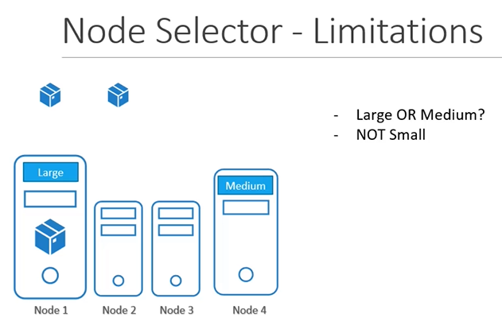

# Node Selectors
  - Take me to [Video Tutorial](https://kodekloud.com/topic/node-selectors/)

Here's a summary of the article "Understanding Node Selectors in Kubernetes":

### Overview:
- The article explains the concept of node selectors in Kubernetes.
- It presents a scenario where specific workloads need to be directed to nodes with particular hardware resources.
- Node selectors allow for the specification of which nodes pods should be scheduled on based on labels.

### Scenario:
- Consider a Kubernetes cluster with three nodes: two smaller nodes and one larger node with higher resources.
- There's a desire to dedicate data processing workloads to the larger node for better resource utilization.

### Using Node Selectors:
- **Definition**:
  - Node selectors are a method to constrain which nodes pods are eligible to be scheduled on.

### Implementation:
- **Pod Definition**:
  - In the pod definition file, a new property called `nodeSelector` is added under the `spec` section.
  - Example: `nodeSelector: size=large`

- **Node Labels**:
  - The key-value pairs used in `nodeSelector` (like `size=large`) are labels assigned to the nodes.
  - Nodes must be labeled appropriately before using node selectors.

### Labeling Nodes:
- **Command**:
  - Use `kubectl label nodes <node-name> <label-key>=<label-value>` to label a node.
  - Example: `kubectl label nodes node1 size=large`

- **Purpose**:
  - Labels allow the scheduler to match and identify the right node for placing the pods.

### Limitations of Node Selectors:
- **Complex Requirements**:
  - Node selectors are simple but limited to using a single label and selector.
  - More complex requirements, like selecting nodes based on multiple conditions, cannot be achieved with node selectors alone.

### Conclusion:
- Node selectors in Kubernetes allow for basic selection of nodes based on labels.
- They are easy to implement and serve the purpose when a straightforward node selection is required.
- For more complex scenarios, where multiple conditions or rules are needed for node selection, node affinity and anti-affinity features are introduced, which will be discussed in the next part.

The article provides a clear understanding of how node selectors work in Kubernetes, demonstrating their use in directing specific workloads to nodes with desired characteristics. It emphasizes the importance of labeling nodes correctly and highlights the simplicity and limitations of node selectors, paving the way for the introduction of more advanced features for complex node selection requirements.

_________________________________________________________________________

In this section, we will take a look at Node Selectors in Kubernetes

#### We add new property called Node Selector to the spec section and specify the label.
- The scheduler uses these labels to match and identify the right node to place the pods on.
  ```
  apiVersion: v1
  kind: Pod
  metadata:
   name: myapp-pod
  spec:
   containers:
   - name: data-processor
     image: data-processor
   nodeSelector:
    size: Large
  ```

  
- To label nodes

  Syntax
  ```
  $ kubectl label nodes <node-name> <label-key>=<label-value>
  ```
  Example
  ```
  $ kubectl label nodes node-1 size=Large
  ```
  

  
- To create a pod definition
  ```
  apiVersion: v1
  kind: Pod
  metadata:
   name: myapp-pod
  spec:
   containers:
   - name: data-processor
     image: data-processor
   nodeSelector:
    size: Large
  ```
  ```
  $ kubectl create -f pod-definition.yml
  ```
  

  
## Node Selector - Limitations
- We used a single label and selector to achieve our goal here. But what if our requirement is much more complex.
  

 
- For this we have **`Node Affinity and Anti Affinity`**
  
#### K8s Reference Docs
- https://kubernetes.io/docs/concepts/scheduling-eviction/assign-pod-node/#nodeselector


