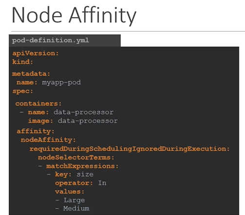
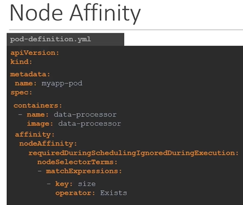

# Node Affinity
  - Take me to the [Video Tutorial](https://kodekloud.com/topic/node-affinity-2/)


Here's a summary of the article "Understanding Node Affinity in Kubernetes":

### Overview:
- The article delves into the concept of node affinity in Kubernetes, focusing on directing pods to specific nodes based on advanced criteria.
- Node affinity provides more sophisticated control compared to simple node selectors.

### Node Affinity:
- **Purpose**:
  - Node affinity ensures that pods are hosted on particular nodes, allowing for better resource allocation and management.

### Basic Structure:
- In the pod specification, under `spec`, there's a section for `affinity` and then `nodeAffinity`.
- The key property is `"requiredDuringSchedulingIgnoredDuringExecution"`.
  - This defines when the affinity rules are enforced: during pod scheduling and ignored once the pod is running.

### Node Selector Terms:
- NRA (Node Selector Terms) is used to specify the key-value pairs.
- Syntax: `"key, operator, value"`.
  - For example: `"size, In, large"` ensures that the pod is placed on a node labeled with "size=large".

### Advanced Operators:
- **In Operator**:
  - Places the pod on a node with a label having any value in the specified list.
  - Example: `"size, In, large, medium"`.

- **NotIn Operator**:
  - Ensures that the pod is not placed on nodes with a certain label value.
  - Example: `"size, NotIn, small"`.

- **Exists Operator**:
  - Checks if the label exists on the nodes, without comparing values.
  - Useful for scenarios where certain nodes don't have a particular label.

### Node Affinity Types:
1. **Required During Scheduling, Ignored During Execution**:
   - Scheduler mandates that the pod be placed on a matching node.
   - If no matching node is found during scheduling, the pod is not scheduled.

2. **Preferred During Scheduling, Ignored During Execution**:
   - Scheduler tries to place the pod on a matching node.
   - If no matching node is found during scheduling, the pod is placed on any available node.

### During Execution:
- When a pod is already running and changes occur in node labels:
  - Current types have this phase set to "ignored", meaning changes in node affinity won't impact running pods.
  - Future types may introduce "Required During Execution", which would evict pods not matching new affinity rules.

### Conclusion:
- Node affinity provides advanced control over pod placement in Kubernetes clusters.
- It allows for complex rules based on node labels and operators.
- The choice between "Required During Scheduling" and "Preferred During Scheduling" depends on the importance of pod placement.
- Node affinity ensures efficient resource allocation and optimal pod placement based on specified criteria.

The article explains how to use node affinity to direct pods to specific nodes based on advanced criteria, detailing the syntax, operators, and types of node affinity. It emphasizes the importance of efficient pod placement and provides insights into managing pods based on changing node configurations.


________________________________________________________________________________________________________________
In this section, we will talk about "Node Affinity" feature in kubernetes.

#### The primary feature of Node Affinity is to ensure that the pods are hosted on particular nodes.
- With **`Node Selectors`** we cannot provide the advance expressions.
  ```
  apiVersion: v1
  kind: Pod
  metadata:
   name: myapp-pod
  spec:
   containers:
   - name: data-processor
     image: data-processor
   nodeSelector:
    size: Large
  ```
  
  ```
  apiVersion: v1
  kind: Pod
  metadata:
   name: myapp-pod
  spec:
   containers:
   - name: data-processor
     image: data-processor
   affinity:
     nodeAffinity:
       requiredDuringSchedulingIgnoredDuringExecution:
          nodeSelectorTerms:
          - matchExpressions:
            - key: size
              operator: In
              values: 
              - Large
              - Medium
  ```
  
  
  ```
  apiVersion: v1
  kind: Pod
  metadata:
   name: myapp-pod
  spec:
   containers:
   - name: data-processor
     image: data-processor
   affinity:
     nodeAffinity:
       requiredDuringSchedulingIgnoredDuringExecution:
          nodeSelectorTerms:
          - matchExpressions:
            - key: size
              operator: NotIn
              values: 
              - Small
  ```
  
  
  ```
  apiVersion: v1
  kind: Pod
  metadata:
   name: myapp-pod
  spec:
   containers:
   - name: data-processor
     image: data-processor
   affinity:
     nodeAffinity:
       requiredDuringSchedulingIgnoredDuringExecution:
          nodeSelectorTerms:
          - matchExpressions:
            - key: size
              operator: Exists
  ```
  
  
  

## Node Affinity Types
- Available
  - requiredDuringSchedulingIgnoredDuringExecution
  - preferredDuringSchedulingIgnoredDuringExecution
- Planned
  - requiredDuringSchedulingRequiredDuringExecution
  - preferredDuringSchedulingRequiredDuringExecution
  
  
  
## Node Affinity Types States

  
  
  
  
#### K8s Reference Docs
- https://kubernetes.io/docs/tasks/configure-pod-container/assign-pods-nodes-using-node-affinity/
- https://kubernetes.io/blog/2017/03/advanced-scheduling-in-kubernetes/
