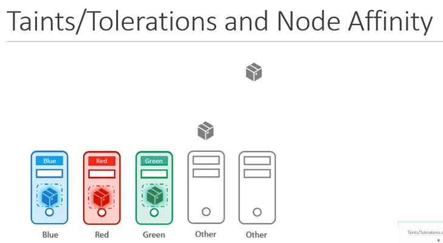

 -----------------

In Kubernetes, "taints and tolerations" and "node affinity" are mechanisms used to control which pods can be scheduled on which nodes in a cluster.

### Taints and Tolerations:
- **Taints**: Taints are properties assigned to nodes that repel certain pods. They are used to repel pods from being scheduled onto nodes unless the pod has a specific "toleration" for that taint. A node can have multiple taints, and each taint consists of a key, value, and effect.
  - **Key**: A string that defines the taint's category, such as "environment" or "hardware".
  - **Value**: A string that further defines the taint.
  - **Effect**: Specifies whether the taint repels pods that do not tolerate it (`NoSchedule`), or just marks them (`PreferNoSchedule`).

- **Tolerations**: Tolerations are set on pods, allowing them to be scheduled on nodes with matching taints. A pod can have multiple tolerations, each consisting of a key, value, effect, and optional operator.
  - **Key** and **Value**: Should match the taint's key and value.
  - **Effect**: Must match the taint's effect.
  - **Operator**: Defines how the toleration matches the taint. Commonly used values are `Exists` (if the key exists, it's tolerated) and `Equal` (key and value must match).

### Node Affinity:
- **Node Affinity**: Node affinity, on the other hand, is a more generalized way to dictate the scheduling of pods based on node properties. It allows you to specify rules that constrain which nodes the pod can be scheduled based on labels assigned to nodes.
  - **RequiredDuringSchedulingIgnoredDuringExecution**: Specifies rules that must be met for a pod to be scheduled onto a node. If a pod does not match the rules, it will not be scheduled.
  - **PreferredDuringSchedulingIgnoredDuringExecution**: Specifies preferences rather than hard requirements. Pods that match the rules will be given preference in scheduling.

### Differences:
- **Purpose**:
  - Taints and tolerations are used when you have specific nodes with certain properties, like GPUs, specialized hardware, or different environments, and you want to ensure that only specific pods can be scheduled on those nodes.
  - Node affinity, on the other hand, is used when you want to control where your pods are placed based on node properties like region, zone, or any custom labels.

- **Usage**:
  - Taints and tolerations are more granular and precise, used for scenarios where you need explicit control over which pods can land on which nodes.
  - Node affinity is more general and can be used to guide the scheduler to place pods on nodes that have certain characteristics.

In summary, if you need fine-grained control over where specific pods are scheduled based on node properties, use taints and tolerations. If you have broader constraints or preferences for pod placement based on node labels, use node affinity rules. Often, you might find a combination of both used in complex deployments to achieve the desired scheduling behavior.
-----------------
# Taints and Tolerations vs Node Affinity
  - Take me to [Video Tutorial](https://kodekloud.com/topic/taints-and-tolerations-vs-node-affinity/)
Here's a summary of the article "Tying Together Taints, Tolerations, and Node Affinity":

### Objective:
- The article aims to demonstrate a combined approach using taints, tolerations, and node affinity in Kubernetes.
- The goal is to ensure specific pods (`blue`, `red`, `green`) are placed on corresponding nodes (`blue`, `red`, `green`) while preventing unwanted pod-node assignments.

### Approach:
1. **Taints and Tolerations**:
   - Apply taints to nodes (`blue`, `red`, `green`) to mark them with their respective colors.
   - Set tolerations on pods (`blue`, `red`, `green`) to tolerate the taints of their corresponding colors.
   - This ensures that each colored pod is placed on its respective colored node.
   - However, other pods may still end up on these nodes, which is not desired.

2. **Node Affinity**:
   - Label the nodes with their colors (`blue`, `red`, `green`).
   - Set node selectors on pods (`blue`, `red`, `green`) to specify affinity to their respective colored nodes.
   - This ensures that each colored pod is placed on its corresponding colored node.
   - However, it doesn't prevent other pods from being placed on these

______________________________________________________________________________________________
In this section, we will take a look at Taints and Tolerations vs Node Affinity
- Taints and Tolerations do not guarantee that the pods will only prefer these nodes; in this case, the red pods may end up on one of the other nodes that do not have a taint or toleration set.
  
  
  
 
- As such, a combination of taints and tolerations and node affinity rules can be used together to completely dedicate nodes for specific parts.

  

  
#### K8s Reference Docs:
- https://kubernetes.io/docs/concepts/scheduling-eviction/taint-and-toleration/
- https://kubernetes.io/docs/tasks/configure-pod-container/assign-pods-nodes-using-node-affinity/
