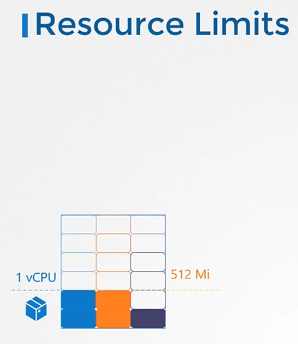
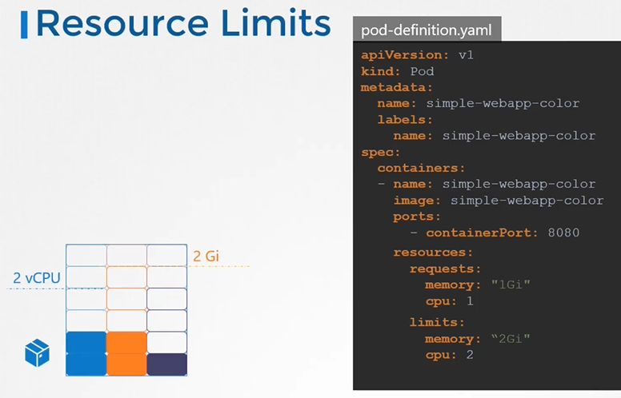
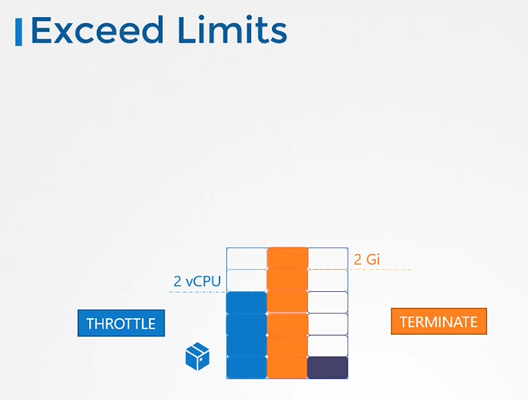

# Resource Limits
  - Take me to [Video Tutorials](https://kodekloud.com/topic/resource-limits/)

Here's a summary of the article on "Resource Requirements in Kubernetes":

### Introduction:
- The article explores resource requirements for pods in a Kubernetes cluster.
- It discusses how Kubernetes scheduler determines pod placement based on resource availability on nodes.
  
### Resource Requests:
- Each pod requires specific CPU and memory resources to run.
- Kubernetes scheduler considers these resource requests when placing pods on nodes.
- Pods' resource requests are defined in the `resources` section of the pod definition file.
- Example: Requesting 4 gibibyte of memory and 2 CPUs for a pod.

### Understanding CPU Requests:
- CPUs can be specified in fractions like 0.1, also represented as 100m (m for milli).
- One CPU count (1) is equivalent to one vCPU in AWS or one core in GCP/Azure.
- Example: Requesting 5 CPUs for a container.

### Understanding Memory Requests:
- Memory can be specified in units like Mi, Gi (mebibytes, gibibytes).
- There's a distinction between G (gigabyte) and Gi (gibibyte).
- Example: Requesting 256 mebibytes of memory for a container.

### Setting Resource Limits:
- By default, containers can use unlimited resources.
- Limits can be set to restrict resource consumption.
- Limits are specified in the `limits` section of the pod definition file.
- Example: Limiting a container to 512 mebibytes of memory.

### Handling Resource Exceedance:
- If a container exceeds its CPU limit, the system throttles its usage.
- If a container exceeds its memory limit, it may be terminated (OOM error).

### Default Configuration:
- Kubernetes does not have default CPU or memory requests or limits.
- Pods can consume all available resources, affecting other pods.
  
### Ideal Resource Configurations:
- **No Requests or Limits**: Not recommended; allows pods to consume all resources.
- **No Requests, Only Limits**: Kubernetes sets requests equal to limits automatically.
- **Requests and Limits**: Pods have guaranteed requests and can go up to defined limits.
- **Requests Only, No Limits**: Pods have guaranteed requests; can use available resources.
  
### Use Cases:
- Setting limits is useful for preventing misuse, like Bitcoin mining.
- Setting requests ensures pods have guaranteed resources when limits are not set.
- Not setting limits allows flexibility but requires ensuring all pods have requests.
  
### Limit Ranges:
- Limit ranges set default values for containers in pods.
- Define defaults, max, and min values for CPU and memory in a limit range object.
- Enforced when creating new pods; existing pods are not affected.

### Resource Quotas:
- Resource quotas limit total resources consumed by all pods in a namespace.
- Set hard limits for requests and limits at the namespace level.
- Example: Limiting total CPU and memory consumption for all pods in a namespace.

### Conclusion:
- Understanding resource requests and limits is crucial for efficient pod management.
- Kubernetes provides flexibility to set requests, limits, default values, and quotas.
- Careful consideration of resource needs and configurations ensures optimal cluster performance.

The article concludes with references to Kubernetes documentation for more information and encourages readers to explore labs for practical application.


___________________________________________________________________________________________________
 
In this section we will take a look at Resource Limits

#### Let us take a look at 3 node kubernetes cluster.
- Each node has a set of CPU, Memory and Disk resources available.
- If there is no sufficient resources available on any of the nodes, kubernetes holds the scheduling the pod. You will see the pod in pending state. If you look at the events, you will see the reason as insufficient CPU.
  
  
  
## Resource Requirements
- By default, K8s assume that a pod or container within a pod requires **`0.5`** CPU and **`256Mi`** of memory. This is known as the **`Resource Request` for a container**.
  
  
  
- If your application within the pod requires more than the default resources, you need to set them in the pod definition file.

  ```
  apiVersion: v1
  kind: Pod
  metadata:
    name: simple-webapp-color
    labels:
      name: simple-webapp-color
  spec:
   containers:
   - name: simple-webapp-color
     image: simple-webapp-color
     ports:
      - containerPort:  8080
     resources:
       requests:
        memory: "1Gi"
        cpu: "1"
  ```
   
   
## Resources - Limits
- By default, k8s sets resource limits to 1 CPU and 512Mi of memory
  
  
  
- You can set the resource limits in the pod definition file.
  
  ```
  apiVersion: v1
  kind: Pod
  metadata:
    name: simple-webapp-color
    labels:
      name: simple-webapp-color
  spec:
   containers:
   - name: simple-webapp-color
     image: simple-webapp-color
     ports:
      - containerPort:  8080
     resources:
       requests:
        memory: "1Gi"
        cpu: "1"
       limits:
         memory: "2Gi"
         cpu: "2"
  ```
  
  
#### Note: Remember Requests and Limits for resources are set per container in the pod.
  
## Exceed Limits
- what happens when a pod tries to exceed resources beyond its limits?

   
   
  
#### K8s Reference Docs:
- https://kubernetes.io/docs/concepts/configuration/manage-resources-containers/
  
  
