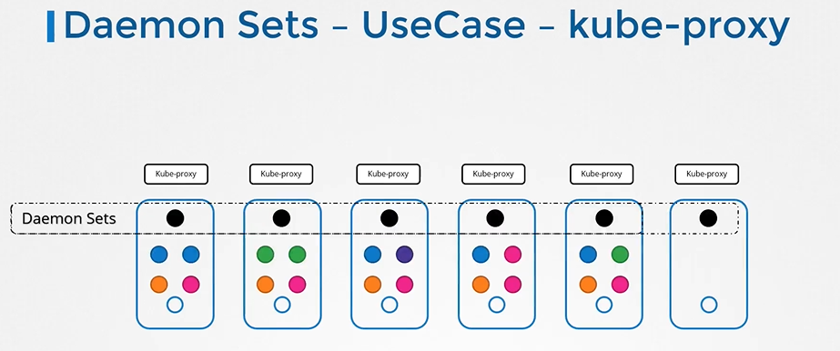
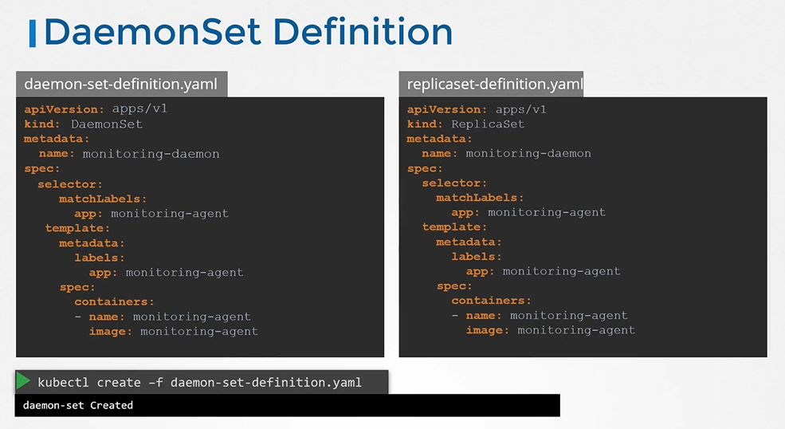

# DaemonSets
  - Take me to [Video Tutorial](https://kodekloud.com/topic/daemonsets/)


Here's a summary of the article on "DaemonSets in Kubernetes":

### Introduction to DaemonSets:
- DaemonSets in Kubernetes deploy one copy of a pod on each node in a cluster.
- When a new node is added, a pod replica is automatically added to that node.
- Similarly, when a node is removed, the corresponding pod is also removed.

### Use Cases:
- **Monitoring Agents**: Deploying monitoring or log collector agents on every node for better cluster monitoring.
- **Kube-proxy Component**: Automatically deploying kube-proxy on each node, a necessary component.
- **Networking Solutions**: Agents required for networking solutions like Vivenet.

### Creating a DaemonSet:
- Similar to creating a ReplicaSet, DaemonSets have a nested pod specification under the `template` section.
- The DaemonSet definition file includes API version, kind (DaemonSet), metadata, and spec.
- Labels in the selector must match those in the pod template.

### DaemonSet Commands:
- **Create DaemonSet**: Use `kubectl create daemonset` command to create a DaemonSet.
- **View DaemonSet**: Check the created DaemonSet with `kubectl get daemonset` command.
- **Details**: For more details, use `kubectl describe daemonset` command.

### DaemonSet Operations:
- **Scheduling Pods**: Earlier versions used `nodeName` property in pod spec to bypass scheduler and place pods on specific nodes.
- **From Kubernetes v1.12**: DaemonSets use the default scheduler and node affinity rules for scheduling pods on nodes.

### Conclusion:
- DaemonSets ensure that one copy of a pod is always present on every node in the cluster.
- Useful for deploying agents, components, or services that need to be on every node.
- Practice working with DaemonSets in the provided practice test.

The lecture concludes with a call to action to practice working with DaemonSets in Kubernetes.


______________________________________________________________
In this section, we will take a look at DaemonSets.

#### DaemonSets are like replicasets, as it helps in to deploy multiple instances of pod. But it runs one copy of your pod on each node in your cluster.
  
  
  
## DaemonSets - UseCases

  
  
  
  
  
  
## DaemonSets - Definition
- Creating a DaemonSet is similar to the ReplicaSet creation process.
- For DaemonSets, we start with apiVersion, kind as **`DaemonSets`** instead of **`ReplicaSet`**, metadata and spec. 
  ```
  apiVersion: apps/v1
  kind: Replicaset
  metadata:
    name: monitoring-daemon
    labels:
      app: nginx
  spec:
    selector:
      matchLabels:
        app: monitoring-agent
    template:
      metadata:
       labels:
         app: monitoring-agent
      spec:
        containers:
        - name: monitoring-agent
          image: monitoring-agent
  ```
  
  ```
  apiVersion: apps/v1
  kind: DaemonSet
  metadata:
    name: monitoring-daemon
    labels:
      app: nginx
  spec:
    selector:
      matchLabels:
        app: monitoring-agent
    template:
      metadata:
       labels:
         app: monitoring-agent
      spec:
        containers:
        - name: monitoring-agent
          image: monitoring-agent
  ```
  
  
- To create a daemonset from a definition file
  ```
  $ kubectl create -f daemon-set-definition.yaml
  ```

## View DaemonSets
- To list daemonsets
  ```
  $ kubectl get daemonsets
  ```
- For more details of the daemonsets
  ```
  $ kubectl describe daemonsets monitoring-daemon
  ```
  
  
## How DaemonSets Works

  

#### K8s Reference Docs
- https://kubernetes.io/docs/concepts/workloads/controllers/daemonset/#writing-a-daemonset-spec
