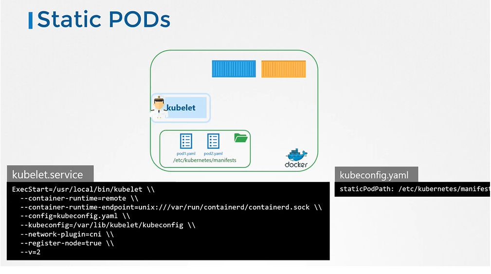
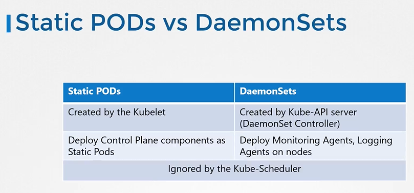

# Static Pods 
  - Take me to [Video Tutorial](https://kodekloud.com/topic/static-pods/)


  Here's a summary of the article on "Static Pods in Kubernetes":

### Introduction to Static Pods:
- In this lecture, the focus is on static Pods in Kubernetes.
- When there is no kube-apiserver, kube-scheduler, or other cluster components, the kubelet on a Node can operate independently.

### How Static Pods Work:
- The kubelet on the Node can create Pods without input from the Kubernetes API server.
- To do this, Pod definition files are placed in a designated directory on the server.
- The kubelet periodically checks this directory, reads the files, and creates Pods accordingly.
- It can also manage Pod lifecycles—restarting crashed Pods and removing deleted Pod files.

### Definition and Configuration:
- Static Pods are Pods created directly by the kubelet, without intervention from the Kubernetes control plane components.
- These Pods are useful for applications that don't need complex orchestration.
- They are created by placing Pod definition files in a designated directory on the host.
- The location of this directory is configured using the `pod-manifest-path` option in the kubelet's configuration.

### Viewing and Managing Static Pods:
- Static Pods can be viewed using the `docker ps` command on the host.
- Since there is no kube-apiserver, `kubectl` commands do not work for managing these Pods.
- Deleting static Pods is done by removing the corresponding file from the designated directory.

### Working with Cluster Nodes:
- When a Node is part of a cluster, the kubelet can create both static Pods and regular Pods from the API server simultaneously.
- The kube-apiserver is aware of static Pods created by the kubelet.
- When a static Pod is created, a read-only mirror object is also created in the kube-apiserver.

### Use Cases and Comparison with DaemonSets:
- Static Pods can be used to deploy control plane components directly as Pods on Nodes.
- This simplifies the setup process as the kubelet manages the control plane Pods automatically.
- Difference with DaemonSets: DaemonSets ensure one instance of an application on all Nodes, managed by a controller; static Pods are directly managed by the kubelet.

### Conclusion:
- Static Pods in Kubernetes are created directly by the kubelet on a Node.
- They are useful for scenarios where Kubernetes control plane components need to be deployed directly as Pods.
- Practice working with static Pods in the provided practice test.

The lecture concludes with an invitation to practice working with static Pods in Kubernetes.

_______________________________________________________________
In this section, we will take a look at Static Pods

#### How do you provide a pod definition file to the kubelet without a kube-apiserver?
- You can configure the kubelet to read the pod definition files from a directory on the server designated to store information about pods.

## Configure Static Pod
- The designated directory can be any directory on the host and the location of that directory is passed in to the kubelet as an option while running the service.
  - The option is named as **`--pod-manifest-path`**.
  
  
  
## Another way to configure static pod 
- Instead of specifying the option directly in the **`kubelet.service`** file, you could provide a path to another config file using the config option, and define the directory path as staticPodPath in the file.

  

## View the static pods
- To view the static pods
  ```
  $ docker ps
  ```
  

#### The kubelet can create both kinds of pods - the static pods and the ones from the api server at the same time.

  

## Static Pods - Use Case

  
  
  
  
## Static Pods vs DaemonSets

   
  

#### K8s Reference Docs
- https://kubernetes.io/docs/tasks/configure-pod-container/static-pod/
