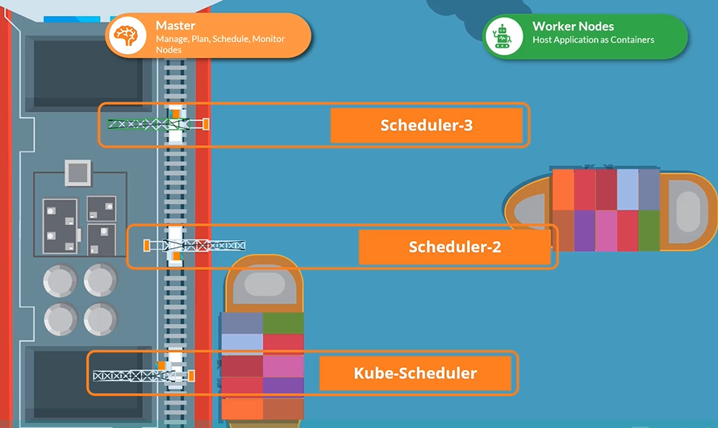
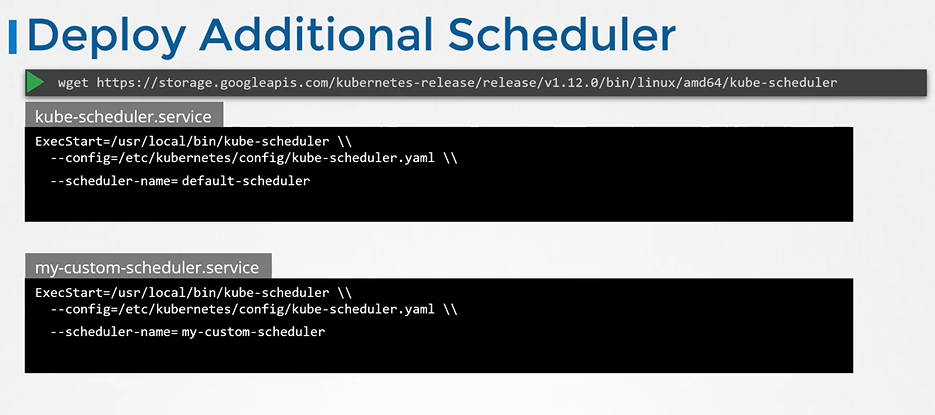
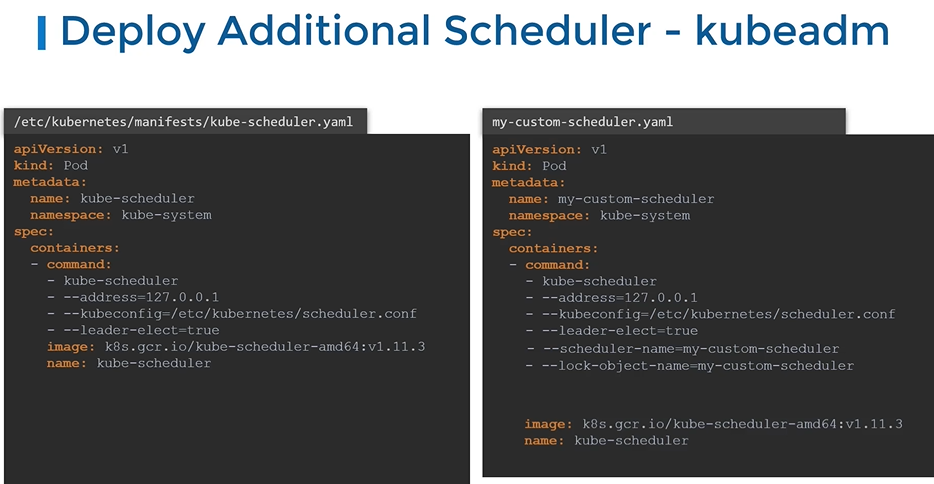
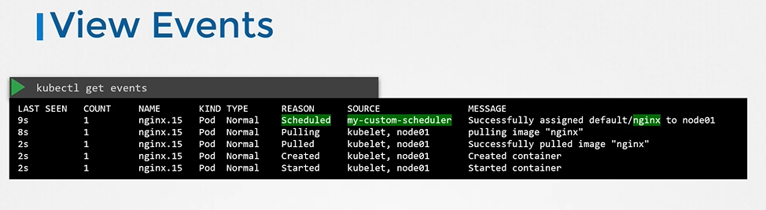

# Multiple Schedulers 
  - Take me to [Video Tutorial](https://kodekloud.com/topic/multiple-schedulers/)

Here's a summary of the article on "Deploying Multiple Schedulers in a Kubernetes Cluster":

### Introduction to Multiple Schedulers:
- This lecture focuses on deploying multiple schedulers in a Kubernetes cluster.
- The default scheduler in Kubernetes has its algorithms for pod distribution but sometimes custom scheduling is needed.

### Reasons for Custom Schedulers:
- Custom scheduling might be needed for applications requiring specific conditions for pod placement.
- Kubernetes allows writing custom scheduler programs, packaging them, and deploying them as default or additional schedulers.

### Configuring Custom Scheduler Names:
- Each scheduler must have a unique name.
- The default scheduler is usually named "default-scheduler."
- Custom schedulers can be named and configured in separate configuration files.

### Simple Deployment of Additional Scheduler:
- Additional schedulers can be deployed using the same kube-scheduler binary.
- Use a custom configuration file for the new scheduler.
- Each scheduler uses its configuration file with a unique name.

### Deploying as a Pod:
- Create a pod definition file with the custom kube-scheduler configuration.
- Use the kubeconfig property to point to the scheduler conf file.
- Specify the scheduler name in the configuration file.

### Leader Election for High Availability:
- When multiple copies of a scheduler run on different master nodes, leader election is used.
- Only one scheduler can be active at a time.
- The leader elect option helps in selecting the leader for scheduling activities.

### Deploying as a Deployment:
- Another method is deploying the scheduler as a deployment.
- Use the kube-scheduler image and the custom config file.
- Additional configurations like service account and cluster role bindings are needed.

### Configuring Pod to Use Custom Scheduler:
- Add a new field "schedulerName" in the pod definition file.
- Specify the name of the custom scheduler in this field.

### Checking Scheduler Status:
- After deployment, use `kubectl get pods` in the kube-system namespace to see the new scheduler running.
- If a pod remains pending, check the logs with `kubectl describe` to troubleshoot.
- Use `kubectl get events -o wide` to view scheduled events and check if the custom scheduler picked up the pod.
- View scheduler logs with `kubectl logs` for troubleshooting issues.

### Conclusion:
- Multiple schedulers can be deployed in a Kubernetes cluster for custom pod scheduling.
- Each scheduler must have a unique name and configuration file.
- Pods can be configured to use a specific scheduler by adding the "schedulerName" field.
- Monitoring scheduler logs and events helps in troubleshooting scheduler-related issues.

The lecture concludes with an invitation to practice deploying multiple schedulers in Kubernetes and to explore how pods are scheduled using custom schedulers.

______________________________________________________________________________
In this section, we will take a look at multiple schedulers

## Custom Schedulers
- Your kubernetes cluster can schedule multiple schedulers at the same time.

  
  
## Deploy additional scheduler
- Download the binary
  ```
  $ wget https://storage.googleapis.com/kubernetes-release/release/v1.12.0/bin/linux/amd64/kube-scheduler
  ```
  
  
## Deploy additional scheduler - kubeadm
   
  
  
  - To create a scheduler pod
    ```
    $ kubectl create -f my-custom-scheduler.yaml
    ```
  
## View Schedulers
- To list the scheduler pods
  ```
  $ kubectl get pods -n kube-system
  ```

## Use the Custom Scheduler
- Create a pod definition file and add new section called **`schedulerName`** and specify the name of the new scheduler
  ```
  apiVersion: v1
  kind: Pod
  metadata:
    name: nginx
  spec:
    containers:
    - image: nginx
      name: nginx
    schedulerName: my-custom-scheduler
  ```
  
  
- To create a pod definition
  ```
  $ kubectl create -f pod-definition.yaml
  ```
- To list pods
  ```
  $ kubectl get pods
  ```

## View Events
- To view events
  ```
  $ kubectl get events
  ```
  
  
## View Scheduler Logs
- To view scheduler logs
  ```
  $ kubectl logs my-custom-scheduler -n kube-system
  ```
  
  
#### K8s Reference Docs
- https://kubernetes.io/docs/tasks/extend-kubernetes/configure-multiple-schedulers/
  
