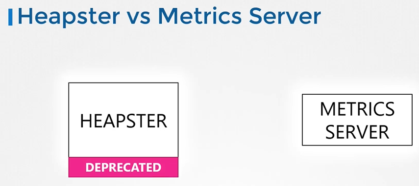
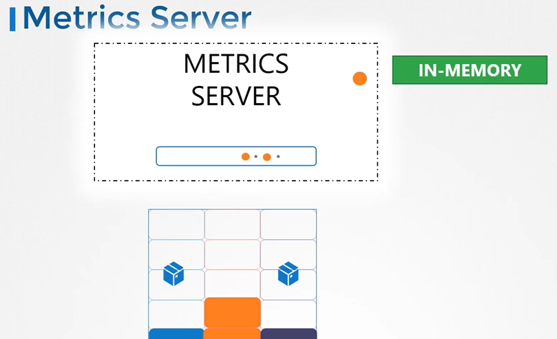

# Monitor Cluster Components
  - Take me to [Video Tutuorials](https://kodekloud.com/topic/monitor-cluster-components/)

Here's a summary of the article on "Monitoring a Kubernetes Cluster":

### Monitoring Needs in Kubernetes:
- To monitor a Kubernetes cluster, you need to track node-level metrics like node health, CPU, memory, network, and disk utilization.
- Also, pod-level metrics such as the number of pods and their performance metrics (CPU, memory consumption) are essential.

### Available Monitoring Solutions:
- Kubernetes lacks a full-featured built-in monitoring solution.
- Several open-source options exist: Metrics Server, Prometheus, Elastic Stack, as well as proprietary solutions like Datadog and Dynatrace.

### Evolution from Heapster to Metrics Server:
- Heapster was an early Kubernetes monitoring project, now deprecated.
- Metrics Server is a slimmed-down version of Heapster.
- Metrics Server retrieves metrics from nodes and pods, aggregates them in memory.
- It's important to note that Metrics Server is an in-memory solution, lacking historical performance data.

### Metrics Generation in Pods:
- Each Kubernetes node runs the kubelet agent.
- The kubelet includes a component called cAdvisor (Container Advisor).
- cAdvisor retrieves pod performance metrics and exposes them through the kubelet API for the Metrics Server.

### Deploying Metrics Server:
- For minikube: `minikube addons enable metrics-server`.
- For other environments: Deploy Metrics Server by cloning deployment files from the GitHub repository.
- Use `kubectl create` to deploy necessary pods, services, and roles for the Metrics Server.

### Viewing Cluster Performance:
- After deployment, Metrics Server collects and processes data.
- To view node CPU and memory consumption: `kubectl top node`.
- For pod performance metrics: `kubectl top pod`.

### Conclusion:
- Monitoring Kubernetes clusters is crucial for understanding resource usage and performance.
- Metrics Server provides basic in-memory monitoring.
- For historical data and more advanced monitoring, consider other open-source or proprietary solutions.
- Developers are encouraged to practice viewing performance metrics on their Kubernetes clusters for hands-on experience.

The article concludes by inviting readers to practice viewing performance metrics on their Kubernetes clusters to deepen their understanding.

____________________________________________________________________________________________________________-

  
In this section, we will take a look at monitoring kubernetes cluster

#### How do you monitor resource consumption in kubernetes? or more importantly, what would you like to monitor?
  
 
## Heapster vs Metrics Server
- Heapster is now deprecated and a slimmed down version was formed known as the **`metrics server`**.

  
  
## Metrics Server

  

#### How are the metrics generated for the PODs on these nodes?

  
  
## Metrics Server - Getting Started

  
  
- Clone the metric server from github repo
  ```
  $ git clone https://github.com/kubernetes-incubator/metrics-server.git
  ```
- Deploy the metric server
  ```
  $ kubectl create -f metric-server/deploy/1.8+/
  ```
  
- View the cluster performance
  ```
  $ kubectl top node
  ```
- View performance metrics of pod
  ```
  $ kubectl top pod
  ```
  
  
  
  
