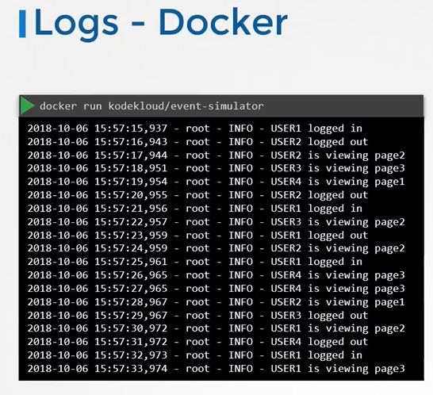

# Managing Application Logs
  - Take me to [Video Tutorial](https://kodekloud.com/topic/managing-application-logs/)


Here's a summary of the article on "Logging Mechanisms in Kubernetes":

### Logging in Docker:
- The instructor runs a Docker container named "event-simulator" that generates random events, simulating a web server.
- Docker containers typically stream events to standard output.
- When running Docker containers in detached mode (`-d`), logs are not visible.
- To view logs, the `docker logs` command followed by the container ID can be used.
- The `-f` option allows for live log viewing.

### Logging in Kubernetes:
- A pod is created in Kubernetes using a pod definition file with the same Docker image.
- After the pod is running, logs can be viewed using `kubectl logs` followed by the pod name.
- The `-f` option streams live logs, similar to the Docker command.

### Handling Multiple Containers in a Pod:
- Kubernetes pods can have multiple Docker containers.
- The instructor modifies the pod definition file to include an additional container named "image-processor".
- When using `kubectl logs` with a pod containing multiple containers, the command requires specifying the container name explicitly.
- Failure to specify the container name explicitly will prompt a request to do so.

### Conclusion:
- Kubernetes provides simple logging functionality for application developers.
- To view logs of a specific container within a pod, the container name must be explicitly specified in the `kubectl logs` command.
- This basic understanding of logging in Kubernetes is sufficient for application development and certification program requirements.

The lecture concludes by encouraging readers to head to the coding exercises section to practice working with logs in Kubernetes.

________________________________________________________________________________________________
In this section, we will take a look at managing application logs

#### Let us start with logging in docker


 

 
#### Logs - Kubernetes
```
apiVersion: v1
kind: Pod
metadata:
  name: event-simulator-pod
spec:
  containers:
  - name: event-simulator
    image: kodekloud/event-simulator
```
 
 
- To view the logs
  ```
  $ kubectl logs -f event-simulator-pod
  ```
- If there are multiple containers in a pod then you must specify the name of the container explicitly in the command.
  ```
  $ kubectl logs -f <pod-name> <container-name>
  $ kubectl logs -f even-simulator-pod event-simulator
  ```

  
  
#### K8s Reference Docs
- https://kubernetes.io/blog/2015/06/cluster-level-logging-with-kubernetes/
 
