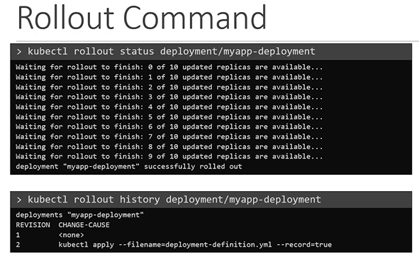
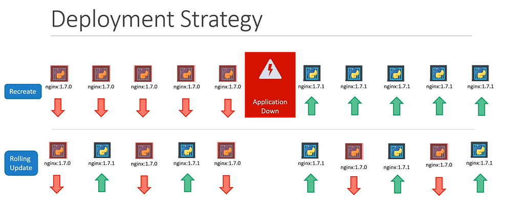
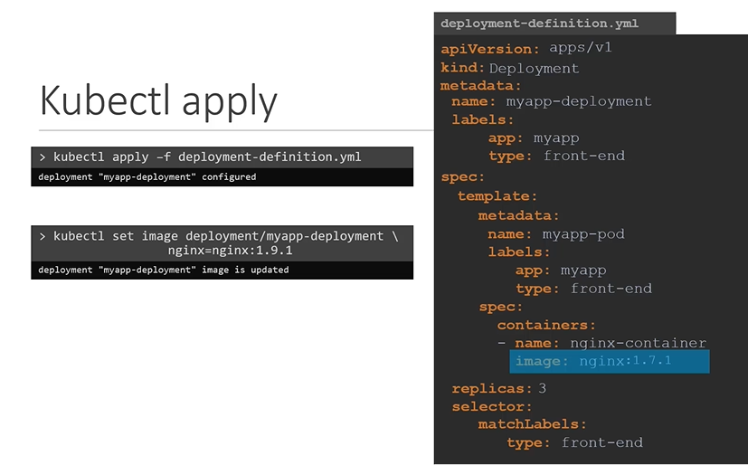
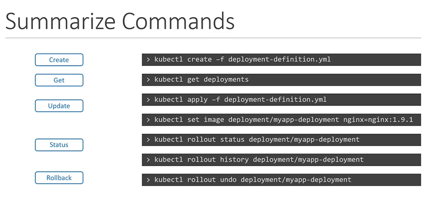

# Rolling Updates and Rollback
  - Take me to [Video Tutorial](https://kodekloud.com/topic/rolling-updates-and-rollbacks/)


Sure! Here's a summary of the article:

### Introduction
- The lecture focuses on updates and rollbacks in a deployment in Kubernetes.

### Rollouts and Versioning
- When a deployment is first created, it triggers a rollout, creating a new deployment revision (e.g., revision one).
- Subsequent upgrades create new rollout triggers and new deployment revisions (e.g., revision two).
- This allows tracking changes and enables rolling back to a previous version if needed.

### Viewing Rollout Status and History
- To view rollout status: `kubectl rollout status <deployment-name>`
- To view rollout history: `kubectl rollout history <deployment-name>`

### Deployment Strategies
- Two deployment strategies:
  1. **Recreate Strategy**:
     - Destroys all existing instances and deploys new instances.
     - Results in downtime.
  2. **Rolling Update Strategy** (default):
     - Updates instances one by one, ensuring no downtime.
     - Older version is taken down and newer version is brought up sequentially.

### Updating a Deployment
- Two ways to update:
  1. Modify the deployment YAML file and apply changes: `kubectl apply -f <filename.yaml>`
  2. Use `kubectl set image` command to update the image of the application.

### Differences in Strategies
- `Recreate Strategy`: Events indicate scaling down old replica set to zero, then scaling up new replica set.
- `Rolling Update Strategy`: Old replica set scaled down one at a time, while new replica set scaled up one at a time.

### Under the Hood of Deployment Upgrades
- When a new deployment is created, it creates a replica set.
- Upgrading application creates a new replica set, deploys containers there, and takes down pods in old replica set.

### Rolling Back Updates
- To undo a change and roll back: `kubectl rollout undo <deployment-name>`
- Pods in the new replica set are destroyed, and old pods are brought back up.

### Summary of Commands
- `kubectl create`: Create a deployment.
- `kubectl get deployments`: List deployments.
- `kubectl apply` and `kubectl set image`: Update deployments.
- `kubectl rollout status`: See rollout status.
- `kubectl rollout undo`: Roll back a deployment operation.

The lecture covers how deployments work in Kubernetes, the different strategies for updating, monitoring rollout status, and how to perform rollbacks when needed. These commands are essential for managing deployments effectively in a Kubernetes cluster.
_______________________________________________________________________________________________________________________-

  
In this section, we will take a look at rolling updates and rollback in a deployment

## Rollout and Versioning in a Deployment

  
  
## Rollout commands
- You can see the status of the rollout by the below command
  ```
  $ kubectl rollout status deployment/myapp-deployment
  ```
- To see the history and revisions
  ```
  $ kubectl rollout history deployment/myapp-deployment
  ```
 
  
  
## Deployment Strategies
- There are 2 types of deployment strategies
  1. Recreate
  2. RollingUpdate (Default Strategy)
  
  
  
## kubectl apply
- To update a deployment, edit the deployment and make necessary changes and save it. Then run the below command.
  ```
  apiVersion: apps/v1
  kind: Deployment
  metadata:
   name: myapp-deployment
   labels:
    app: nginx
  spec:
   template:
     metadata:
       name: myap-pod
       labels:
         app: myapp
         type: front-end
     spec:
      containers:
      - name: nginx-container
        image: nginx:1.7.1
   replicas: 3
   selector:
    matchLabels:
      type: front-end       
  ```
  ```
  $ kubectl apply -f deployment-definition.yaml
  ```
- Alternate way to update a deployment say for example for updating an image.
  ```
  $ kubectl set image deployment/myapp-deployment nginx=nginx:1.9.1
  ```
  
  
## Recreate vs RollingUpdate
  
  
  
## Upgrades

  
  
## Rollback
  
  
  
- To undo a change
  ```
  $ kubectl rollout undo deployment/myapp-deployment
  ```
  
## kubectl create
- To create a deployment
  ```
  $ kubectl create deployment nginx --image=nginx
  ```
## Summarize kubectl commands
```
$ kubectl create -f deployment-definition.yaml
$ kubectl get deployments
$ kubectl apply -f deployment-definition.yaml
$ kubectl set image deployment/myapp-deployment nginx=nginx:1.9.1
$ kubectl rollout status deployment/myapp-deployment
$ kubectl rollout history deployment/myapp-deployment
$ kubectl rollout undo deployment/myapp-deployment
```


 
#### K8s Reference Docs
- https://kubernetes.io/docs/concepts/workloads/controllers/deployment
- https://kubernetes.io/docs/tasks/run-application/run-stateless-application-deployment
