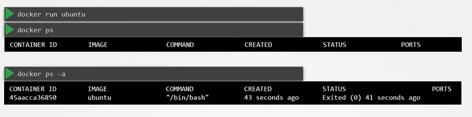
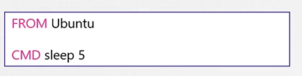
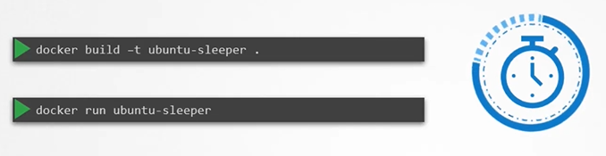

# Commands and Arguments in Docker
  - Take me to [Video Tutorial](https://kodekloud.com/topic/commands-and-arguments-in-docker/)


Here's a summary of the article:

### Introduction
- The lecture covers commands and arguments in a pod definition file in Kubernetes.
- Explains the importance of understanding these concepts, often overlooked in certifications.

### Docker and Commands
- Docker containers are meant to run specific tasks or processes, not to host an operating system.
- The `CMD` instruction in Dockerfiles defines the program to run within the container.
- When running a container from an Ubuntu image, the default command is usually `bash`.

### Specifying Commands
- To override the default command, append a command to `docker run`.
  - Example: `docker run ubuntu sleep 5`
- Create a new image with a specified command:
  - Use `CMD` instruction in Dockerfile.
  - Specify the command as a shell form or in a JSON array format.

### Entry Point Instruction
- The `ENTRYPOINT` instruction specifies the program to run when the container starts.
- Command line parameters are appended to the entry point.
- Difference between `CMD` and `ENTRYPOINT`:
  - `CMD`: Replaces entire command line parameters.
  - `ENTRYPOINT`: Appends command line parameters.

### Combining Entry Point and Command
- Use both `ENTRYPOINT` and `CMD` to set default and override commands.
- Example:
  ```dockerfile
  ENTRYPOINT ["sleep"]
  CMD ["5"]
  ```

### Runtime Modifications
- Modify the entry point during runtime with `docker run` options.
- Example:
  ```bash
  docker run --entrypoint sleep2.0 ubuntu-sleeper 10
  ```

### Summary
- Understanding commands and arguments is crucial for defining the behavior of containers in Kubernetes.
- `CMD` and `ENTRYPOINT` instructions in Dockerfiles control the default behavior of containers.
- Use JSON array format to specify commands and arguments.
- `ENTRYPOINT` appends command line parameters, while `CMD` replaces them entirely.

The lecture explains the significance of commands and arguments in Docker containers, how to override default commands, and the difference between `CMD` and `ENTRYPOINT` instructions. It also covers how to combine these instructions and modify the behavior of containers at runtime. Understanding these concepts is essential for managing and defining container behavior effectively in Kubernetes.

_____________________________________________________________________________________________________________________________-
CMD and ENTRYPOINT are two Dockerfile instructions that together define the command that runs when your container starts. You must use these instructions in your Dockerfiles so that users can easily interact with your images.

Because CMD and ENTRYPOINT work in tandem, they can often be confusing to understand. However, they have different effects and exist to increase your image’s flexibility: ENTRYPOINT sets the process to run, while CMD supplies default arguments to that process.

Let’s dive in and explore how to properly use these instructions, starting with ENTRYPOINT.

We will cover:

How does ENTRYPOINT work in Docker?
The difference between ENTRYPOINT and CMD
Example 1 – Using Docker ENTRYPOINT
Example 2 – Using Docker CMD
Example 3 – Using ENTRYPOINT and CMD together
How Does ENTRYPOINT Work in Docker?
The ENTRYPOINT Dockerfile instruction sets the process that’s executed when your container starts.

In this example, the container will run /usr/bin/my-app:

ENTRYPOINT ["/usr/bin/my-app"]
The somewhat misleadingly named CMD instruction sets the default arguments that are passed to the ENTRYPOINT process. It determines the final form of the command string that will be executed. In the following example, the container will run /usr/bin/my-app help:

ENTRYPOINT ["/usr/bin/my-app"]
CMD ["help"]
Images can only have one ENTRYPOINT. If you repeat the Dockerfile instruction more than once, the last one will apply. When an image is created without an ENTRYPOINT, Docker defaults to using /bin/sh -c.

What is the difference between docker run and ENTRYPOINT?
The docker run command starts a new container using a specified image. When no further arguments are given, the process that runs in the container will exactly match the ENTRYPOINT and CMD defined in the image:

# Executes /usr/bin/my-app help
$ docker run my-image:latest
You can change the CMD by supplying arguments to the docker run command, after the name of your image:

# Executes /usr/bin/my-app version
$ docker run my-image:latest version
Note that this always changes the CMD, not the ENTRYPOINT. Therefore, the docker run command starts new containers and sets the CMD that’s passed as arguments to the image’s ENTRYPOINT. ENTRYPOINT applies to all containers and defines the process which will be run.

Technically, it is possible to override the ENTRYPOINT using docker run by setting its --entrypoint flag. Although this is rarely required, the technique can be useful if you want to launch a shell inside a container, such as to inspect the contents of an image’s filesystem:

# Executes bash -c "ls /"
$ docker run --entrypoint bash my-image:latest -c "ls /"
Check out also our Docker Cheat Sheet with 36 Docker CLI commands.

The difference between Docker ENTRYPOINT and CMD
To reiterate what we’ve discussed above, ENTRYPOINT and CMD are similar but separate instructions that complement each other:

ENTRYPOINT is the process that’s executed inside the container.
CMD is the default set of arguments that are supplied to the ENTRYPOINT process.
There are also differences in how you override these values when you start a container:

CMD is easily overridden by appending your own arguments to the docker run command.
ENTRYPOINT can be changed using the --entrypoint flag, but this should rarely be necessary for container images being used in the way they were intended. If you do change the ENTRYPOINT, you’ll almost certainly need to set a custom CMD too—as otherwise, your new ENTRYPOINT is likely to receive arguments that it doesn’t understand.
Separating these two instructions, instead of offering a single one that defines both the command and arguments, makes Docker container images more flexible.

Specifically, the relationship between ENTRYPOINT and CMD simplifies the containerization of executable command-line apps. In this case, the same binary should be run on every invocation but with different user-supplied arguments. The image author can set the ENTRYPOINT to the binary’s location, then allow the user to directly execute sub-commands through docker run.

For example, instead of typing docker run my-app:latest /usr/bin/my-app version, users can execute docker run my-app:latest version—the version CMD set in the docker run command is automatically appended to the image’s ENTRYPOINT of /usr/bin/my-app.

When to use ENTRYPOINT vs CMD?
When you’re writing a Dockerfile, it’s good practice to set ENTRYPOINT and CMD. Follow the rules described above to decide which values to assign—here’s a recap:

ENTRYPOINT should be the path to the process that will be executed inside the container.
CMD should be the default arguments to pass to that command (if any).
Incorrectly setting CMD instead of ENTRYPOINT is a common mistake. While your image will usually still work—because Docker defaults to using /bin/sh -c as the ENTRYPOINT—end users won’t be able to directly pass arguments to your binary using docker run. They’ll need to pass the full path to the binary instead, as the container’s ENTRYPOINT process will be /bin/sh -c instead of your own app.

💡 You might also like:

Common Infrastructure Challenges and How to Solve Them
16 DevOps Best Practices to Follow
Top Most Useful CI/CD Tools for DevOps
Example 1 - Using Docker ENTRYPOINT
Let’s try a few different examples of using ENTRYPOINT and CMD.

First, here’s a Dockerfile that uses ENTRYPOINT alone:

FROM alpine:latest
ENTRYPOINT ["ls"]
Build the image:

$ docker build -t entrypoint-demo:latest .
Then start a container:

$ docker run entrypoint-demo:latest
bin
dev
etc
home
...

The ENTRYPOINT instruction means Docker runs the ls command when the container starts. As no CMD is set, the command is called without arguments.

You can pass arguments directly through to the command by appending them to your docker run statement:

$ docker run entrypoint-demo:latest -alh
total 64K    
drwxr-xr-x    1 root     root        4.0K Jul 26 18:38 .
drwxr-xr-x    1 root     root        4.0K Jul 26 18:38 ..
-rwxr-xr-x    1 root     root           0 Jul 26 18:38 .dockerenv
drwxr-xr-x    2 root     root        4.0K Jun 14 15:03 bin
drwxr-xr-x    5 root     root         340 Jul 26 18:38 dev
drwxr-xr-x    1 root     root        4.0K Jul 26 18:38 etc
drwxr-xr-x    2 root     root        4.0K Jun 14 15:03 home
Everything after the image name gets passed to the ENTRYPOINT as its arguments, resulting in ls -alh being called in the container. You didn’t have to type ls as part of your docker run command, demonstrating that ENTRYPOINT means users don’t need to know what a container’s binary is or where it’s stored.

Example 2 - Using Docker CMD
Now replace your Dockerfile with the following content:

FROM alpine:latest
CMD ["ls"]
Build and run the new image:

$ docker build -t cmd-demo:latest .

$ docker run cmd-demo:latest
bin
dev
etc
home
...
The output is the same as before. Because no ENTRYPOINT is set, the CMD of ls is appended to the default ENTRYPOINT, resulting in /bin/sh -c "ls" being executed—the ls command still runs, but as a shell subprocess.

Now observe what happens if you try to pass arguments to the ls command via docker run:

$ docker run cmd-demo:latest -alh
docker: Error response from daemon: failed to create task for container: failed to create shim task: OCI runtime create failed: runc create failed: unable to start container process: exec: "-alh": executable file not found in $PATH: unknown.
ERRO[0000] error waiting for container:
This doesn’t work because ls isn’t the ENTRYPOINT. The -alh is passed as an argument to the default /bin/sh -c entrypoint, which results in the container’s shell trying to evaluate -alh as a command.

Example: Using ENTRYPOINT and CMD together
Finally, let’s try using both ENTRYPOINT and CMD in your Docker image:

FROM alpine:latest
ENTRYPOINT ["ls"]
CMD ["-alh"]
Build and run the image:

$ docker build -t entrypoint-cmd-demo:latest .

$ docker run entrypoint-cmd-demo:latest
total 64K    
drwxr-xr-x    1 root     root        4.0K Jul 26 18:46 .
drwxr-xr-x    1 root     root        4.0K Jul 26 18:46 ..
-rwxr-xr-x    1 root     root           0 Jul 26 18:46 .dockerenv
drwxr-xr-x    2 root     root        4.0K Jun 14 15:03 bin
drwxr-xr-x    5 root     root         340 Jul 26 18:46 dev
drwxr-xr-x    1 root     root        4.0K Jul 26 18:46 etc
drwxr-xr-x    2 root     root        4.0K Jun 14 15:03 home
...
This time the ls command (ENTRYPOINT) is automatically called with the -alh argument (CMD).

You can still supply custom arguments instead by overriding the CMD with docker run:

$ docker run entrypoint-cmd-demo:latest -p --full-time
drwxr-xr-x    2 root     root          4096 2023-06-14 15:03:40 +0000 bin/
drwxr-xr-x    5 root     root           340 2023-07-26 18:48:50 +0000 dev/
drwxr-xr-x    1 root     root          4096 2023-07-26 18:48:50 +0000 etc/
drwxr-xr-x    2 root     root          4096 2023-06-14 15:03:40 +0000 home/
...
Key points
In this article, we’ve explored the relationship between Docker’s CMD and ENTRYPOINT Dockerfile instructions. You’ve seen how ENTRYPOINT defines the process that’s launched in containers, whereas CMD sets the default arguments for that process.

ENTRYPOINT isn’t usually overridden by end users, but CMD can easily be changed through docker run. This allows you to create container images that conveniently package command-line applications. Set your image’s ENTRYPOINT to your app’s binary, then use CMD to specify the default sub-command. Users will be able to override CMD to access your app’s other functions using docker run app-image app-command syntax.

Packaging software as a container makes it more portable, allowing you to eliminate discrepancies between environments. You can use the container on your laptop, in production, and within your CI/CD infrastructure. Take a look at how Spacelift uses Docker containers to run CI jobs.

_____________________________________________________________________________________________________


In this section, we will take a look at commands and arguments in docker

- To run a docker container
  ```
  $ docker run ubuntu
  ```
- To list running containers
  ```
  $ docker ps 
  ```
- To list all containers including that are stopped
  ```
  $ docker ps -a
  ```
  
  
  
#### Unlike virtual machines, containers are not meant to host operating system.
- Containers are meant to run a specific task or process such as to host an instance of a webserver or application server or a database server etc.

  
  
  
#### How do you specify a different command to start the container?
- One Option is to append a command to the docker run command and that way it overrides the default command specified within the image.
  ```
  $ docker run ubuntu sleep 5
  ```
- This way when the container starts it runs the sleep program, waits for 5 seconds and then exists. How do you make that change permanent?
  
  
  
- There are different ways of specifying the command either the command simply as is in a shell form or in a JSON array format.
 
  
  
- Now, build the docker image
  ```
  $ docker build -t ubuntu-sleeper .
  ```
- Run docker container
  ```
  $ docker run ubuntu-sleeper
  ```
  
  
  
## Entrypoint Instruction
- The entrypoint instruction is like the command instruction as in you can specify the program that will be run when the container starts and whatever you specify on the command line.

#### K8s Reference Docs
- https://docs.docker.com/engine/reference/builder/#cmd
