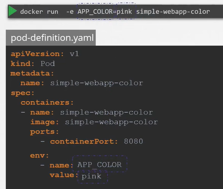

# Configure Environment Variables In Applications
  - Take me to [Video Tutorial](https://kodekloud.com/topic/configure-environment-variables-in-applications/)


Here's a summary of the article:

### Introduction
- The lecture focuses on setting environment variables in Kubernetes pods.
- It uses a pod definition file that utilizes the same image as the Docker command from a previous lecture.

### Setting Environment Variables
- To set an environment variable in Kubernetes, use the `ENV` property in the pod definition file.
- The `ENV` property is an array, with each item starting with a dash indicating an item in the array.
- Each item in the `ENV` array has:
  - A `name`: The name of the environment variable available within the container.
  - A `value`: The value of the environment variable.

### Direct Way of Specifying
- The article demonstrates a direct way of specifying environment variables using a plain key-value pair format.

### Other Methods
- Apart from the direct method, there are other ways to set environment variables, such as using config maps and secrets.
- When using config maps or secrets:
  - Instead of specifying a `value`, use `valueFrom`.
  - Then specify the source of the value, either a config map or a secret.

### Future Topics
- The article hints at upcoming lectures where it will delve into config maps and secret keys in more detail.

### Conclusion
- Setting environment variables in Kubernetes pods can be done directly using the `ENV` property.
- There are also advanced methods like using config maps and secrets, which will be covered in future lectures.

The lecture provides a straightforward explanation of setting environment variables in Kubernetes pods using the `ENV` property in the pod definition file. It also briefly mentions the upcoming discussion on using config maps and secrets for more advanced configurations.


_________________________________________________________________________________________________________________________-


  
#### ENV variables in Docker
```
$ docker run -e APP_COLOR=pink simple-webapp-color
```

#### ENV variables in kubernetes 
- To set an environment variable set an **`env`** property in pod definition file.
  
  ```
  apiVersion: v1
  kind: Pod
  metadata:
    name: simple-webapp-color
  spec:
   containers:
   - name: simple-webapp-color
     image: simple-webapp-color
     ports:
     - containerPort: 8080
     env:
     - name: APP_COLOR
       value: pink
  ```
  
  
- There are other ways of setting the environment variables such as **`ConfigMaps`** and **`Secrets`**

  
  
#### K8s Reference Docs
- https://kubernetes.io/docs/tasks/inject-data-application/define-environment-variable-container/
