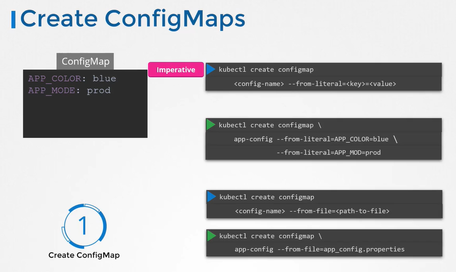
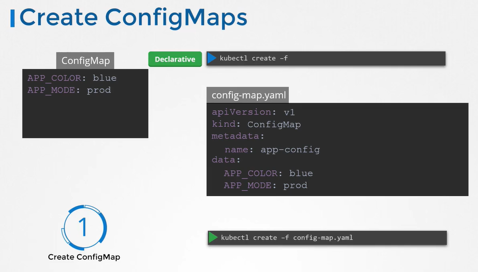
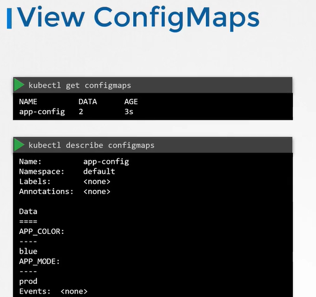
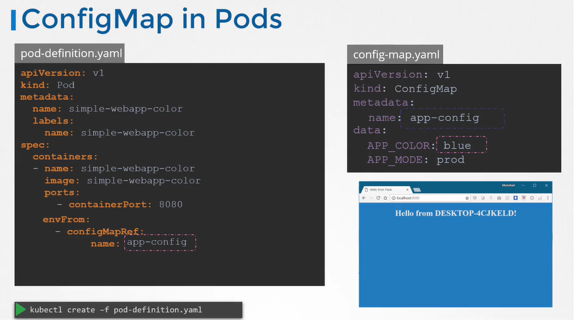
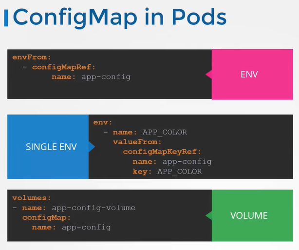

# Configure ConfigMaps in Applications
  - Take me to [Video Tutorial](https://kodekloud.com/topic/configure-configmaps-in-applications/)


Here's a summary of the article:

### Introduction
- The lecture focuses on working with configuration data in Kubernetes.
- It starts with a discussion on managing environment variables in pod definition files.

### Using Config Maps
- When managing a lot of pod definition files, it becomes challenging to handle environment data within the files.
- Config maps are used in Kubernetes to pass configuration data in the form of key-value pairs.
- Config maps are injected into pods during creation, making the key-value pairs available as environment variables for the application inside the pod's container.

### Two Phases of Configuring Config Maps
1. **Create Config Maps:**
   - There are two ways to create config maps: imperative and declarative.
   - The imperative way involves using the `kubectl create configmap` command with `--from-literal` option to directly specify key-value pairs.
   - Example: `kubectl create configmap app-config --from-literal=app-color=blue`

   - Another method is to use the `--from-file` option to specify a path to a file containing the required data.
   - Example: `kubectl create configmap app-config --from-file=path/to/config/file`

2. **Declarative Approach:**
   - Involves creating a config map definition file similar to pod definition files.
   - The file includes `apiVersion`, `kind`, `metadata`, and `data` sections.
   - Example:
     ```yaml
     apiVersion: v1
     kind: ConfigMap
     metadata:
       name: app-config
     data:
       app-color: blue
     ```

### Viewing and Listing Config Maps
- Use `kubectl get configmaps` to view the list of config maps.
- Use `kubectl describe configmaps` to view detailed information, including the configuration data.

### Injecting Config Maps into Pods
- To inject a config map into a pod, add a new property `envFrom` to the container's properties.
- `envFrom` is a list, allowing multiple environment variables to be passed.
- Each item in the list corresponds to a config map item.
- Specify the name of the config map created earlier to inject its values into the pod's environment variables.

### Conclusion
- Config maps are a way to manage configuration data in Kubernetes.
- They allow for the central management of key-value pairs that can be injected into pod environments.
- The article demonstrates the creation of config maps using both imperative and declarative approaches, as well as how to inject them into pod definitions.

The lecture provides a practical guide on working with configuration data in Kubernetes, focusing on the use of config maps to manage environment variables and their injection into pods. It emphasizes the two methods of creating config maps, viewing them, and associating them with pods to configure the application environment within Kubernetes.


___________________________________________________________________________________________________________________


  
In this section, we will take a look at configuring configmaps in applications

## ConfigMaps
- There are 2 phases involved in configuring ConfigMaps. 
  - First, create the configMaps
  - Second, Inject then into the pod.
- There are 2 ways of creating a configmap.
  - The Imperative way
    ```
    $ kubectl create configmap app-config --from-literal=APP_COLOR=blue --from-literal=APP_MODE=prod
    $ kubectl create configmap app-config --from-file=app_config.properties (Another way)
    ```
    
    
  - The Declarative way
    
    ```
    apiVersion: v1
    kind: ConfigMap
    metadata:
     name: app-config
    data:
     APP_COLOR: blue
     APP_MODE: prod
    ```
    ```
    Create a config map definition file and run the 'kubectl create` command to deploy it.
    $ kubectl create -f config-map.yaml
    ```
    
    
 ## View ConfigMaps
 - To view configMaps
   ```
   $ kubectl get configmaps (or)
   $ kubectl get cm
   ```
 - To describe configmaps
   ```
   $ kubectl describe configmaps
   ```
   
   
   
 ## ConfigMap in Pods
 - Inject configmap in pod
   ```
   apiVersion: v1
   kind: Pod
   metadata:
     name: simple-webapp-color
   spec:
    containers:
    - name: simple-webapp-color
      image: simple-webapp-color
      ports:
      - containerPort: 8080
      envFrom:
      - configMapRef:
          name: app-config
   ```
   ```
   apiVersion: v1
   kind: ConfigMap
   metadata:
     name: app-config
   data:
     APP_COLOR: blue
     APP_MODE: prod
   ```
   ```
   $ kubectl create -f pod-definition.yaml
   ```
  
   
   
 #### There are other ways to inject configuration variables into pod   
 - You can inject it as a **`Single Environment Variable`** 
 - You can inject it as a file in a **`Volume`**
 
   
   
 #### K8s Reference Docs
 - https://kubernetes.io/docs/tasks/configure-pod-container/configure-pod-configmap/
 - https://kubernetes.io/docs/tasks/configure-pod-container/configure-pod-configmap/#define-container-environment-variables-using-configmap-data
 - https://kubernetes.io/docs/tasks/configure-pod-container/configure-pod-configmap/#create-configmaps-from-files
