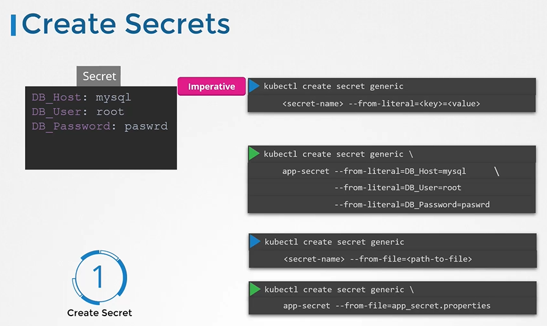

# Secrets
  - Take me to [Video Tutorials](https://kodekloud.com/topic/secrets-2/)


Here's a summary of the article:

### Introduction to Secrets in Kubernetes
- The lecture introduces the concept of secrets in Kubernetes.
- Secrets are used to store sensitive information such as passwords or keys, unlike ConfigMaps which store configuration data in plain text format.
- Secrets are stored in an encoded format for security purposes.

### Steps for Working with Secrets
1. **Creating Secrets:**
   - There are two ways to create secrets: imperative and declarative.
   - **Imperative Way:**
     - Use `kubectl create secret generic` command with `--from-literal` option to specify key-value pairs directly.
     - Example: `kubectl create secret generic app-secret --from-literal=DB_host=MySQL`

   - **Alternative:**
     - Use `--from-file` option to specify a path to a file containing the required data.
     - Data from the file is read and stored under the name of the file.

   - **Declarative Approach:**
     - Create a definition file with `apiVersion`, `kind`, `metadata`, and `data` sections.
     - Values in the `data` section must be encoded.
     - Example:
       ```yaml
       apiVersion: v1
       kind: Secret
       metadata:
         name: app-secret
       data:
         DB_password: base64_encoded_value
       ```

2. **Viewing and Managing Secrets:**
   - Use `kubectl get secrets` to list the created secrets.
   - Use `kubectl describe secret` to view detailed information about a secret, excluding the values.
   - To view the values, use `kubectl get secret` with the `-o yaml` option.

3. **Injecting Secrets into Pods:**
   - Add a new property `envFrom` to the container's properties in the pod definition file.
   - `envFrom` is a list, allowing multiple secret items to be passed.
   - Each item in the list corresponds to a secret item.

### Other Considerations and Best Practices:
- **Security Concerns:**
  - Secrets are encoded, not encrypted. They can be decoded by anyone with access to the cluster.
  - Avoid checking in secret definition files with code repositories.
  - Encrypt secrets at rest using encryption configuration.
  - Limit access to secrets by configuring role-based access control (RBAC).

- **Third-Party Secret Providers:**
  - Consider using third-party secret providers like AWS, Azure, GCP, or Vault.
  - These providers store secrets externally and handle security measures.

- **Advanced Topics:**
  - Configuration of third-party secret providers and encryption at rest are advanced topics.
  - These topics will be covered in the Certified Kubernetes Security Specialist course.

### Closing Notes:
- The article emphasizes the importance of securing sensitive data in Kubernetes.
- It advises caution in handling secrets and provides practical steps for creating, managing, and injecting secrets into pods.
- Finally, it suggests practicing with labs to reinforce understanding of working with secrets in Kubernetes.

The lecture provides a comprehensive guide on using secrets in Kubernetes, covering creation methods, best practices for security, and considerations for managing and accessing sensitive data within the cluster. It emphasizes the need for caution and proper security measures when handling secrets, along with suggestions for advanced topics and third-party solutions for enhanced security.

__________________________________________________________________________________________________________________________________________

Remember that secrets encode data in base64 format. Anyone with the base64 encoded secret can easily decode it. As such the secrets can be considered as not very safe.

The concept of safety of the Secrets is a bit confusing in Kubernetes. The kubernetes documentation page and a lot of blogs out there refer to secrets as a "safer option" to store sensitive data. They are safer than storing in plain text as they reduce the risk of accidentally exposing passwords and other sensitive data. In my opinion it's not the secret itself that is safe, it is the practices around it. 

Secrets are not encrypted, so it is not safer in that sense. However, some best practices around using secrets make it safer. As in best practices like:

Not checking-in secret object definition files to source code repositories.

Enabling Encryption at Rest for Secrets so they are stored encrypted in ETCD. 


Also the way kubernetes handles secrets. Such as:

A secret is only sent to a node if a pod on that node requires it.

Kubelet stores the secret into a tmpfs so that the secret is not written to disk storage.

Once the Pod that depends on the secret is deleted, kubelet will delete its local copy of the secret data as well.

Read about the protections and risks of using secrets here


Having said that, there are other better ways of handling sensitive data like passwords in Kubernetes, such as using tools like Helm Secrets, HashiCorp Vault. I hope to make a lecture on these in the future.


__________________________________________________________________________________________________________________


In this section, we will take a look at secrets in kubernetes

## Web-Mysql Application

 
 
- One way is to move the app properties/envs into a configmap. But the configmap stores data into a plain text format. It is definitely not a right place to store a password.
  ```
  apiVersion: v1
  kind: ConfigMap
  metadata:
   name: app-config
  data:
    DB_Host: mysql
    DB_User: root
    DB_Password: paswrd
  ```
  
  
- Secrets are used to store sensitive information. They are similar to configmaps but they are stored in an encrypted format or a hashed format.

#### There are 2 steps involved with secrets
- First, Create a secret
- Second, Inject the secret into a pod.
  
  
  
#### There are 2 ways of creating a secret
- The Imperative way
  ```
  $ kubectl create secret generic app-secret --from-literal=DB_Host=mysql --from-literal=DB_User=root --from-literal=DB_Password=paswrd
  $ kubectl create secret generic app-secret --from-file=app_secret.properties
  ```
  
  
- The Declarative way
  ```
  Generate a hash value of the password and pass it to secret-data.yaml definition value as a value to DB_Password variable.
  $ echo -n "mysql" | base64
  $ echo -n "root" | base64
  $ echo -n "paswrd"| base64
  ```
  
  Create a secret definition file and run `kubectl create` to deploy it
  ```
  apiVersion: v1
  kind: Secret
  metadata:
   name: app-secret
  data:
    DB_Host: bX1zcWw=
    DB_User: cm9vdA==
    DB_Password: cGFzd3Jk
  ```
  ```
  $ kubectl create -f secret-data.yaml
  ```

  
  
## Encode Secrets

  
  
## View Secrets
- To view secrets
  ```
  $ kubectl get secrets
  ```
- To describe secret
  ```
  $ kubectl describe secret
  ```
- To view the values of the secret
  ```
  $ kubectl get secret app-secret -o yaml
  ```
  
  
  
## Decode Secrets
- To decode secrets
  ```
  $ echo -n "bX1zcWw=" | base64 --decode
  $ echo -n "cm9vdA==" | base64 --decode
  $ echo -n "cGFzd3Jk" | base64 --decode
  ```
  
  
## Configuring secret with a pod
- To inject a secret to a pod add a new property **`envFrom`** followed by **`secretRef`** name and then create the pod-definition
  
  ```
  apiVersion: v1
  kind: Secret
  metadata:
   name: app-secret
  data:
    DB_Host: bX1zcWw=
    DB_User: cm9vdA==
    DB_Password: cGFzd3Jk
  ```
  ```
   apiVersion: v1
   kind: Pod
   metadata:
     name: simple-webapp-color
   spec:
    containers:
    - name: simple-webapp-color
      image: simple-webapp-color
      ports:
      - containerPort: 8080
      envFrom:
      - secretRef:
          name: app-secret
   ```
  ```
  $ kubectl create -f pod-definition.yaml
  ```
  
  
#### There are other ways to inject secrets into pods.
- You can inject as **`Single ENV variable`**
- You can inject as whole secret as files in a **`Volume`**

  
  
## Secrets in pods as volume
- Each attribute in the secret is created as a file with the value of the secret as its content.
  
  

  

#### Additional Notes: [A Note on Secrets](https://kodekloud.com/topic/a-note-on-secrets/)

#### K8s Reference Docs
- https://kubernetes.io/docs/concepts/configuration/secret/
- https://kubernetes.io/docs/concepts/configuration/secret/#use-cases
- https://kubernetes.io/docs/tasks/inject-data-application/distribute-credentials-secure/
