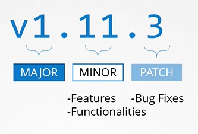

# Kubernetes Software Versions
  - Take me to [Video Tutorial](https://kodekloud.com/topic/kubernetes-software-versions/)


Here's a summary of the article on Kubernetes releases and versions:

### Introduction
- The lecture focuses on Kubernetes releases and how the project manages software versions.
- Kubernetes releases follow a standard versioning scheme consisting of major, minor, and patch versions.

### Kubernetes Version Structure
- Kubernetes release versions have three parts: major, minor, and patch.
  - **Major Version:** Indicates significant changes or updates to the software.
  - **Minor Version:** Released every few months with new features and functionalities.
  - **Patch Version:** Released more often for critical bug fixes.

### Software Release Procedure
- Kubernetes follows a standard software release versioning procedure.
- New features and functionalities are introduced through minor releases every few months.
- The first major version, 1.0, was released in July 2015.
- The latest stable version, as of the recording, is 1.13.0.
- Stable releases of Kubernetes are labeled as stable.

### Alpha and Beta Releases
- Kubernetes also has alpha and beta releases for testing new features.
- **Alpha Releases:** Features are disabled by default and may be buggy. Used for early testing.
- **Beta Releases:** Features are enabled by default and well-tested before stable release.

### Kubernetes Release Package
- The Kubernetes release package contains executables for all Kubernetes components.
- Download the Kubernetes.tar.gz file and extract it to find the components.
- Control plane components, like API server and scheduler, are of the same version within the package.
- Other components such as etcd cluster and CoreDNS servers have their own versioning.

### Upgrading Kubernetes
- The lecture concludes with a mention of upcoming topics, including how to upgrade from one version to another.
- Kubernetes GitHub repository's releases page provides details on all releases, including alpha, beta, and stable versions.
- Users can find information on supported versions of externally dependent applications like etcd and CoreDNS.

### Conclusion
- The article provides insights into Kubernetes release versions, their structure, and the release procedure.
- It highlights the significance of major, minor, and patch versions in Kubernetes.
- Users are encouraged to check the Kubernetes GitHub repository for detailed release notes and download the Kubernetes release package for installation.

This lecture offers a comprehensive overview of Kubernetes release versions, their structure, and the release process, including the use of alpha and beta releases for testing new features. It also guides users on where to find release information and how to download the Kubernetes release package for installation. Further topics on upgrading Kubernetes are teased for upcoming lectures.

___________________________________________________________________________________


  
In this section, we will take a look at various kubernetes releases and versions

#### We can see the kubernetess version that we installed
```
$ kubectl get nodes
```


#### Let's take a closer look at the version number
- It consists of 3 parts
  - First is the major version
  - Second is the minor version
  - Finally, the patch version
  
  
  
#### Kubernetes follows a standard software release versioning procedure
- You can find all kubernetes releases at https://github.com/kubernetes/kubernetes/releases

  
  
  
  
#### Downloaded package has all the kubernetes components in it except **`ETCD Cluster`** and **`CoreDNS`** as they are seperate projects.

 
 
#### References

 - https://github.com/kubernetes/community/blob/master/contributors/design-proposals/release/versioning.md
 - https://github.com/kubernetes/community/blob/master/contributors/design-proposals/api-machinery/api-group.md
 - https://blog.risingstack.com/the-history-of-kubernetes/
 - https://kubernetes.io/docs/setup/release/version-skew-policy/
 
 


