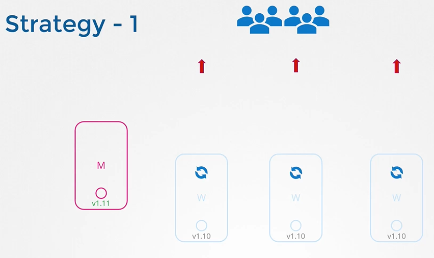
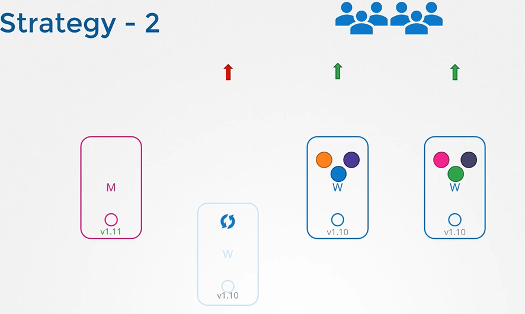

# Cluster Upgrade Introduction
  - Take me to [Video Tutorial](https://kodekloud.com/topic/cluster-upgrade-introduction/)


Here's a summary of the article on the cluster upgrade process in Kubernetes:

### Introduction
- The lecture covers the process of upgrading a Kubernetes cluster.
- It clarifies the version dependencies between different components of the control plane.

### Version Compatibility
- Different Kubernetes components can have different versions.
- The kube-apiserver should always be at the highest version.
- The controller-manager and kube-scheduler can be at one version lower.
- The kubelet and kube-proxy can be at two versions lower than kube-apiserver.

### Permissible Version Skew
- Allows for live upgrades by upgrading components one by one.
- Supports upgrading from one minor version to the next.

### Upgrade Process Overview
- Kubernetes supports the latest three minor versions at any given time.
- The recommended upgrade approach is to upgrade one minor version at a time.
- Master nodes are upgraded first, followed by worker nodes.

### Upgrade Strategies
1. **Simultaneous Upgrade:**
   - All worker nodes are upgraded at once.
   - Requires downtime as pods are down during the upgrade.
   - Once upgraded, nodes are back up, new pods are scheduled, and users regain access.

2. **Sequential Upgrade (One Node at a Time):**
   - Upgrade one worker node at a time.
   - Workloads move to other nodes during the upgrade.
   - Users continue to access applications while one node is upgraded.
   - Repeat the process for each worker node.

3. **Adding New Nodes:**
   - Provision new worker nodes with the updated software version.
   - Move workloads to new nodes and decommission old ones.
   - Useful in cloud environments where nodes can be easily provisioned.

### Upgrade Steps
1. **Master Node Upgrade:**
   - Control plane components like API server briefly go down during upgrade.
   - Applications on worker nodes continue to serve users.
   - Management functions like `kubectl` and controller-managers are down.
   - `kubectl drain` safely terminates pods from a node before upgrading.
   - Once upgraded, cluster functions normally.

2. **Worker Node Upgrade:**
   - Move workloads from the node to be upgraded using `kubectl drain`.
   - Upgrade `kubeadm` and `kubelet` packages on the worker node.
   - Update node configuration using `kubeadm tool`.
   - Restart `kubelet` service and mark the node as schedulable with `kubectl uncordon`.

3. **Repeat for Each Worker Node:**
   - Repeat the upgrade steps for each worker node.
   - After each upgrade, verify the cluster status using `kubectl get nodes`.

### Conclusion
- The upgrade process ensures minimal disruption to running applications.
- `kubeadm` provides commands to plan and execute the cluster upgrade.
- Users are encouraged to practice upgrading clusters in the practice test section.

The lecture provides a comprehensive guide on upgrading a Kubernetes cluster, emphasizing the importance of maintaining version compatibility and different upgrade strategies. It outlines steps to upgrade both master and worker nodes, ensuring minimal disruption to applications running on the cluster. Users are encouraged to follow the provided steps and practice upgrading clusters in a safe environment.


___________________________________________________________________________________________________________________________________


  
#### Is it mandatory for all of the kubernetes components to have the same versions?
- No, The components can be at different release versions.
  
#### At any time, kubernetes supports only up to the recent 3 minor versions
- The recommended approach is to upgrade one minor version at a time.
  
  
  
#### Options to upgrade k8s cluster
 
  
  
## Upgrading a Cluster
- Upgrading a cluster involves 2 major steps
  
#### There are different strategies that are available to upgrade the worker nodes
- One is to upgrade all at once. But then your pods will be down and users will not be able to access the applications.
  
- Second one is to upgrade one node at a time. 
  
- Third one would be to add new nodes to the cluster
  
  
## kubeadm - Upgrade master node
- kubeadm has an upgrade command that helps in upgrading clusters.
  ```
  $ kubeadm upgrade plan
  ```
  
  
- Upgrade kubeadm from v1.11 to v1.12
  ```
  $ apt-get upgrade -y kubeadm=1.12.0-00
  ```
- Upgrade the cluster
  ```
  $ kubeadm upgrade apply v1.12.0
  ```
- If you run the 'kubectl get nodes' command, you will see the older version. This is because in the output of the command it is showing the versions of kubelets on each of these nodes registered with the API Server and not the version of API Server itself  
  ```
  $ kubectl get nodes
  ```
  
  
  
- Upgrade 'kubelet' on the master node
  ```
  $ apt-get upgrade kubelet=1.12.0-00
  ```
- Restart the kubelet
  ```
  $ systemctl restart kubelet
  ```
- Run 'kubectl get nodes' to verify
  ```
  $ kubectl get nodes
  ```
  
  
 
## kubeadm - Upgrade worker nodes
  
- From master node, run 'kubectl drain' command to move the workloads to other nodes
  ```
  $ kubectl drain node-1
  ```
- Upgrade kubeadm and kubelet packages
  ```
  $ apt-get upgrade -y kubeadm=1.12.0-00
  $ apt-get upgrade -y kubelet=1.12.0-00
  ```
- Update the node configuration for the new kubelet version
  ```
  $ kubeadm upgrade node config --kubelet-version v1.12.0
  ```
- Restart the kubelet service
  ```
  $ systemctl restart kubelet
  ```
- Mark the node back to schedulable
  ```
  $ kubectl uncordon node-1
  ```
  
  
  
- Upgrade all worker nodes in the same way

  
  

#### Demo Video on [Cluster Upgrade](https://kodekloud.com/topic/demo-cluster-upgrade/)

#### K8s Reference Docs
- https://kubernetes.io/docs/tasks/administer-cluster/kubeadm/kubeadm-upgrade/
- https://kubernetes.io/docs/reference/setup-tools/kubeadm/kubeadm-upgrade/
  
