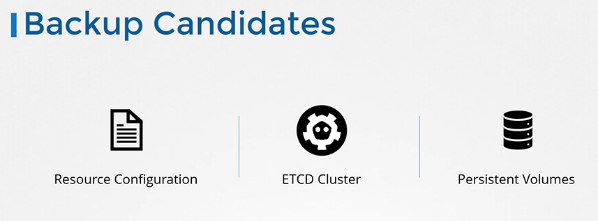
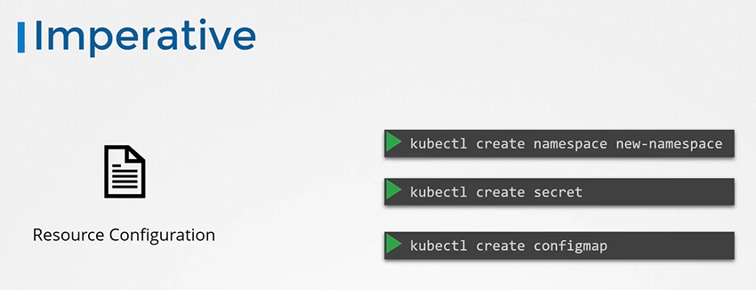
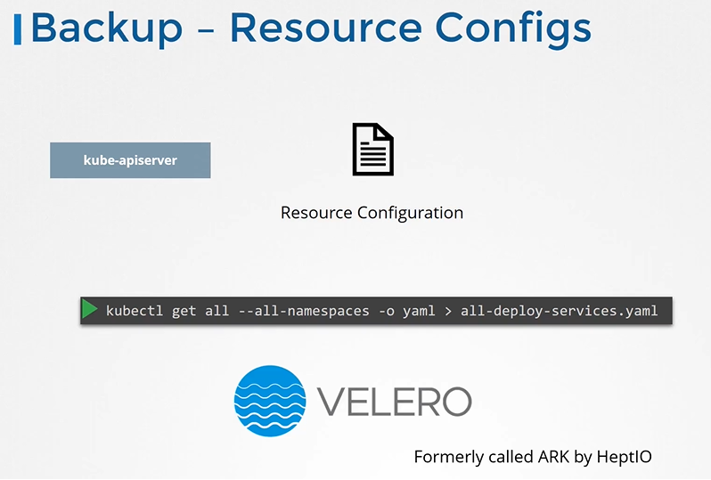
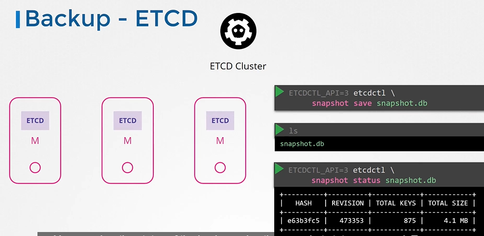

# Backup and Restore Methods
  - Take me to [Video Tutorial](https://kodekloud.com/topic/backup-and-restore-methods/)


Here's a summary of the article on backup and restore methodologies in Kubernetes:

### Introduction
- The lecture discusses the considerations for backing up a Kubernetes cluster.
- It emphasizes the importance of backing up etcd and resource configurations.

### What to Backup
1. **Resource Configurations**:
   - Includes deployments, pods, services, namespaces, etc.
   - Can be saved as object definition files in a folder.
   - Preferred approach is the declarative method for easy reuse and sharing.
   - Store these files in source code repositories for team maintenance.

2. **Querying Kube API Server**:
   - Provides a way to back up resource configurations imperatively.
   - Query using `kubectl get all` command for pods, deployments, and services.
   - Extract output in YAML format and save as a backup.
   - Useful for scenarios where not all team members follow declarative standards.

3. **Using Backup Tools**:
   - Tools like Ark (now called Velero by Heptio) automate Kubernetes backups.
   - Helps in taking backups of the cluster using the Kubernetes API.

4. **Backing up etcd**:
   - Etcd stores cluster state information.
   - Hosted on master nodes with a specified data directory.
   - Backup can be performed by:
     - Specifying the data directory for backup by backup tools.
     - Using etcd's built-in snapshot solution:
       - `etcdctl snapshot save` command creates a snapshot of the etcd database.
       - Specify the snapshot file name (`snapshot.db`) and path.
       - Snapshot status can be checked with `etcdctl snapshot status` command.

### Restoring from Backup
1. **Backup etcd**:
   - Stop Kube API server service.
   - Run `etcdctl snapshot restore` with the path to the backup file (`snapshot.db`).
   - New data directory (`var/lib/etcd_from_backup`) is created.
   - Update etcd configuration file to use the new data directory.
   - Reload the service daemon and restart etcd service.
   - Start Kube API server service.

2. **Considerations**:
   - Specify certificate files for authentication.
   - Specify the endpoint to the etcd cluster and the necessary certificates.

### Backup Options Overview
- **Etcd Backup**:
  - Pros: Direct backup of cluster state, useful for entire cluster restoration.
  - Cons: Requires access to etcd, may not be available in managed Kubernetes.

- **Kube API Server Query Backup**:
  - Pros: Easier access, useful for managed Kubernetes environments.
  - Cons: Resource-intensive for larger clusters, lacks direct etcd state backup.

### Conclusion
- Backup strategies in Kubernetes include resource configuration backups and etcd backups.
- Resource configurations can be saved in object definition files and stored in repositories.
- Etcd backups can be performed using built-in snapshot tools (`etcdctl`).
- Tools like Ark/Velero automate backup processes using Kubernetes API.
- Practice tests are available for backing up etcd and restoring from backups.

The article provides a detailed guide on backup and restore methodologies in Kubernetes, covering both resource configuration backups and etcd backups. It explains the steps to take backups using `kubectl` and `etcdctl` commands, as well as the considerations for restoring from backups. Users are encouraged to practice these methods in a safe environment to ensure they can efficiently manage backups and restore cluster states when necessary.


_________________________________________________________________________________________________________


  
In this section, we will take a look at backup and restore methods

## Backup Candidates
 
 
 
## Resource Configuration
- Imperative way
  
  

- Declarative Way (Preferred approach)
  ```
  apiVersion: v1
  kind: Pod
  metadata:
    name: myapp-pod
    labels:
      app: myapp
      type: front-end
  spec:
    containers:
    - name: nginx-container
      image: nginx
  ```
 
 
- A good practice is to store resource configurations on source code repositories like github.

  

## Backup - Resource Configs

  ```
  $ kubectl get all --all-namespaces -o yaml > all-deploy-services.yaml (only for few resource groups)
  ```

- There are many other resource groups that must be considered. There are tools like **`ARK`** or now called **`Velero`** by Heptio that can do this for you.

  
  
## Backup - ETCD
- So, instead of backing up resources as before, you may choose to backup the ETCD cluster itself. 
  
  
  
- You can take a snapshot of the etcd database by using **`etcdctl`** utility snapshot save command.
  ```
  $ ETCDCTL_API=3 etcdctl snapshot save snapshot.db
  ```
  ```
  $  ETCDCTL_API=3 etcdctl snapshot status snapshot.db
  ```
  
  
## Restore - ETCD
- To restore etcd from the backup at later in time. First stop kube-apiserver service
  ```
  $ service kube-apiserver stop
  ```
- Run the etcdctl snapshot restore command
- Update the etcd service
- Reload system configs
  ```
  $ systemctl daemon-reload
  ```
- Restart etcd
  ```
  $ service etcd restart
  ```
  
  
  
- Start the kube-apiserver
  ```
  $ service kube-apiserver start
  ```
#### With all etcdctl commands specify the cert,key,cacert and endpoint for authentication.
```
$ ETCDCTL_API=3 etcdctl \
  snapshot save /tmp/snapshot.db \
  --endpoints=https://[127.0.0.1]:2379 \
  --cacert=/etc/kubernetes/pki/etcd/ca.crt \
  --cert=/etc/kubernetes/pki/etcd/etcd-server.crt \
  --key=/etc/kubernetes/pki/etcd/etcd-server.key
```

  
  
#### K8s Reference Docs
- https://kubernetes.io/docs/tasks/administer-cluster/configure-upgrade-etcd/


 
