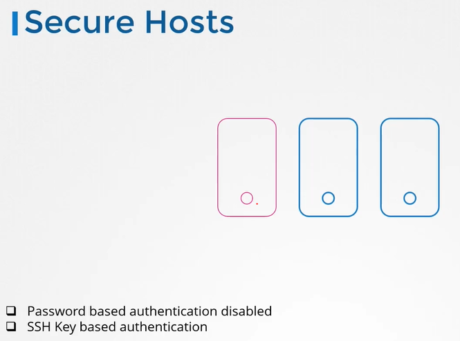
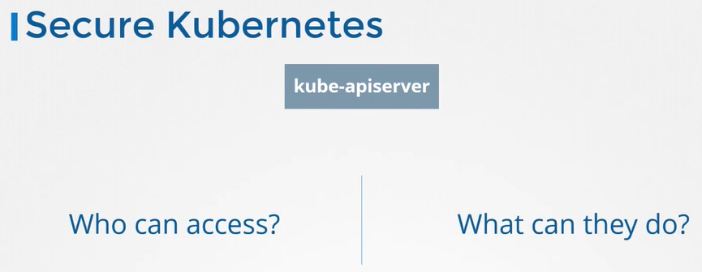
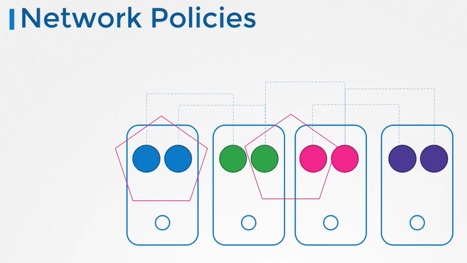

# Kubernetes Security Primitives
  - Take me to [Video Tutorial](https://kodekloud.com/topic/kubernetes-security-primitives/)
  ### Notes on Lecture Transcript

#### Introduction
- **Lecture Focus:** Security primitives in Kubernetes
- **Importance:** Security is crucial for Kubernetes as it is widely used for hosting production applications.

#### High-Level Overview of Security Primitives
1. **Host Security:**
   - Secure all access to hosts forming the Kubernetes cluster.
   - Disable root access.
   - Disable password-based authentication.
   - Enable SSH key-based authentication only.
   - Ensure physical or virtual infrastructure is secured to prevent compromises.

2. **API Server Security:**
   - **Central Component:** kube-apiserver.
   - **Interaction:** Through kube control utility or direct API access.
   - **Defense Strategy:** Control access to the API server.
   - **Authentication:** Determines who can access the cluster.
     - Methods: User IDs and passwords in static files, tokens, certificates, external authentication providers like LDAP.
     - Service Accounts: Created for machine access.
   - **Authorization:** Determines what actions can be performed in the cluster.
     - Mechanisms: Role-based access controls (RBAC), attribute-based access control, Node authorizers, webhooks.

3. **TLS Encryption:**
   - **Components Secured:** Communication between ETCD cluster, kube-controller-manager, scheduler, API server, worker nodes (Kubelet, kube-proxy).
   - **Purpose:** Ensure all communication within the cluster is encrypted.
   - **Details:** Setting up certificates between components will be covered in a dedicated section.

4. **Pod Communication:**
   - **Default Behavior:** All Pods can access all other Pods within the cluster.
   - **Restriction:** Network policies can restrict access between Pods.
   - **Details:** Implementation of network policies will be covered in the network policy section.

#### Conclusion
- **Next Steps:** Detailed exploration of the mentioned security primitives in upcoming lectures.
-----------------------------------------------------------------------------------------------------
In this section, we will take a look at kubernetes security primitives

## Secure Hosts

 
  
## Secure Kubernetes
- We need to make two types of decisions.
  - Who can access?
  - What can they do?
 
  
  
## Authentication
- Who can access the API Server is defined by the Authentication mechanisms.
  
## Authorization
- Once they gain access to the cluster, what they can do is defined by authorization mechanisms.

## TLS Certificates
- All communication with the cluster, between the various components such as the ETCD Cluster, kube-controller-manager, scheduler, api server, as well as those running on the working nodes such as the kubelet and kubeproxy is secured using TLS encryption.

 
 
## Network Policies
What about communication between applications within the cluster?

  
  
