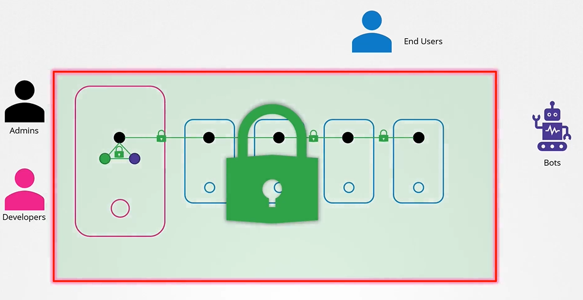
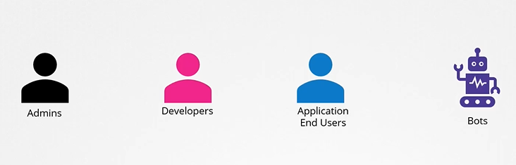
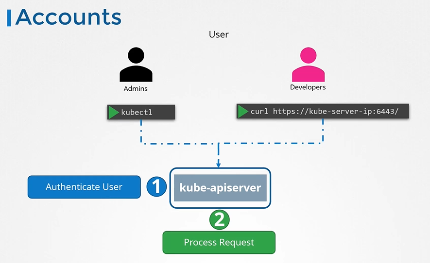
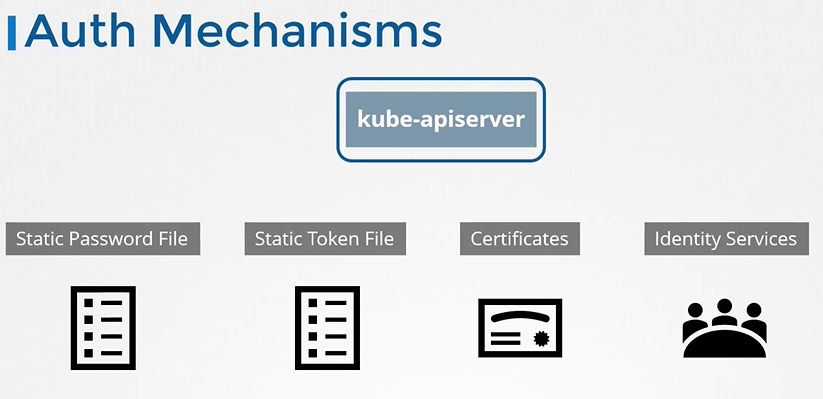
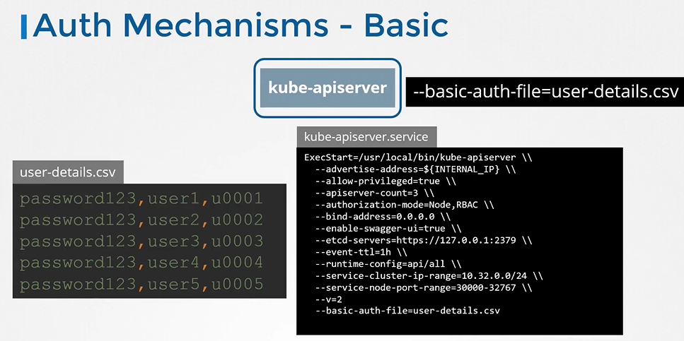
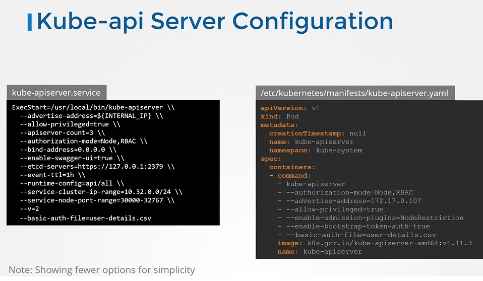
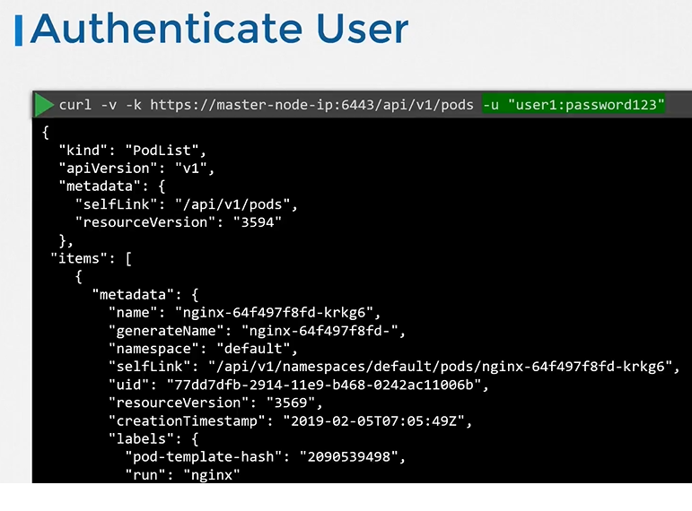
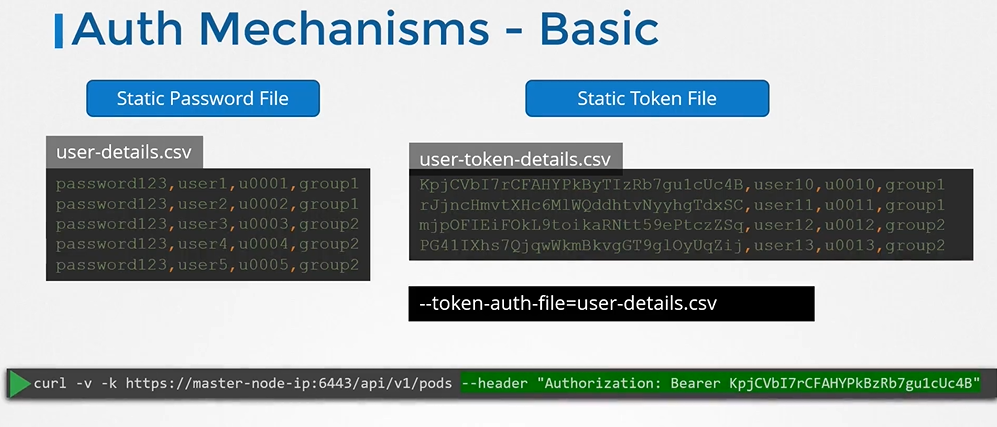
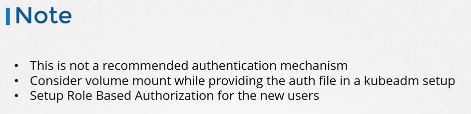

# Authentication
  - Take me to [Video Tutorial](https://kodekloud.com/topic/authentication/)
### Summary of the Transcript

#### Lecture Topic
- **Focus:** Authentication in a Kubernetes cluster
- **Objective:** Securing access to the Kubernetes cluster using various authentication mechanisms.

#### Key Points

1. **User Types:**
   - **Administrators:** Perform administrative tasks.
   - **Developers:** Test or deploy applications.
   - **End Users:** Access applications deployed on the cluster (managed by applications themselves, not discussed here).
   - **Third-party Applications:** Access cluster for integration purposes.
   - **Service Accounts:** Used by processes/services/applications requiring access to the cluster.

2. **Authentication Overview:**
   - **Human Users:** Administrators and developers.
   - **Robot Users:** Processes/services/applications.
   - **Management of User Accounts:**
     - Kubernetes does not manage user accounts natively.
     - Relies on external sources (files with user details, certificates, third-party identity services like LDAP).

3. **User Access and API Server:**
   - **API Server Role:** Manages all user access, authenticates requests.
   - **Access Methods:** Through `kubectl` tool or API directly.
   - **Authentication Mechanisms:**
     - Static password files.
     - Static token files.
     - Certificates.
     - Third-party authentication protocols (LDAP, Kerberos).

4. **Static Password and Token Files:**
   - **Static Password File:**
     - CSV file with columns: password, username, user ID (optional fourth column for group details).
     - File specified as an option to the Kube API server.
     - Requires Kube API server restart (handled automatically by Kubeadm tool).
   - **Static Token File:**
     - Similar to password file but uses tokens instead of passwords.
     - Token specified in the request for authentication.

5. **Security Note:**
   - Storing usernames, passwords, and tokens in clear text is insecure and not recommended.
   - This method is used for simplicity to understand the basics of authentication.

6. **Next Steps:**
   - Discussion on other authentication mechanisms in upcoming lectures.
   - Future topics include certificate-based authentication and securing communication within the Kubernetes cluster using certificates.
   - Authorization setup for new users will be discussed later in the course.

#### Practical Tips
- **Kubeadm Setup:** Ensure volume mounts for passing the authentication file.
- **Detailed Instructions:** Available in the article following the lecture.

The lecture aims to provide a foundational understanding of how authentication works in Kubernetes, starting with simple mechanisms before moving to more secure methods.
-----------------------------------------------------------------------------------------------------------------------
Article on Setting up Basic Authentication
Setup basic authentication on Kubernetes (Deprecated in 1.19)
Note: This is not recommended in a production environment. This is only for learning purposes. Also note that this approach is deprecated in Kubernetes version 1.19 and is no longer available in later releases

Follow the below instructions to configure basic authentication in a kubeadm setup.

Create a file with user details locally at /tmp/users/user-details.csv

# User File Contents
password123,user1,u0001
password123,user2,u0002
password123,user3,u0003
password123,user4,u0004
password123,user5,u0005


Edit the kube-apiserver static pod configured by kubeadm to pass in the user details. The file is located at /etc/kubernetes/manifests/kube-apiserver.yaml


apiVersion: v1
kind: Pod
metadata:
  name: kube-apiserver
  namespace: kube-system
spec:
  containers:
  - command:
    - kube-apiserver
      <content-hidden>
    image: k8s.gcr.io/kube-apiserver-amd64:v1.11.3
    name: kube-apiserver
    volumeMounts:
    - mountPath: /tmp/users
      name: usr-details
      readOnly: true
  volumes:
  - hostPath:
      path: /tmp/users
      type: DirectoryOrCreate
    name: usr-details


Modify the kube-apiserver startup options to include the basic-auth file


apiVersion: v1
kind: Pod
metadata:
  creationTimestamp: null
  name: kube-apiserver
  namespace: kube-system
spec:
  containers:
  - command:
    - kube-apiserver
    - --authorization-mode=Node,RBAC
      <content-hidden>
    - --basic-auth-file=/tmp/users/user-details.csv
Create the necessary roles and role bindings for these users:


---
kind: Role
apiVersion: rbac.authorization.k8s.io/v1
metadata:
  namespace: default
  name: pod-reader
rules:
- apiGroups: [""] # "" indicates the core API group
  resources: ["pods"]
  verbs: ["get", "watch", "list"]
 
---
# This role binding allows "jane" to read pods in the "default" namespace.
kind: RoleBinding
apiVersion: rbac.authorization.k8s.io/v1
metadata:
  name: read-pods
  namespace: default
subjects:
- kind: User
  name: user1 # Name is case sensitive
  apiGroup: rbac.authorization.k8s.io
roleRef:
  kind: Role #this must be Role or ClusterRole
  name: pod-reader # this must match the name of the Role or ClusterRole you wish to bind to
  apiGroup: rbac.authorization.k8s.io
Once created, you may authenticate into the kube-api server using the users credentials

curl -v -k https://localhost:6443/api/v1/pods -u "user1:password123"
--------------------------------------------------_________________________________________________________________________________


In this section, we will take a look at authentication in a kubernetes cluster

## Accounts

  
  
#### Different users that may be accessing the cluster security of end users who access the applications deployed on the cluster is managed by the applications themselves internally.

 
 
- So, we left with 2 types of users
  - Humans, such as the Administrators and Developers
  - Robots such as other processes/services or applications that require access to the cluster.
  

  
  
- All user access is managed by apiserver and all of the requests goes through apiserver.
 
  
  
## Authentication Mechanisms
- There are different authentication mechanisms that can be configured.

  
  
## Authentication Mechanisms - Basic
  
  
  
## kube-apiserver configuration
- If you set up via kubeadm then update kube-apiserver.yaml manifest file with the option.
  
  
  
## Authenticate User

- To authenticate using the basic credentials while accessing the API server specify the username and password in a curl command.
  ```
  $ curl -v -k http://master-node-ip:6443/api/v1/pods -u "user1:password123"
  ```
  
  
- We can have additional column in the user-details.csv file to assign users to specific groups.

  
  
## Note
 
 
  
  
#### K8s Reference Docs
- https://kubernetes.io/docs/reference/access-authn-authz/authentication/ 
  
  
