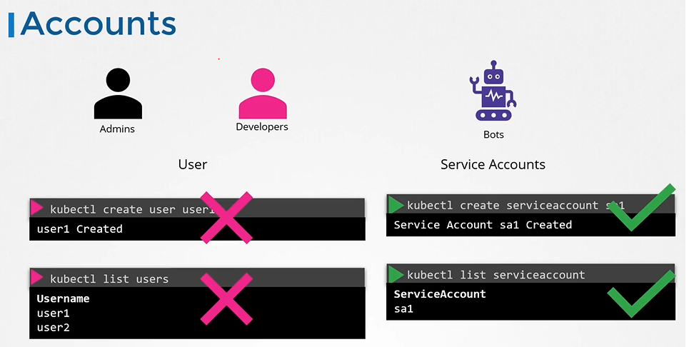

# Authentication
  - Take me to [Video Tutorial](https://kodekloud.com/topic/authentication/)
### Summary of the Transcript

#### Lecture Topic
- **Focus:** Authentication in a Kubernetes cluster
- **Objective:** Securing access to the Kubernetes cluster using various authentication mechanisms.

#### Key Points

1. **User Types:**
   - **Administrators:** Perform administrative tasks.
   - **Developers:** Test or deploy applications.
   - **End Users:** Access applications deployed on the cluster (managed by applications themselves, not discussed here).
   - **Third-party Applications:** Access cluster for integration purposes.
   - **Service Accounts:** Used by processes/services/applications requiring access to the cluster.

2. **Authentication Overview:**
   - **Human Users:** Administrators and developers.
   - **Robot Users:** Processes/services/applications.
   - **Management of User Accounts:**
     - Kubernetes does not manage user accounts natively.
     - Relies on external sources (files with user details, certificates, third-party identity services like LDAP).

3. **User Access and API Server:**
   - **API Server Role:** Manages all user access, authenticates requests.
   - **Access Methods:** Through `kubectl` tool or API directly.
   - **Authentication Mechanisms:**
     - Static password files.
     - Static token files.
     - Certificates.
     - Third-party authentication protocols (LDAP, Kerberos).

4. **Static Password and Token Files:**
   - **Static Password File:**
     - CSV file with columns: password, username, user ID (optional fourth column for group details).
     - File specified as an option to the Kube API server.
     - Requires Kube API server restart (handled automatically by Kubeadm tool).
   - **Static Token File:**
     - Similar to password file but uses tokens instead of passwords.
     - Token specified in the request for authentication.

5. **Security Note:**
   - Storing usernames, passwords, and tokens in clear text is insecure and not recommended.
   - This method is used for simplicity to understand the basics of authentication.

6. **Next Steps:**
   - Discussion on other authentication mechanisms in upcoming lectures.
   - Future topics include certificate-based authentication and securing communication within the Kubernetes cluster using certificates.
   - Authorization setup for new users will be discussed later in the course.

#### Practical Tips
- **Kubeadm Setup:** Ensure volume mounts for passing the authentication file.
- **Detailed Instructions:** Available in the article following the lecture.

The lecture aims to provide a foundational understanding of how authentication works in Kubernetes, starting with simple mechanisms before moving to more secure methods.
-----------------------------------------------------------------------------------------------------------------------
In this section, we will take a look at authentication in a kubernetes cluster

## Accounts

  
  
#### Different users that may be accessing the cluster security of end users who access the applications deployed on the cluster is managed by the applications themselves internally.

 
 
- So, we left with 2 types of users
  - Humans, such as the Administrators and Developers
  - Robots such as other processes/services or applications that require access to the cluster.
  

  
  
- All user access is managed by apiserver and all of the requests goes through apiserver.
 
  
  
## Authentication Mechanisms
- There are different authentication mechanisms that can be configured.

  
  
## Authentication Mechanisms - Basic
  
  
  
## kube-apiserver configuration
- If you set up via kubeadm then update kube-apiserver.yaml manifest file with the option.
  
  
  
## Authenticate User

- To authenticate using the basic credentials while accessing the API server specify the username and password in a curl command.
  ```
  $ curl -v -k http://master-node-ip:6443/api/v1/pods -u "user1:password123"
  ```
  
  
- We can have additional column in the user-details.csv file to assign users to specific groups.

  
  
## Note
 
 
  
  
#### K8s Reference Docs
- https://kubernetes.io/docs/reference/access-authn-authz/authentication/ 
  
  
