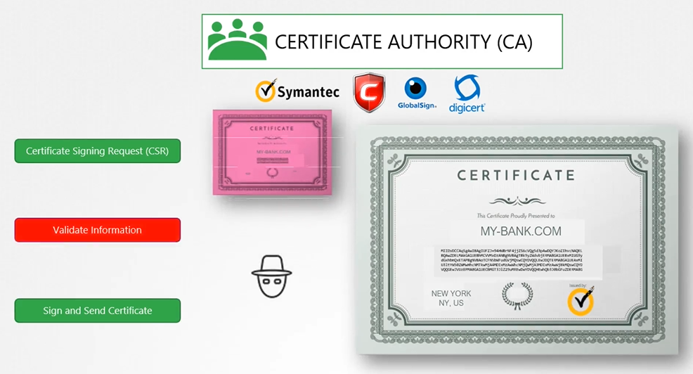
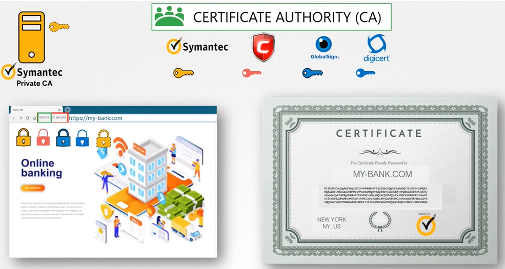

# TLS Basics
  - Take me to [Video Tutorial](https://kodekloud.com/topic/tls-basics/)
  - ### Summary of the Article

#### Lecture Focus
- **Topic:** Understanding SSL/TLS certificates
- **Objective:** To explain the basics of TLS certificates, their importance, and how to configure them for securing SSH or web servers.

#### Key Concepts and Explanations
1. **Purpose of Certificates:**
   - Ensure secure communication between two parties.
   - Validate the identity of the server to the client.

2. **Symmetric vs. Asymmetric Encryption:**
   - **Symmetric Encryption:** Uses a single key for both encryption and decryption. This method is secure but risky as the key must be shared.
   - **Asymmetric Encryption:** Uses a pair of keys (public and private). The public key encrypts data, which only the private key can decrypt.

3. **Public and Private Keys:**
   - **Private Key:** Kept secure and private.
   - **Public Key:** Shared publicly to enable encrypted communication.

4. **SSL/TLS in Web Communication:**
   - When a user accesses a web server, the server provides its public key.
   - The user's browser uses this public key to encrypt a symmetric key, which is then sent to the server.
   - The server decrypts this symmetric key using its private key, enabling secure communication.

5. **Certificate Authorities (CAs):**
   - Trusted organizations that verify and sign certificates.
   - Ensure the legitimacy of the server's identity.
   - Popular CAs include Symantec, DigiCert, Comodo, and GlobalSign.

6. **Certificate Signing Request (CSR):**
   - Generated by the server, containing its public key and domain information.
   - Sent to a CA for signing, resulting in a trusted certificate.

7. **Preventing Man-in-the-Middle Attacks:**
   - Ensuring certificates are signed by trusted CAs prevents attackers from impersonating legitimate servers.

8. **Role of Browsers:**
   - Browsers have built-in public keys of CAs.
   - Validate the server's certificate using these CA public keys.

9. **Private vs. Public CAs:**
   - **Public CAs:** Validate certificates for public websites.
   - **Private CAs:** Used within organizations for internal sites.

10. **Client Certificates:**
    - Less common, but can be used to verify the client's identity to the server.
    - Clients generate their own key pairs and obtain signed certificates from a CA.

11. **Public Key Infrastructure (PKI):**
    - The system of CAs, servers, clients, and the processes for managing digital certificates.

12. **Practical Notes:**
    - Certificates are named with extensions like `.crt` or `.pem` for public keys and `.key` for private keys.

#### Summary of Key Takeaways
- **Encryption Types:** Understanding symmetric and asymmetric encryption and their uses.
- **Certificates:** Learning about the creation, use, and validation of TLS certificates.
- **CAs:** Recognizing the role of certificate authorities in ensuring secure web communication.
- **PKI:** Knowing the components and importance of Public Key Infrastructure.
- **Naming Conventions:** Familiarity with file extensions for certificates and keys.

The lecture aims to build foundational knowledge on SSL/TLS certificates, emphasizing their role in securing web and SSH communications and ensuring trust through the use of certificate authorities.
______________________________________________________________________________________________________________________________________
In this section, we will take a look at TLS Basics

## Certificate
- A certificate is used to guarantee trust between 2 parties during a transaction.
- Example: when a user tries to access web server, tls certificates ensure that the communication between them is encrypted.

  
  
  
## Symmetric Encryption
- It is a secure way of encryption, but it uses the same key to encrypt and decrypt the data and the key has to be exchanged between the sender and the receiver, there is a risk of a hacker gaining access to the key and decrypting the data.

  
  
## Asymmetric Encryption
- Instead of using single key to encrypt and decrypt data, asymmetric encryption uses a pair of keys, a private key and a public key.

  
  
  
  
  
  
  
  

#### How do you look at a certificate and verify if it is legit?
- who signed and issued the certificate.
- If you generate the certificate then you will have it sign it by yourself; that is known as self-signed certificate.

  
  
#### How do you generate legitimate certificate? How do you get your certificates singed by someone with authority?
- That's where **`Certificate Authority (CA)`** comes in for you. Some of the popular ones are Symantec, DigiCert, Comodo, GlobalSign etc.

  
  
  
  
  
  
## Public Key Infrastructure
   
   
   
## Certificates naming convention

  
  
  

  
   

  
  
  

  
  
  
  
  
  

  
  
