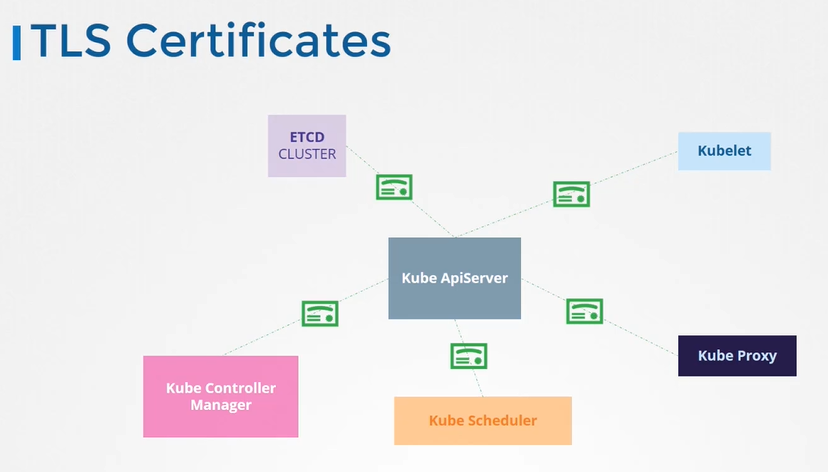
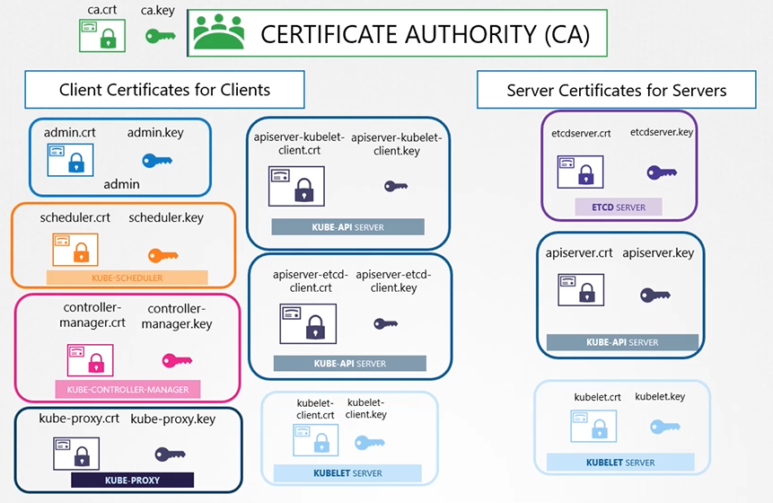

# TLS in Kubernetes
  - Take me to [Video Tutorial](https://kodekloud.com/topic/tls-in-kubernetes/)
In this lecture, the focus is on securing a Kubernetes cluster using TLS certificates. Building on the previous lecture about public and private keys and Certificate Authorities (CAs), the discussion is now extended to the context of Kubernetes.

**Key Concepts Recap:**
1. **Certificates Types:**
   - **Server Certificates**: Configured on servers to secure communication.
   - **Root Certificates**: Configured on CA servers.
   - **Client Certificates**: Configured on clients to verify their identity.

2. **Naming Conventions**: 
   - Certificates with public keys: `.CRT` or `.PEM`.
   - Private keys: `.key` or `-key.PEM`.

**Kubernetes Cluster Security:**
1. **Components and Their Certificates**:
   - **Kube-API Server**: Acts as a server exposing an HTTPS service. Requires `APIserver.cert` and `APIserver.key`.
   - **ETCD Server**: Stores cluster information. Requires `etcdserver.crt` and `etcdserver.key`.
   - **Kubelet Services**: On worker nodes, exposes an HTTPS API endpoint. Requires `kubelet.cert` and `kubelet.key`.

2. **Client Components**:
   - **Admin User**: Uses `kubectl` to interact with the kube-API server. Requires `admin.crt` and `admin.key`.
   - **Scheduler**: Schedules pods and needs to access the kube-API server. Requires `scheduler.cert` and `scheduler.key`.
   - **Kube Controller Manager**: Another client accessing the kube-API server. Requires its own certificate pair.
   - **Kube-Proxy**: Authenticates to the kube-API server. Requires `kubeproxy.crt` and `kubeproxy.key`.

**Inter-Server Communication**:
- **Kube-API Server to ETCD Server**: Kube-API server acts as a client. Can use its own certificates or a new pair specifically for this purpose.
- **Kube-API Server to Kubelet**: Can use the original certificates or generate new ones for this interaction.

**Grouping Certificates**:
- **Client Certificates**: Used by clients like admin, scheduler, and kube-proxy to connect to the kube-API server.
- **Server Certificates**: Used by the kube-API server, ETCD server, and kubelet to authenticate their clients.

**Generating Certificates**:
- **Certificate Authority (CA)**: At least one CA is required for the cluster. It signs all certificates. The CA has its own certificate and key pair: `CA.crt` and `CA.key`.

**Summary**:
To secure a Kubernetes cluster, certificates are essential. Server certificates secure services, client certificates authenticate clients, and a CA signs these certificates. Understanding the role of each certificate and adhering to naming conventions helps manage the complex security needs of a Kubernetes environment effectively.

____________________________________________________________________________________________________________________________________________
In this section, we will take a look at TLS in kubernetes

#### The two primary requirements are to have all the various services within the cluster to use server certificates and all clients to use client certificates to verify they are who they say they are.
- Server Certificates for Servers
- Client Certificates for Clients

  
  
#### Let's look at the different components within the k8s cluster and identify the various servers and clients and who talks to whom.

  
  
