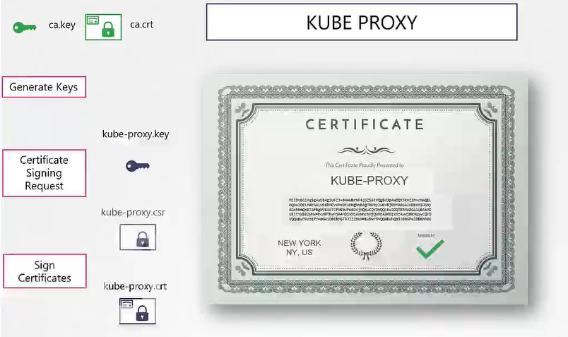
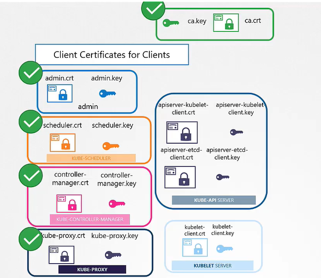

# TLS in kubernetes - Certificate Creation
  - Take me to [Video Tutorial](https://kodekloud.com/topic/tls-in-kubernetes-certificate-creation/)
In this lecture, the focus is on generating certificates for a Kubernetes cluster using OpenSSL. Here is a summary of the key points discussed:

### Generating Certificates
1. **CA Certificates**:
   - **Create a Private Key**: `openssl genrsa -out ca.key`.
   - **Generate a Certificate Signing Request (CSR)**: Use the private key to generate a CSR specifying the Common Name (CN) as "Kubernetes-CA".
   - **Sign the Certificate**: Use the OpenSSL X509 command to self-sign the CSR, resulting in a CA root certificate.

2. **Client Certificates**:
   - **Admin User**:
     - Create a private key and CSR with the name "Kube Admin".
     - Sign the certificate with the CA key pair.
     - The certificate includes the group "System Masters" to grant administrative privileges.
   - **Other Components (Scheduler, Controller Manager, Kube Proxy)**:
     - Follow a similar process as the admin user, prefixing system component names with "system".
   
3. **Server-Side Certificates**:
   - **ETCD Server**:
     - Generate a certificate named "ETCD-server".
     - In a high availability setup, generate additional peer certificates.
   - **Kube API Server**:
     - Generate a certificate with multiple DNS names and IP addresses, specified in an OpenSSL config file.
   - **Kubelets**:
     - Generate a certificate for each node, named after the node (e.g., node01, node02).
     - Include group "System Nodes" in the certificates for proper permission assignments.

### Using Certificates
1. **Admin Certificate**:
   - Use the certificate and key for REST API calls to the Kube API server or move parameters to a kubeconfig file.
2. **ETCD and Kube API Server**:
   - Configure ETCD with server and peer certificates.
   - Pass the CA file and API server certificates to the Kube API server's configuration.
   - Kube API server uses its certificates for communication with ETCD and kubelets.
3. **Kubelets**:
   - Each node's kubelet server uses node-specific certificates.
   - Kubelets also use client certificates to authenticate to the Kube API server.

### Important Notes
- Every component needs the CA root certificate to validate others.
- Configuration files like kubeconfig are essential for managing certificate details.
- The next lecture will cover how to view certificate information and configure certificates using the Kubeadm tool.

This lecture provides a comprehensive guide on generating and using certificates to secure communication within a Kubernetes cluster, ensuring each component is properly authenticated and authorized.

__________________________________________________________________________________________________
In this section, we will take a look at TLS certificate creation in kubernetes

## Generate Certificates
- There are different tools available such as easyrsa, openssl or cfssl etc. or many others for generating certificates.

## Certificate Authority (CA)

- Generate Keys
  ```
  $ openssl genrsa -out ca.key 2048
  ```
- Generate CSR
  ```
  $ openssl req -new -key ca.key -subj "/CN=KUBERNETES-CA" -out ca.csr
  ```
- Sign certificates
  ```
  $ openssl x509 -req -in ca.csr -signkey ca.key -out ca.crt
  ```
 
 
 
## Generating Client Certificates

#### Admin User Certificates

- Generate Keys
  ```
  $ openssl genrsa -out admin.key 2048
  ```
- Generate CSR
  ```
  $ openssl req -new -key admin.key -subj "/CN=kube-admin" -out admin.csr
  ```
- Sign certificates
  ```
  $ openssl x509 -req -in admin.csr -CA ca.crt -CAkey ca.key -out admin.crt
  ```
  
  
  
- Certificate with admin privilages
  ```
  $ openssl req -new -key admin.key -subj "/CN=kube-admin/O=system:masters" -out admin.csr
  ```
  
#### We follow the same procedure to generate client certificate for all other components that access the kube-apiserver.

  
  
  
  
  
   
  
  
## Generating Server Certificates

## ETCD Server certificate

  
  
  
  
## Kube-apiserver certificate

  
  
  
  
## Kubectl Nodes (Server Cert)

   
   
## Kubectl Nodes (Client Cert)

   
   
   
   
  
  

  

  


  
  
  
  
 
