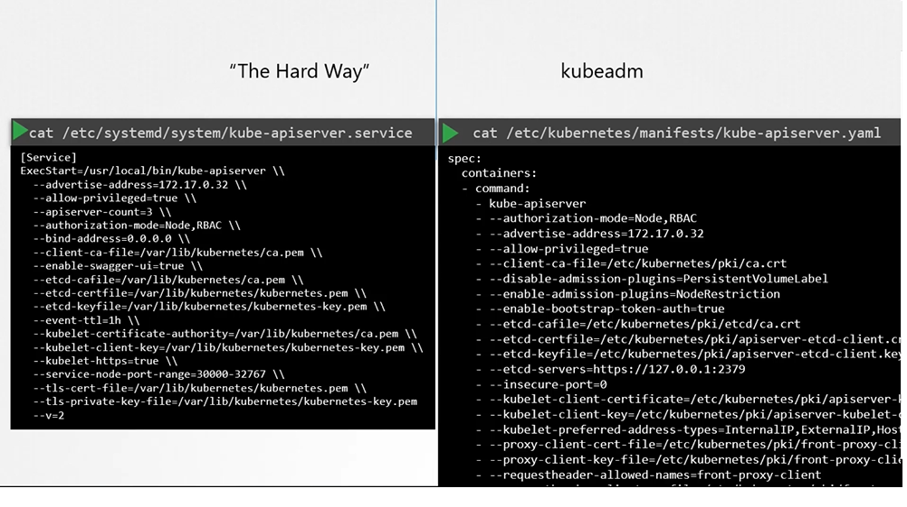
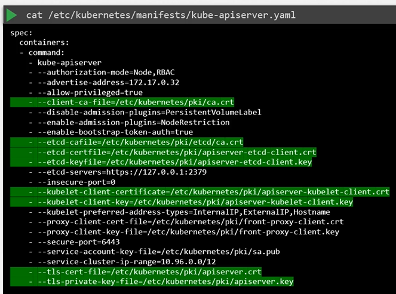
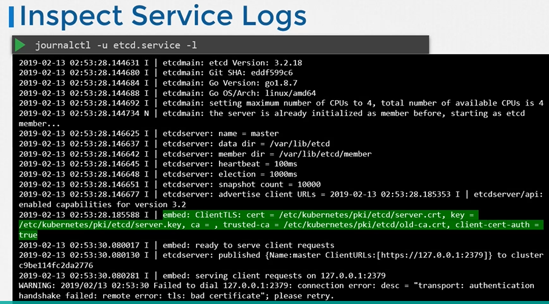
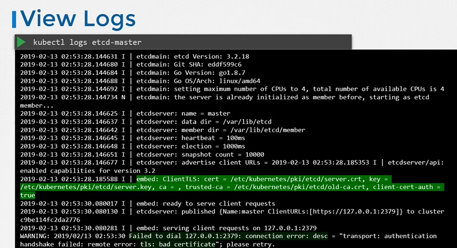

# View Certificate Details
  - Take me to [Video Tutorial](https://kodekloud.com/topic/view-certificate-details/)
 In this lecture, we focus on viewing and checking the health of certificates in an existing Kubernetes cluster. Here's a summary of the key points:

### Overview
- **Scenario**: You join a new team as an administrator and are tasked with performing a health check on the cluster’s certificates.
- **Objective**: Identify and inspect all certificates used in the Kubernetes cluster to ensure they are valid and correctly configured.

### Steps to Perform a Health Check
1. **Understand the Cluster Setup**:
   - Clusters can be set up in different ways: manually (the "hard way") or using automated tools like kubeadm.
   - The method used affects where and how certificates are managed and stored.

2. **Identify Certificate Files**:
   - In a kubeadm setup, certificate files are found in the kube-apiserver definition file under `/etc/kubernetes/manifests/`.
   - Note down the paths, names, and other relevant information of the certificate files.

3. **Inspect Certificate Details**:
   - Use the `openssl x509` command to decode each certificate and view details.
   - **Details to Check**:
     - **Subject Name**: E.g., "kube-apiserver".
     - **Alternate Names**: Ensure all DNS names and IP addresses are listed.
     - **Issuer**: Should be the correct Certificate Authority (CA).
     - **Validity**: Check the expiration date to ensure the certificate is not expired.

4. **Log Information**:
   - Document all certificates in a spreadsheet, noting down the paths, alternate names, organization, issuer, and expiration dates.
   - Compare these details with the requirements listed in the Kubernetes documentation.

### Troubleshooting
- **Logs**:
  - If components are deployed as native services, use the OS logging functionality to view service logs.
  - If deployed as pods (via kubeadm), use `kubectl logs <pod-name>` to view logs.
  - If core components like the kube-apiserver or etcd are down and `kubectl` commands fail, use Docker commands (`docker ps -a` and `docker logs <container-id>`) to fetch logs.

### Conclusion
- Ensure all certificates are properly configured and valid by checking names, alternate names, issuer, and expiration dates.
- Use provided resources, such as an Excel spreadsheet template and Kubernetes documentation, to aid in the health check.
- Practice viewing and inspecting certificates to familiarize yourself with the process.

This lecture provides a comprehensive guide to performing a health check on Kubernetes cluster certificates, ensuring that all certificates are valid and properly configured.

================================================================================================================================
In this section, we will take a look how to view certificates in a kubernetes cluster.

## View Certs 
 

 
 
 - To view the details of the certificate
   ```
   $ openssl x509 -in /etc/kubernetes/pki/apiserver.crt -text -noout
   ```
   
   
   
#### Follow the same procedure to identify information about of all the other certificates

   
   
## Inspect Server Logs - Hardware setup
- Inspect server logs using journalctl
  ```
  $ journalctl -u etcd.service -l
  ```
  
  
  
## Inspect Server Logs - kubeadm setup
- View logs using kubectl
  ```
  $ kubectl logs etcd-master
  ```
  
  
- View logs using docker ps and docker logs
  ```
  $ docker ps -a
  $ docker logs <container-id>
  ```
  
  
#### K8s Reference Docs
- https://kubernetes.io/docs/setup/best-practices/certificates/#certificate-paths
  
  

  

   
   

