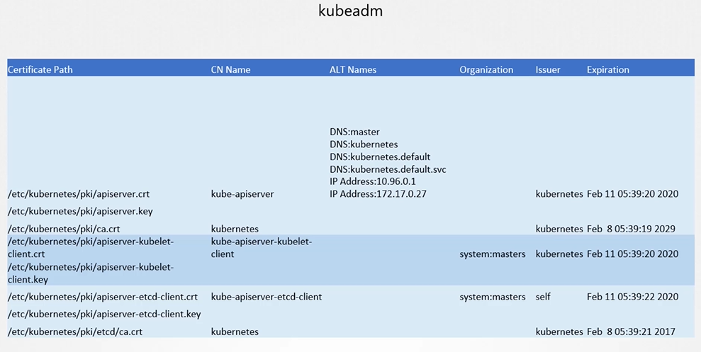

# View Certificate Details
  - Take me to [Video Tutorial](https://kodekloud.com/topic/view-certificate-details/)
 In this lecture, we focus on viewing and checking the health of certificates in an existing Kubernetes cluster. Here's a summary of the key points:
`openssl x509` is a command-line tool in the OpenSSL suite used to manage X.509 certificates. X.509 is a standard defining the format of public key certificates, which are used in various security protocols, including SSL/TLS, to establish secure communications over networks. The `openssl x509` command provides a variety of functions for working with these certificates, including viewing, creating, signing, and converting certificates.

### Common Uses of `openssl x509`

1. **View Certificate Details**:
   To display the details of a certificate in a readable format.
   ```sh
   openssl x509 -in certificate.crt -text -noout
   ```

2. **Convert Certificate Formats**:
   Convert a certificate from PEM to DER format.
   ```sh
   openssl x509 -in certificate.pem -outform der -out certificate.der
   ```
   Convert a certificate from DER to PEM format.
   ```sh
   openssl x509 -in certificate.der -inform der -outform pem -out certificate.pem
   ```

3. **Verify a Certificate**:
   To verify the integrity and validity of a certificate.
   ```sh
   openssl x509 -in certificate.crt -noout -modulus | openssl md5
   ```

4. **Create a Self-Signed Certificate**:
   To create a new self-signed certificate.
   ```sh
   openssl req -x509 -newkey rsa:4096 -keyout key.pem -out cert.pem -days 365
   ```

5. **Extract Information from a Certificate**:
   To extract the subject or issuer from a certificate.
   ```sh
   openssl x509 -in certificate.crt -noout -subject
   openssl x509 -in certificate.crt -noout -issuer
   ```

6. **Check Certificate Expiration Date**:
   To check the expiration date of a certificate.
   ```sh
   openssl x509 -enddate -noout -in certificate.crt
   ```

### Common Options for `openssl x509`

- `-in filename`: Input file (certificate to read).
- `-out filename`: Output file (where to write the processed certificate).
- `-inform PEM|DER`: Input format (PEM or DER).
- `-outform PEM|DER`: Output format (PEM or DER).
- `-text`: Print the certificate in human-readable text form.
- `-noout`: Do not output the encoded version of the certificate.
- `-subject`: Print the subject of the certificate.
- `-issuer`: Print the issuer of the certificate.
- `-enddate`: Print the expiration date of the certificate.
- `-serial`: Print the serial number of the certificate.

### Examples

1. **View Certificate Details**:
   ```sh
   openssl x509 -in mycert.pem -text -noout
   ```

2. **Convert Certificate Format**:
   ```sh
   openssl x509 -in mycert.pem -outform der -out mycert.der
   ```

3. **Create a Self-Signed Certificate**:
   ```sh
   openssl req -x509 -newkey rsa:2048 -keyout mykey.pem -out mycert.pem -days 365
   ```

4. **Extract the Subject**:
   ```sh
   openssl x509 -in mycert.pem -noout -subject
   ```

5. **Check Certificate Expiration Date**:
   ```sh
   openssl x509 -in mycert.pem -enddate -noout
   ```

The `openssl x509` command is powerful and versatile, making it a fundamental tool for anyone working with X.509 certificates, whether for web servers, secure communications, or other security-related tasks.


==============================================================================================


### Overview
- **Scenario**: You join a new team as an administrator and are tasked with performing a health check on the cluster’s certificates.
- **Objective**: Identify and inspect all certificates used in the Kubernetes cluster to ensure they are valid and correctly configured.

### Steps to Perform a Health Check
1. **Understand the Cluster Setup**:
   - Clusters can be set up in different ways: manually (the "hard way") or using automated tools like kubeadm.
   - The method used affects where and how certificates are managed and stored.

2. **Identify Certificate Files**:
   - In a kubeadm setup, certificate files are found in the kube-apiserver definition file under `/etc/kubernetes/manifests/`.
   - Note down the paths, names, and other relevant information of the certificate files.

3. **Inspect Certificate Details**:
   - Use the `openssl x509` command to decode each certificate and view details.
   - **Details to Check**:
     - **Subject Name**: E.g., "kube-apiserver".
     - **Alternate Names**: Ensure all DNS names and IP addresses are listed.
     - **Issuer**: Should be the correct Certificate Authority (CA).
     - **Validity**: Check the expiration date to ensure the certificate is not expired.

4. **Log Information**:
   - Document all certificates in a spreadsheet, noting down the paths, alternate names, organization, issuer, and expiration dates.
   - Compare these details with the requirements listed in the Kubernetes documentation.

### Troubleshooting
- **Logs**:
  - If components are deployed as native services, use the OS logging functionality to view service logs.
  - If deployed as pods (via kubeadm), use `kubectl logs <pod-name>` to view logs.
  - If core components like the kube-apiserver or etcd are down and `kubectl` commands fail, use Docker commands (`docker ps -a` and `docker logs <container-id>`) to fetch logs.

### Conclusion
- Ensure all certificates are properly configured and valid by checking names, alternate names, issuer, and expiration dates.
- Use provided resources, such as an Excel spreadsheet template and Kubernetes documentation, to aid in the health check.
- Practice viewing and inspecting certificates to familiarize yourself with the process.

This lecture provides a comprehensive guide to performing a health check on Kubernetes cluster certificates, ensuring that all certificates are valid and properly configured.

================================================================================================================================


In this section, we will take a look how to view certificates in a kubernetes cluster.

## View Certs 
 

 
 
 - To view the details of the certificate
   ```
   $ openssl x509 -in /etc/kubernetes/pki/apiserver.crt -text -noout
   ```
   
   
   
#### Follow the same procedure to identify information about of all the other certificates

   
   
## Inspect Server Logs - Hardware setup
- Inspect server logs using journalctl
  ```
  $ journalctl -u etcd.service -l
  ```
  
  
  
## Inspect Server Logs - kubeadm setup
- View logs using kubectl
  ```
  $ kubectl logs etcd-master
  ```
  
  
- View logs using docker ps and docker logs
  ```
  $ docker ps -a
  $ docker logs <container-id>
  ```
  
  
#### K8s Reference Docs
- https://kubernetes.io/docs/setup/best-practices/certificates/#certificate-paths
  
  

  

   
   

