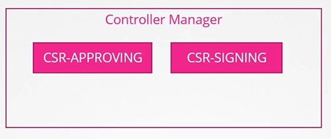

# Certificate API
  - Take me to [Video Tutorial](https://kodekloud.com/topic/certificates-api/)
In this lecture, we delve into managing certificates and explore the Certificate API in Kubernetes. Here's a summary of the key points covered:

### Overview
- **Setup**: As the cluster administrator, you've established a CA server and generated certificates for various components, ensuring that services run smoothly.
- **User Access**: When a new admin joins the team, you facilitate their access to the cluster by providing them with a certificate-key pair.
- **Certificate Rotation**: Certificates have a validity period, and when they expire, a new CSR is generated and signed by the CA server to maintain security.
- **CA Server**: The CA server, a critical component, houses the key and certificate files, ensuring secure certificate signing processes.
- **Certificates API**: Kubernetes offers a built-in Certificates API for automated certificate management, including signing requests and rotation.

### Certificate Signing Process
1. **User Request**: A user generates a private key and submits a CSR (Certificate Signing Request) to the administrator.
2. **Administrator Action**:
   - The administrator creates a `CertificateSigningRequest` Kubernetes object, encoding the CSR.
   - This object is reviewed and approved using `kubectl` commands, triggering Kubernetes to sign the certificate.
3. **Certificate Extraction**: The signed certificate is extracted from the `CertificateSigningRequest` object, decoded, and shared with the user.

### Controller Manager's Role
- **Certificate Operations**: All certificate-related operations are managed by the controller manager, specifically through controllers like `CSR-Approving` and `CSR-Signing`.
- **CA Configuration**: The controller manager's service configuration includes options to specify the CA server's root certificate and private key.

### Practice
- **Hands-On**: Engage with the Certificates API through practical exercises to reinforce learning and understanding.

This lecture offers a comprehensive guide to managing certificates in Kubernetes, from user access provisioning to automated certificate signing and rotation using the Certificates API.

=================================================================================


In this section, we will take a look at how to manage certificates and certificate API's in kubernetes

## CA (Certificate Authority)
- The CA is really just the pair of key and certificate files that we have generated, whoever gains access to these pair of files can sign any certificate for the kubernetes environment.

#### Kubernetes has a built-in certificates API that can do this for you. 
- With the certificate API, we now send a certificate signing request (CSR) directly to kubernetes through an API call.
   
  
   
#### This certificate can then be extracted and shared with the user.
- A user first creates a key
  ```
  $ openssl genrsa -out jane.key 2048
  ```
- Generates a CSR
  ```
  $ openssl req -new -key jane.key -subj "/CN=jane" -out jane.csr 
  ```
- Sends the request to the administrator and the adminsitrator takes the key and creates a CSR object, with kind as "CertificateSigningRequest" and a encoded "jane.csr"
  ```
  apiVersion: certificates.k8s.io/v1beta1
  kind: CertificateSigningRequest
  metadata:
    name: jane
  spec:
    groups:
    - system:authenticated
    usages:
    - digital signature
    - key encipherment
    - server auth
    request:
      <certificate-goes-here>
  ```
  $ cat jane.csr |base64 
  $ kubectl create -f jane.yaml
  ```
 
  
- To list the csr's
  ```
  $ kubectl get csr
  ```
- Approve the request
  ```
  $ kubectl certificate approve jane
  ```
- To view the certificate
  ```
  $ kubectl get csr jane -o yaml
  ```
- To decode it
  ```
  $ echo "<certificate>" |base64 --decode
  ```
  
  
  
#### All the certificate releated operations are carried out by the controller manager. 
- If anyone has to sign the certificates they need the CA Servers, root certificate and private key. The controller manager configuration has two options where you can specify this.

  
  
  
  
  
#### K8s Reference Docs
- https://kubernetes.io/docs/reference/access-authn-authz/certificate-signing-requests/
- https://kubernetes.io/docs/tasks/tls/managing-tls-in-a-cluster/
 
  


