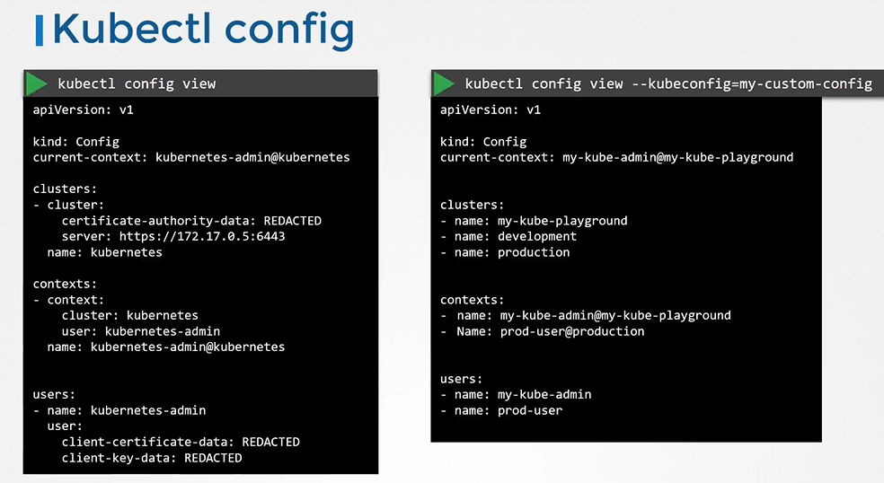
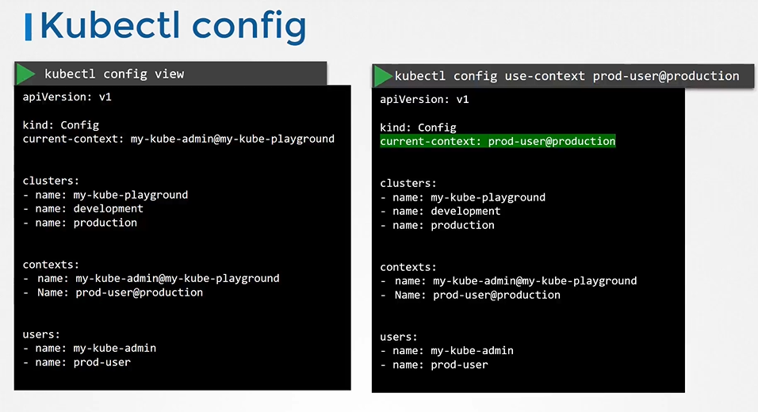

# KubeConfig 
  - Take me to [Video Tutorial](https://kodekloud.com/topic/kubeconfig/)
This lecture delves into kubeconfigs in Kubernetes, providing a comprehensive guide to understanding and working with these configuration files. Here's a summary of the key points covered:

### Overview
- **Purpose**: Kubeconfigs streamline access to Kubernetes clusters by storing configuration details, eliminating the need to specify options repeatedly in `kubectl` commands.
- **Components**: Kubeconfig files consist of three main sections: clusters, users, and contexts, each defining various configurations for cluster access.
- **Usage**: By configuring kubeconfig files, users can seamlessly switch between clusters, users, and namespaces without specifying credentials and server addresses in each command.

### Kubeconfig Structure
- **Clusters Section**: Specifies details of Kubernetes clusters, including server addresses and CA certificates.
- **Users Section**: Defines user accounts with their associated credentials, such as client certificates and keys.
- **Contexts Section**: Marries clusters and users together, defining which user accesses which cluster.

### Managing Kubeconfigs
- **Default Configuration**: By default, `kubectl` looks for a `config` file under `.kube` in the user's home directory, simplifying command execution.
- **Creating Contexts**: Users can define contexts to specify which user accesses which cluster, streamlining authentication processes.
- **Configuration Customization**: Kubeconfig files can be customized to suit individual needs, such as specifying default contexts or configuring namespaces.

### Certificate Management
- **File Paths vs. Data**: Certificate paths can be specified directly or as data in Base64-encoded format within the kubeconfig file.
- **Certificate Decoding**: Users can decode certificate data using Base64 utilities for enhanced security and flexibility.

### Practical Exercises
- **Hands-On Practice**: Engaging in practical exercises helps users familiarize themselves with kubeconfig files and troubleshoot issues effectively.

Overall, this lecture equips users with the knowledge and skills necessary to effectively manage kubeconfig files, streamline cluster access, and troubleshoot configuration-related issues in Kubernetes environments.

========================================================================


In this section, we will take a look at kubeconfig in kubernetes


#### Client uses the certificate file and key to query the kubernetes Rest API for a list of pods using curl.
- You can specify the same using kubectl

  
  
- We can move these information to a configuration file called kubeconfig. And the specify this file as the kubeconfig option in the command.
  ```
  $ kubectl get pods --kubeconfig config
  ```
  
## Kubeconfig File
- The kubeconfig file has 3 sections
  - Clusters
  - Contexts
  - USers
  
  
  
  
  
- To view the current file being used
  ```
  $ kubectl config view
  ```
- You can specify the kubeconfig file with kubectl config view with "--kubeconfig" flag
  ```
  $ kubectl config veiw --kubeconfig=my-custom-config
  ```
  
  
  
- How do you update your current context? Or change the current context
  ```
  $ kubectl config view --kubeconfig=my-custom-config
  ```
  
  
  
- kubectl config help
  ```
  $ kubectl config -h
  ```
  
  
  
## What about namespaces?

  
 
## Certificates in kubeconfig

  
 
  
  
  
 
#### K8s Reference Docs
- https://kubernetes.io/docs/tasks/access-application-cluster/configure-access-multiple-clusters/
- https://kubernetes.io/docs/reference/generated/kubectl/kubectl-commands#config
