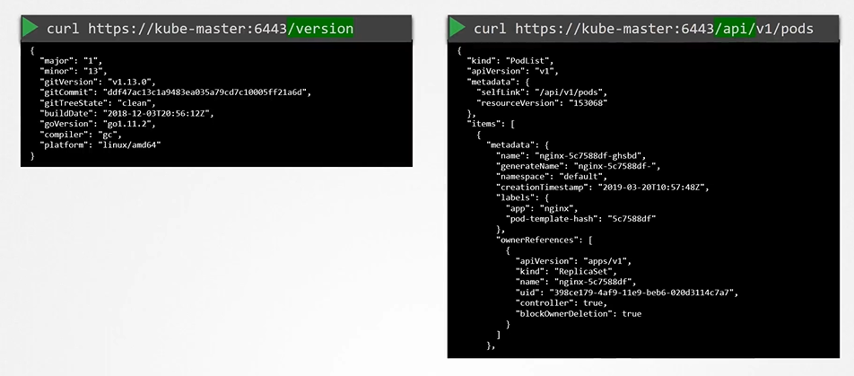
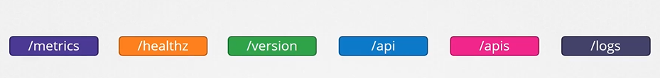
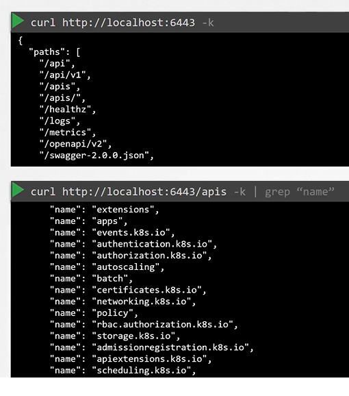
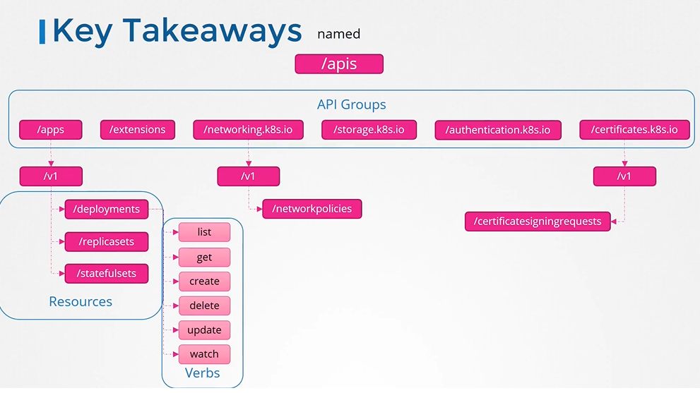

# API Groups
  - Take me to [Video Tutorial](https://kodekloud.com/topic/api-groups/)
This lecture focuses on understanding API groups in Kubernetes and their significance in managing cluster functionality. Here's a summary of the main points covered:

### Introduction to Kubernetes API
- **Role of API Server**: All interactions with the Kubernetes cluster, whether through `kubectl` or REST, are mediated by the API server.
- **API Endpoints**: Various operations, such as checking the cluster version or retrieving pod lists, are achieved by accessing specific API endpoints.

### API Groups
- **Purpose**: The Kubernetes API is organized into multiple groups based on functionality, including versioning, monitoring, logging, etc.
- **Core Group**: Houses fundamental resources like namespaces, pods, nodes, services, etc.
- **Named Group**: Contains more organized APIs for newer features, such as apps, networking, storage, authentication, authorization, etc.
- **Resource Actions**: Each resource within an API group supports a set of actions (verbs) like list, get, create, delete, update, watch, etc.

### Accessing API Groups
- **Direct Access**: Accessing the API directly via cURL requires authentication using certificate files.
- **Kubectl Proxy**: Running `kubectl proxy` launches a proxy service locally, allowing access to the cluster API without explicitly specifying authentication details in cURL commands.

### Distinction Between Kube Proxy and Kubectl Proxy
- **Kube Proxy**: Facilitates communication between pods and services across different nodes in the cluster.
- **Kubectl Proxy**: An HTTP proxy service created by `kubectl` utility to access the Kubernetes API server.

### Key Takeaways
- **Grouping of Resources**: Kubernetes resources are categorized into various API groups, simplifying management and access control.
- **Verbs and Actions**: Each resource supports specific actions, enabling precise control over cluster operations.
- **Authorization**: Understanding API groups lays the foundation for implementing access control policies in Kubernetes.

### Conclusion
- The lecture concludes by highlighting the importance of API groups in Kubernetes and hints at their role in authorization, which will be covered in the next section.

Understanding API groups is crucial for effectively managing Kubernetes clusters and implementing access control mechanisms.

========================================================================================================

In this section, we will take a look at API Groups in kubernetes

## To return version and list pods via API's 

 
 
- The kubernetes API is grouped into multiple such groups based on their purpose. Such as one for **`APIs`**, one for **`healthz`**, **`metrics`** and **`logs`** etc.

  
 
## API and APIs
- These APIs are catagorized into two.
  - The core group - Where all the functionality exists
    
    
 
  - The Named group - More organized and going forward all the newer features are going to be made available to these named groups.
  
    
    
- To list all the api groups

  
  
## Note on accessing the kube-apiserver
- You have to authenticate by passing the certificate files.

  
  
- An alternate is to start a **`kubeproxy`** client
  
  
  
## kube proxy vs kubectl proxy
 
  
  
## Key Takeaways

  

#### K8s Reference Docs
- https://kubernetes.io/docs/concepts/overview/kubernetes-api/
- https://kubernetes.io/docs/reference/using-api/api-concepts/
- https://kubernetes.io/docs/tasks/extend-kubernetes/http-proxy-access-api/
