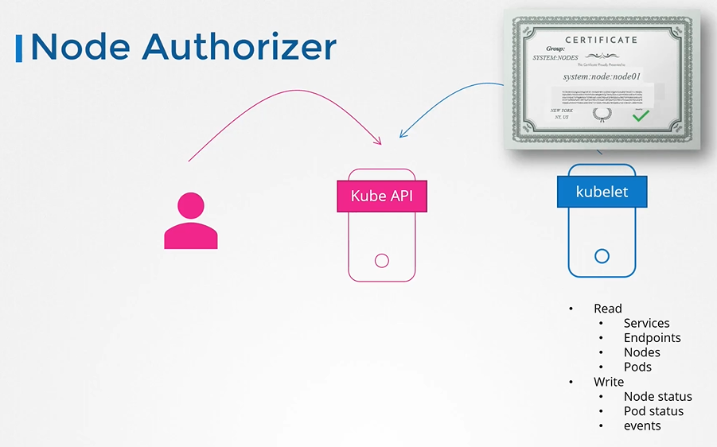
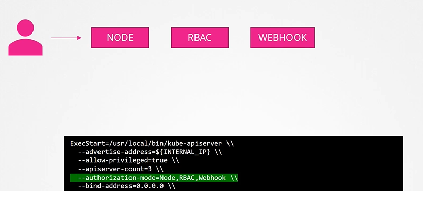

# Authorization
  - Take me to [Video Tutorial](https://kodekloud.com/topic/authorization/)
This lecture delves into the concept of authorization in Kubernetes, highlighting its importance in controlling access to cluster resources. Here's a breakdown of the key points covered:

### Need for Authorization
- **Role of Administrators**: Administrators perform various operations in the cluster, but as more users access the cluster, different levels of access control become necessary.
- **User Categories**: Users can include administrators, developers, testers, and external applications, each requiring different levels of access.

### Authorization Mechanisms
1. **Node Authorization**:
   - Special authorizer for kubelets on nodes.
   - Requests from kubelets are authorized based on predefined privileges.

2. **Attribute-Based Authorization**:
   - Associates users or groups with specific permissions defined in policy files.
   - Manual management of policy files, making it complex and difficult to scale.

3. **Role-Based Access Control (RBAC)**:
   - Defines roles with sets of permissions.
   - Users are associated with roles, simplifying access management.
   - Changes made to roles reflect across all associated users.

4. **External Authorization**:
   - Third-party tools like Open Policy Agent handle admission control and authorization.
   - Kubernetes sends user information to the external tool, which decides access based on policies.

5. **Always Allow and Always Deny**:
   - Modes for allowing or denying all requests without authorization checks.
   - Configured using the `Authorization Mode` option on the Kube API Server.
   - Multiple modes can be configured, and requests are authorized sequentially until approval.

### Implementation Details
- **Configuring Authorization Modes**: Specified using the `Authorization Mode` option on the Kube API Server.
- **Default Mode**: If not specified, defaults to `Always Allow`.
- **Sequential Authorization**: Requests are checked against each configured mode in order until granted access.

### Conclusion
- Authorization mechanisms are essential for controlling access to Kubernetes resources.
- Role-Based Access Control (RBAC) offers a standardized and scalable approach to access management.
- Understanding and configuring authorization modes is crucial for securing Kubernetes clusters effectively.

In the upcoming lectures, a deeper dive into Role-Based Access Control (RBAC) will be provided.

=================================================================================================================


In this section, we will take a look at authorization in kubernetes

## Why do you need Authorization in your cluster?
- As an admin, you can do all operations
  ```
  $ kubectl get nodes
  $ kubectl get pods
  $ kubectl delete node worker-2
  ```
  
  
  
## Authorization Mechanisms
- There are different authorization mechanisms supported by kubernetes
  - Node Authorization
  - Attribute-based Authorization (ABAC)
  - Role-Based Authorization (RBAC)
  - Webhook
  
## Node Authorization

  
  
## ABAC

  
  
## RBAC

  

## Webhook
  
  
  
## Authorization Modes
- The mode options can be defined on the kube-apiserver

  
  
- When you specify multiple modes, it will authorize in the order in which it is specified

  
  
  
  #### K8s Reference Docs
  - https://kubernetes.io/docs/reference/access-authn-authz/authorization/
  
