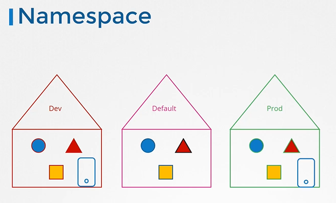

# Cluster Roles
  - Take me to [Video Tutorial](https://kodekloud.com/topic/cluster-roles/)
In this lecture, the focus shifts to cluster roles and cluster role bindings in Kubernetes, which handle authorization for cluster-wide resources. Here's a summary of the key points covered:

### Namespaced vs. Cluster-Scoped Resources
- Kubernetes resources can be categorized as namespaced or cluster-scoped.
- Namespaced resources are created within a specific namespace, while cluster-scoped resources are not associated with any particular namespace.

### Introduction to Cluster Roles and Cluster Role Bindings
- Cluster roles and cluster role bindings are used for authorizing users to access cluster-wide resources like nodes and persistent volumes.
- Unlike roles and role bindings, which are namespaced, cluster roles and cluster role bindings are not limited to a specific namespace.

### Creating Cluster Roles
1. **Create Cluster Role Definition File**:
   - Define a cluster role object with the kind set to `ClusterRole`.
   - Specify the rules for the cluster role, including the resources and permissions.
   - Example: Creating a cluster role for a cluster administrator to manage nodes.

2. **Create Cluster Role**:
   - Use the `kubectl create clusterrole` command to create the cluster role based on the definition file.

### Creating Cluster Role Bindings
1. **Create Cluster Role Binding Definition File**:
   - Define a cluster role binding object with the kind set to `ClusterRoleBinding`.
   - Specify the user details in the `subjects` section.
   - Reference the cluster role created earlier in the `roleRef` section.

2. **Create Cluster Role Binding**:
   - Use the `kubectl create clusterrolebinding` command to create the cluster role binding based on the definition file.

### Flexibility of Cluster Roles
- While cluster roles are typically used for cluster-scoped resources, they can also be applied to namespaced resources, granting access across all namespaces.

### Default Cluster Roles
- Kubernetes automatically creates several default cluster roles during cluster setup, which will be explored further in practice tests.

### Conclusion
- Cluster roles and cluster role bindings provide a mechanism for authorizing users to manage cluster-wide resources in Kubernetes.
- They are essential for granting permissions to perform administrative tasks at the cluster level.
- Understanding the distinction between namespaced and cluster-scoped resources is crucial for effective access control in Kubernetes environments.

  ========================================================================================================


    
In this section, we will take a look at cluster roles

## Roles
- Roles and Rolebindings are namespaced meaning they are created within namespaces.
  
  
  
## Namespaces
- Can you group or isolate nodes within  a namespace?
  - No, those are cluster wide or cluster scoped resources. They cannot be associated to any particular namespace.
  
  
  
- So the resources are categorized as either namespaced or cluster scoped.
  
- To see namespaced resources
  ```
  $ kubectl api-resources --namespaced=true
  ```
- To see non-namespaced resources
  ```
  $ $ kubectl api-resources --namespaced=false
  ```
  
  
  
## Cluster Roles and Cluster Role Bindings
- Cluster Roles are roles except they are for a cluster scoped resources. Kind as **`CLusterRole`** 
  ```
  apiVersion: rbac.authorization.k8s.io/v1
  kind: ClusterRole
  metadata:
    name: cluster-administrator
  rules:
  - apiGroups: [""] # "" indicates the core API group
    resources: ["nodes"]
    verbs: ["get", "list", "delete", "create"]
  ```
  ```
  apiVersion: rbac.authorization.k8s.io/v1
  kind: ClusterRoleBinding
  metadata:
    name: cluster-admin-role-binding
  subjects:
  - kind: User
    name: cluster-admin
    apiGroup: rbac.authorization.k8s.io
  roleRef:
    kind: ClusterRole
    name: cluster-administrator
    apiGroup: rbac.authorization.k8s.io
  ```
  ```
  $ kubectl create -f cluster-admin-role.yaml
  $ kubectl create -f cluster-admin-role-binding.yaml
  ```
  
 
  
- You can create a cluster role for namespace resources as well. When you do that user will have access to these resources across all namespaces.

#### K8s Reference Docs
- https://kubernetes.io/docs/reference/access-authn-authz/rbac/#role-and-clusterrole
- https://kubernetes.io/docs/reference/access-authn-authz/rbac/#command-line-utilities
  
  
