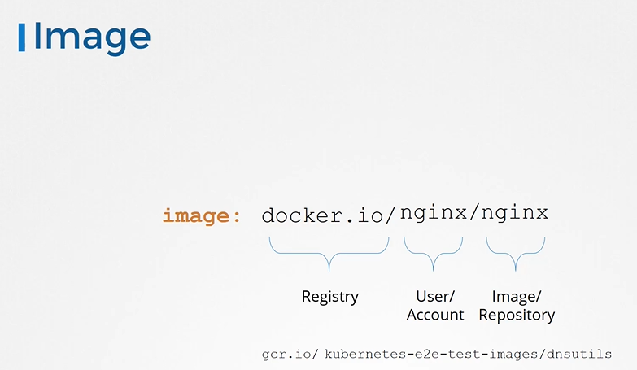
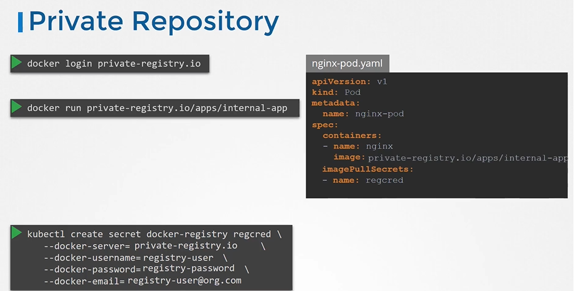

# Image Security
  - Take me to [Video Tutorial](https://kodekloud.com/topic/image-security/)
In this lecture, the focus is on securing images in Kubernetes. Here's a summary of the key points covered:

### Image Naming Convention
- Docker follows a specific naming convention for images, consisting of the repository name and the image name.
- The repository name can include the user or account name, with "library" being the default account for Docker's official images.
- Images are pulled from Docker Hub by default, but there are other popular registries like Google's registry (gcr.io) or private registries hosted by cloud service providers.

### Private Registries
- Private registries are useful for hosting in-house applications or sensitive images that shouldn't be publicly accessible.
- Cloud service providers like AWS, Azure, or GCP often provide private registries by default.
- Private repositories on these registries can be secured with credentials, allowing access only to authorized users.

### Authentication with Private Registries
- To run a container using a private image, users first need to log into the private registry using the `docker login` command and provide their credentials.
- In Kubernetes, authentication for private registries is managed using secret objects.
- A secret object of type "docker registry" is created, containing the registry server name, username, password, and email address.
- This secret is then referenced in the pod definition file under the `imagePullSecrets` section, allowing Kubernetes to use the credentials to pull images from the private registry.

### Implementation in Kubernetes
1. **Create Docker Registry Secret**:
   - Define a secret object with the credentials for the private registry.
   - Specify the registry server name, username, password, and email address.

2. **Reference Secret in Pod Definition**:
   - Include the secret in the pod definition file under the `imagePullSecrets` section.

3. **Pull Images with Credentials**:
   - When the pod is created, Kubernetes uses the credentials from the secret to pull images from the private registry.

### Conclusion
- Securing images is essential for protecting sensitive applications and data in Kubernetes environments.
- Private registries offer a solution for hosting and managing private images, with authentication managed through secret objects in Kubernetes.
- Understanding how to configure and use image pull secrets is crucial for deploying secure applications in Kubernetes clusters.

======================================================================================================


In this section we will take a look at image security

# Image
   
  ```
  apiVersion: v1
  kind: Pod
  metadata:
    name: nginx-pod
  spec:
    containers:
    - name: nginx
      image: nginx
  ```
  
  
  
  
  
# Private Registry
- To login to the registry
  ```
  $ docker login private-registry.io
  ```
- Run the application using the image available at the private registry
  ```
  $ docker run private-registry.io/apps/internal-app
  ```
  
  
  
- To pass the credentials to the docker untaged on the worker node for that we first create a secret object with credentials in it.
  ```
  $ kubectl create secret docker-registry regcred \
    --docker-server=private-registry.io \ 
    --docker-username=registry-user \
    --docker-password=registry-password \
    --docker-email=registry-user@org.com
  ```
- We then specify the secret inside our pod definition file under the imagePullSecret section 
  ```
  apiVersion: v1
  kind: Pod
  metadata:
    name: nginx-pod
  spec:
    containers:
    - name: nginx
      image: private-registry.io/apps/internal-app
    imagePullSecrets:
    - name: regcred
  ```
  
  
  #### K8s Reference Docs
  - https://kubernetes.io/docs/concepts/containers/images/
