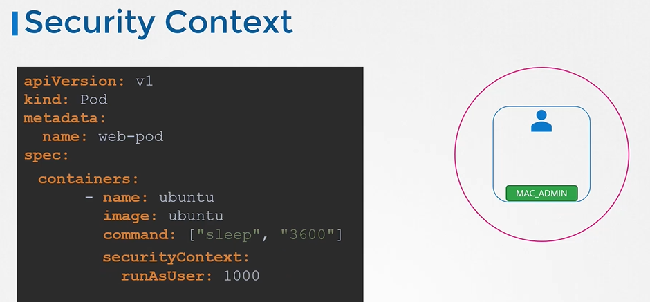

# Security Context
  - Take me to [Video Tutorial](https://kodekloud.com/topic/security-contexts-2/)
In this lecture, Mumshad Mannambeth introduces Security Contexts in Kubernetes, which allow users to define security standards for containers running in Pods. Here's a summary of the key points covered:

1. **Introduction to Security Contexts**:
   - Similar to Docker containers, Kubernetes allows users to define security settings for containers.
   - Security Contexts in Kubernetes enable users to configure settings such as the user ID used to run the container and Linux capabilities.

2. **Configuration Options**:
   - Security settings can be configured at either the Pod level or the container level.
   - If configured at the Pod level, settings apply to all containers within the Pod.
   - When settings are configured at both levels, container-level settings override Pod-level settings.

3. **Pod Definition File**:
   - Example pod definition file is provided, which runs an Ubuntu image with the sleep command.

4. **Configuring Security Contexts**:
   - To configure security context on the container, add a field called `securityContext` under the `spec` section of the Pod.
   - Use the `runAsUser` option to set the user ID for the Pod.
   - To apply the same configuration at the container level, move the entire `securityContext` section under the container specification.

5. **Adding Capabilities**:
   - Capabilities can be added using the `capabilities` option.
   - Specify a list of capabilities to be added to the Pod.

6. **Conclusion**:
   - Understanding and configuring security contexts is essential for ensuring the security of containers running in Kubernetes.
   - Practice exercises are recommended for viewing, configuring, and troubleshooting issues related to security contexts.

Overall, Security Contexts provide a way to enforce security standards and controls within Kubernetes clusters, contributing to a more secure containerized environment.

=============================================================================================================================


In this section, we will take a look at security context

## Container Security
 ```
 $ docker run --user=1001 ubuntu sleep 3600
 $ docker run -cap-add MAC_ADMIN ubuntu
 ```
 
 
 
## Kubernetes Security
- You may choose to configure the security settings at a container level or at a pod level.

 

## Security Context
- To add security context on the container and a field called **`securityContext`** under the spec section.
  ```
  apiVersion: v1
  kind: Pod
  metadata:
    name: web-pod
  spec:
    securityContext:
      runAsUser: 1000
    containers:
    - name: ubuntu
      image: ubuntu
      command: ["sleep", "3600"]
  ```
  
  
- To set the same context at the container level, then move the whole section under container section.
  
  ```
  apiVersion: v1
  kind: Pod
  metadata:
    name: web-pod
  spec:
    containers:
    - name: ubuntu
      image: ubuntu
      command: ["sleep", "3600"]
      securityContext:
        runAsUser: 1000
  ```
  
  
- To add capabilities use the **`capabilities`** option
  ```
  apiVersion: v1
  kind: Pod
  metadata:
    name: web-pod
  spec:
    containers:
    - name: ubuntu
      image: ubuntu
      command: ["sleep", "3600"]
      securityContext:
        runAsUser: 1000
        capabilities: 
          add: ["MAC_ADMIN"]
  ```
  
  
  
### K8s Reference Docs
- https://kubernetes.io/docs/tasks/configure-pod-container/security-context/
